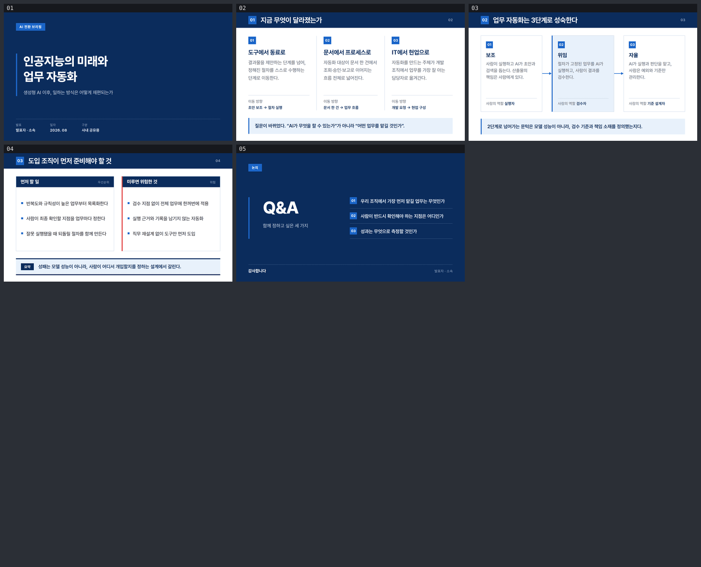

# pt-slide

[slides-grab](https://github.com/NomaDamas/slides-grab)로 만든 프레젠테이션 덱 모음.
슬라이드는 전부 편집·검색 가능한 시맨틱 HTML(720pt × 405pt)이고, 여기서 PDF·PNG·PPTX로 내보낸다.

**🔗 <https://jeonck.github.io/pt-slide/>** — 두 덱을 브라우저에서 바로 볼 수 있다.

## 덱

| 덱 | 내용 | 장수 | 스타일 |
|---|---|---|---|
| [`decks/test-deck`](decks/test-deck/) | **인공지능의 미래와 업무 자동화** — 사내 공유용 한국어 발표 덱. 커버 → 변화 진단 → 자동화 3단계 → 도입 준비 → Q&A | 5 | `ppt-korea-policy-navy` |
| [`decks/agentic-rag`](decks/agentic-rag/) | **From RAG to Agentic RAG** — 영어 기술 덱. 클래식 RAG의 한계 → 검색이 루프가 되는 전환 → 도입 패턴 → 비용과 결정 → Q&A | 6 | `ppt-blueprint-schematic-deck` |
| [`decks/mlops-platform`](decks/mlops-platform/) | **MLOps Platform Roadmap** — 영어 컨설팅 익스히빗. 진단 → 역량 지도 → 3단계 시퀀스 → build vs buy → 결정 → 논의 | 7 | `ppt-consulting-precision-grid` |
| [`decks/feature-store`](decks/feature-store/) | **Feature Store adoption review** — 영어 고스트 덱. 무엇을 푸는가 → 무엇인가 → 언제 도입하나 → 비용 → 결정 | 6 | `ppt-mckinsey-ghost-deck` |
| [`decks/model-registry`](decks/model-registry/) | **Model Registry operating guide** — 영어 대장(ledger) 덱. 무엇을 기록하나 → 승격 원장 → 운영 규칙 4개 → 미결 사항 | 5 | `ppt-archival-index-deck` |
| [`decks/alert-design`](decks/alert-design/) | **Alert design: what deserves a page** — 영어 모노크롬 리스크 덱. 세 목적지(page·ticket·dashboard) → 페이지의 자격을 묻는 시험 3문 → 탈락한 알럿의 처분 → 결정 | 5 | `ppt-monochrome-risk` |
| [`decks/incident-response`](decks/incident-response/) | **Incident response: the first 30 minutes** — 영어 다크 테크 런북. 기술이 아닌 세 가지 실패 → 역할이 하지 않는 일 → 체크포인트 5 → 심각도가 지우는 의무 → 결정 | 6 | `ppt-dark-tech` |
| [`decks/deployment-strategies`](decks/deployment-strategies/) | **Deployment strategies** — 영어 블록 인포그래픽. rolling·blue-green·canary 비교 → 전략을 정하는 두 질문 → 각 전략의 전제 조건 → 결정 | 5 | `ppt-bold-block-infographic-deck` |
| [`decks/ci-pipeline`](decks/ci-pipeline/) | **CI pipeline: what belongs in it** — 영어 정밀 그리드 덱. CI가 매 커밋에 답하는 질문 → CI/머지 후/스케줄 경계 → 신호를 지키는 두 정책 → 이미 느릴 때 → 결정 | 6 | `ppt-precision-fintech-deck` |
| [`decks/iac-drift`](decks/iac-drift/) | **Infrastructure drift** — 영어 스위스 에디토리얼 덱. 손으로 고친 변경이 계획을 무효로 만드는 고리 → 콘솔이 이기는 이유 → 경로를 하나로 만드는 세 수 → 결정 | 5 | `ppt-swiss-editorial-bold` |
| [`decks/postmortem`](decks/postmortem/) | **Blameless postmortems** — 영어 신문 조판 덱. 회고가 쓰이는 용도 → 그 말이 요구하는 세 가지 양보 → 사람이 사실대로 말하게 되는 조건 → 결정 | 6 | `ppt-print-first-newspaper` |
| [`decks/staging-parity`](decks/staging-parity/) | **Why staging lies** — 영어 엔지니어드 다크 덱. 그린 런이 증명하는 것 → 네 가지 간극과 각각이 숨기는 것 → 정직한 두 선택지 → 결정 | 5 | `ppt-engineered-dark-deck` |
| [`decks/backup-restore`](decks/backup-restore/) | **A backup you have never restored** — 영어 헤리티지 럭셔리 덱. 백업이 조용히 실패하는 지점 → 장난감 데이터로는 증명되지 않는다 → 훈련의 산출물은 고쳐진 런북 → 결정 | 5 | `ppt-heritage-luxury-deck` |
| [`decks/slo`](decks/slo/) | **Service level objectives** — 영어 모노크롬 인프라 덱. SLO는 지표가 아니라 스위치다 → 에러 버짓 → 적어두지 않은 예외 → 스위치가 아니게 되는 세 경로 → 결정 | 6 | `ppt-monochrome-infrastructure-deck` |
| [`decks/secrets`](decks/secrets/) | **Revocability is the standard** — 영어 패턴 볼드 포스터 덱. 흔한 규칙이 실패하는 이유 → 회전이 싸지는 조건 → 회전 불가는 곧 영구 → 결정 | 5 | `ppt-pattern-bold-poster-keynote` |
| [`decks/oncall-rotation`](decks/oncall-rotation/) | **On-call rotations people can survive** — 영어 웜 미니멀 다이어그램 덱. 로타는 인력 결정이다 → 인수인계가 실어야 하는 것 → 페이지 상한이 상류에 강제하는 것 → 결정 | 5 | `ppt-warm-minimal-diagram-deck` |
| [`decks/style-showcase`](decks/style-showcase/) | **번들 스타일 92종 견본** — `slides-grab list-styles`가 출력하는 스타일마다 한 장씩. 스타일 고를 때 보는 카탈로그 | 92 | 92종 전부 |

각 덱 폴더의 `README.md`에 그 덱의 구성·판단·재생성 방법이 있다.
스타일 92종 전체 목록(각 스타일의 id·축·색)은 [style-showcase README의 표](decks/style-showcase/README.md#스타일-92종-전체-목록)에 있다.

### 산출물

| | HTML | GitHub에서 보기 | 로컬 미리보기 |
|---|---|---|---|
| test-deck | `slide-01.html` … `slide-05.html` | **[뷰어](https://jeonck.github.io/pt-slide/decks/test-deck/viewer.html)** · [PDF](decks/test-deck/ai-automation-deck.pdf) · [이미지](decks/test-deck/preview/) | [`viewer.html`](decks/test-deck/viewer.html) |
| agentic-rag | `slide-01.html` … `slide-06.html` | **[뷰어](https://jeonck.github.io/pt-slide/decks/agentic-rag/viewer.html)** · [PDF](decks/agentic-rag/agentic-rag.pdf) · [이미지](decks/agentic-rag/preview/) | [`viewer.html`](decks/agentic-rag/viewer.html) |
| mlops-platform | `slide-01.html` … `slide-07.html` | **[뷰어](https://jeonck.github.io/pt-slide/decks/mlops-platform/viewer.html)** · [PDF](decks/mlops-platform/mlops-platform.pdf) · [이미지](decks/mlops-platform/preview/) | [`viewer.html`](decks/mlops-platform/viewer.html) |
| feature-store | `slide-01.html` … `slide-06.html` | **[뷰어](https://jeonck.github.io/pt-slide/decks/feature-store/viewer.html)** · [PDF](decks/feature-store/feature-store.pdf) · [이미지](decks/feature-store/preview/) | [`viewer.html`](decks/feature-store/viewer.html) |
| model-registry | `slide-01.html` … `slide-05.html` | **[뷰어](https://jeonck.github.io/pt-slide/decks/model-registry/viewer.html)** · [PDF](decks/model-registry/model-registry.pdf) · [이미지](decks/model-registry/preview/) | [`viewer.html`](decks/model-registry/viewer.html) |
| alert-design | `slide-01.html` … `slide-05.html` | **[뷰어](https://jeonck.github.io/pt-slide/decks/alert-design/viewer.html)** · [PDF](decks/alert-design/alert-design.pdf) · [이미지](decks/alert-design/preview/) | [`viewer.html`](decks/alert-design/viewer.html) |
| incident-response | `slide-01.html` … `slide-06.html` | **[뷰어](https://jeonck.github.io/pt-slide/decks/incident-response/viewer.html)** · [PDF](decks/incident-response/incident-response.pdf) · [이미지](decks/incident-response/preview/) | [`viewer.html`](decks/incident-response/viewer.html) |
| deployment-strategies | `slide-01.html` … `slide-05.html` | **[뷰어](https://jeonck.github.io/pt-slide/decks/deployment-strategies/viewer.html)** · [PDF](decks/deployment-strategies/deployment-strategies.pdf) · [이미지](decks/deployment-strategies/preview/) | [`viewer.html`](decks/deployment-strategies/viewer.html) |
| ci-pipeline | `slide-01.html` … `slide-06.html` | **[뷰어](https://jeonck.github.io/pt-slide/decks/ci-pipeline/viewer.html)** · [PDF](decks/ci-pipeline/ci-pipeline.pdf) · [이미지](decks/ci-pipeline/preview/) | [`viewer.html`](decks/ci-pipeline/viewer.html) |
| iac-drift | `slide-01.html` … `slide-05.html` | **[뷰어](https://jeonck.github.io/pt-slide/decks/iac-drift/viewer.html)** · [PDF](decks/iac-drift/iac-drift.pdf) · [이미지](decks/iac-drift/preview/) | [`viewer.html`](decks/iac-drift/viewer.html) |
| postmortem | `slide-01.html` … `slide-06.html` | **[뷰어](https://jeonck.github.io/pt-slide/decks/postmortem/viewer.html)** · [PDF](decks/postmortem/postmortem.pdf) · [이미지](decks/postmortem/preview/) | [`viewer.html`](decks/postmortem/viewer.html) |
| staging-parity | `slide-01.html` … `slide-05.html` | **[뷰어](https://jeonck.github.io/pt-slide/decks/staging-parity/viewer.html)** · [PDF](decks/staging-parity/staging-parity.pdf) · [이미지](decks/staging-parity/preview/) | [`viewer.html`](decks/staging-parity/viewer.html) |
| backup-restore | `slide-01.html` … `slide-05.html` | **[뷰어](https://jeonck.github.io/pt-slide/decks/backup-restore/viewer.html)** · [PDF](decks/backup-restore/backup-restore.pdf) · [이미지](decks/backup-restore/preview/) | [`viewer.html`](decks/backup-restore/viewer.html) |
| slo | `slide-01.html` … `slide-06.html` | **[뷰어](https://jeonck.github.io/pt-slide/decks/slo/viewer.html)** · [PDF](decks/slo/slo.pdf) · [이미지](decks/slo/preview/) | [`viewer.html`](decks/slo/viewer.html) |
| secrets | `slide-01.html` … `slide-05.html` | **[뷰어](https://jeonck.github.io/pt-slide/decks/secrets/viewer.html)** · [PDF](decks/secrets/secrets.pdf) · [이미지](decks/secrets/preview/) | [`viewer.html`](decks/secrets/viewer.html) |
| oncall-rotation | `slide-01.html` … `slide-05.html` | **[뷰어](https://jeonck.github.io/pt-slide/decks/oncall-rotation/viewer.html)** · [PDF](decks/oncall-rotation/oncall-rotation.pdf) · [이미지](decks/oncall-rotation/preview/) | [`viewer.html`](decks/oncall-rotation/viewer.html) |
| style-showcase | `slide-01.html` … `slide-92.html` | **[뷰어](https://jeonck.github.io/pt-slide/decks/style-showcase/viewer.html)** · [PDF](decks/style-showcase/slides-grab-style-showcase.pdf) · [이미지](decks/style-showcase/README.md#브라우저에서-바로-보기) | [`viewer.html`](decks/style-showcase/viewer.html) |

> **저장소 안의 `.html`을 GitHub에서 클릭하면 페이지가 아니라 소스 코드가 보인다.** GitHub은 저장소 트리의
> `.html`을 렌더링하지 않고 텍스트로 서빙하기 때문이고, 파일이 잘못된 게 아니다.
> **위 Pages 링크로 열면 실제 페이지로 뜬다.** 표의 PDF·이미지 열도 GitHub에서 바로 보인다.
>
> 그 밖의 방법:
> - **로컬에서 열기** (권장) — 클론 후 `viewer.html`을 브라우저로. 폰트·레이아웃이 그대로 나오는 유일한 방법
> - **GitHub Pages** — **이미 배포돼 있다: <https://jeonck.github.io/pt-slide/>**.
>   `main`에 푸시할 때마다 `.github/workflows/pages.yml`이 저장소를 그대로 다시 배포한다
> - **htmlpreview** — `htmlpreview.github.io/?<파일 URL>`. Pages가 있으니 이제 쓸 일은 없다

각 덱의 `preview/` 이미지는 커밋돼 있다. 전체 해상도 렌더 PNG는 용량 때문에 커밋하지 않으니
(`.gitignore` 참고) 필요하면 아래 `png` 명령으로 다시 만든다.



## 시작하기

Node.js ≥ 20 필요.

```bash
npm install
npx playwright install chromium   # validate / png / pdf가 Chromium을 쓴다
```

## 작업 흐름

slides-grab은 **Plan → Design → Export** 3단계이고, 각 단계 사이에 게이트가 있다.

```bash
DECK=decks/test-deck

npx slides-grab validate     --slides-dir $DECK    # 오버플로·클리핑·겹침 검사
npx slides-grab png          --slides-dir $DECK --output-dir $DECK/gate-preview --resolution 1080p
npx slides-grab build-viewer --slides-dir $DECK    # viewer.html 갱신
npx slides-grab edit         --slides-dir $DECK    # 브라우저 시각 편집기
npx slides-grab pdf          --slides-dir $DECK --output $DECK/deck.pdf
```

`pdf` / `convert` / `figma`는 **디자인 게이트 영수증이 있어야** 실행된다. 슬라이드 HTML을 고치면 영수증이 무효가 되므로, 다시 통과시켜야 한다:

```
validate → png(증거 재촬영) → Pass A / Pass B 리포트 갱신 → slides-grab design-gate --verdict proceed
```

두 덱 모두 `gate-pass-a.md`(시스템 계약)와 `gate-pass-b.md`(청중 임팩트) 리포트, 그리고 `.slides-grab/`에 영수증이 들어 있다.

## 스크립트

| 경로 | 하는 일 |
|---|---|
| [`scripts/new-deck.mjs`](scripts/new-deck.mjs) | 새 덱 스캐폴딩 — 폴더, 로컬 임베드용 Pretendard(`--display`면 Latin 서체까지), 아웃라인 뼈대 |
| [`scripts/build-style-showcase.mjs`](scripts/build-style-showcase.mjs) | 스타일 스펙에서 팔레트·타이포·레이아웃을 읽어 견본 92장을 생성 |
| [`scripts/build-contact-sheets.mjs`](scripts/build-contact-sheets.mjs) | 렌더된 PNG를 3×4 컨택트 시트로 묶음. 기본은 리뷰용 큰 타일, `--web`은 README에 붙일 `preview/` 이미지 |
| [`.github/workflows/pages.yml`](.github/workflows/pages.yml) | `main` 푸시마다 저장소를 <https://jeonck.github.io/pt-slide/>로 배포 |

```bash
node scripts/new-deck.mjs my-deck                                                # 새 덱 시작
node scripts/build-style-showcase.mjs
node scripts/build-contact-sheets.mjs decks/style-showcase/gate-preview          # 리뷰용
node scripts/build-contact-sheets.mjs decks/style-showcase/gate-preview --web    # README용 preview/
```

## 덱 만들기

새 덱은 **`deck` 스킬**([`.claude/skills/deck/`](.claude/skills/deck/))이 처음부터 끝까지 안내한다.
Claude Code에서 그냥 이렇게 말하면 된다:

```
decks/ai-roadmap 에 '제조 현장의 AI 품질검사' 8장 덱 만들어줘
```

스킬이 스캐폴딩 → 스타일 선택 → 아웃라인 → 슬라이드 → validate → 디자인 게이트 → export → 푸시까지
정해진 순서로 끌고 간다. 슬라이드 작성 규칙(`references/slide-html.md`), 게이트 절차
(`references/design-gate.md`), 이 환경에서 실제로 났던 오류와 해법(`references/troubleshooting.md`)이
같이 들어 있다.

## 알아둘 것

- **폰트는 로컬 임베드.** 한글 폰트가 없는 환경에서도 그대로 렌더되도록 Pretendard(와 견본 덱의 Latin 서체 4종)를 각 덱의 `assets/fonts/`에 넣고 상대경로로 참조한다. 저장된 슬라이드 HTML에 원격 URL은 없다 — slides-grab 규칙이기도 하다.
- **한국어 줄바꿈.** 모든 슬라이드에 `word-break: keep-all`을 걸어 어절이 줄 중간에서 쪼개지지 않게 했다.
- **test-deck에는 수치·차트가 없다.** 출처를 댈 수 있는 실측 데이터가 없어서 만들지 않았다.
- **커버와 Q&A의 `발표자 · 소속`은 자리표시자다.** 발표 전에 채울 것.
- **PPTX(`convert`)·Figma(`figma`) 내보내기는 slides-grab에서 experimental / unstable로 표시돼 있다.** 손보정이 필요할 수 있다.
