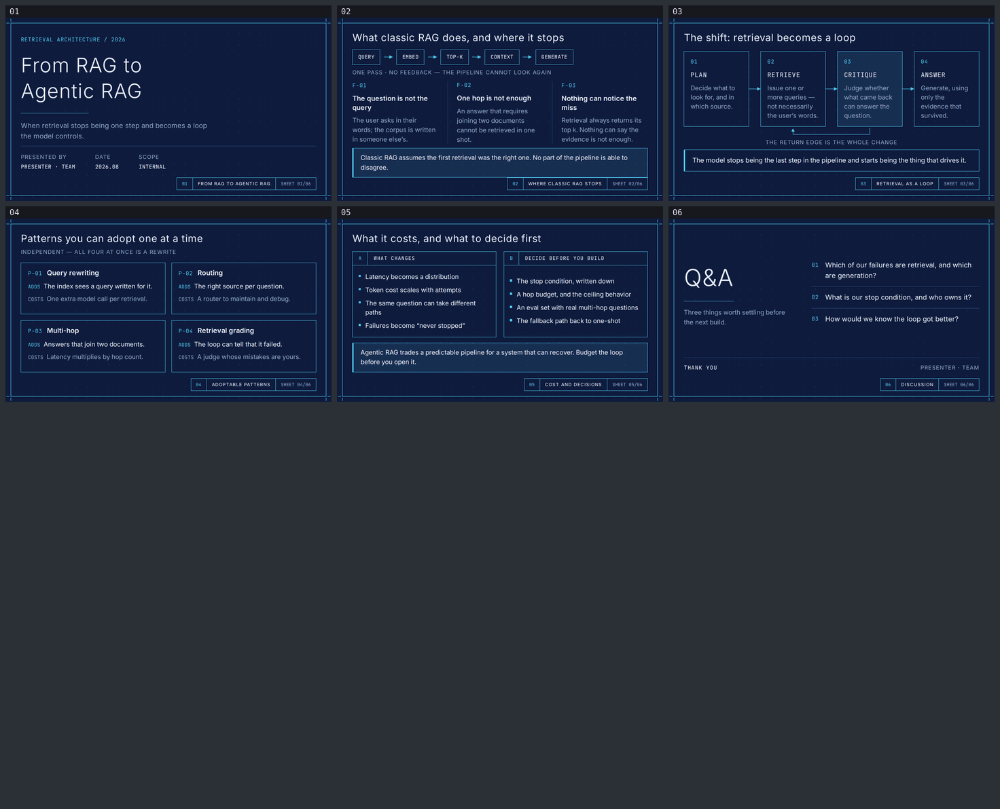

# agentic-rag — From RAG to Agentic RAG

A six-slide English deck for engineers who already run a classic RAG pipeline and are
deciding whether to make retrieval agentic. Built with
[slides-grab](https://github.com/NomaDamas/slides-grab).

**[Open the viewer](https://jeonck.github.io/pt-slide/decks/agentic-rag/viewer.html)** ·
[PDF](agentic-rag.pdf)



| # | Sheet | Job |
|---|---|---|
| 01 | From RAG to Agentic RAG | Cover |
| 02 | Where classic RAG stops | The one-pass pipeline and its three failure modes |
| 03 | Retrieval as a loop | PLAN → RETRIEVE → CRITIQUE → ANSWER, with the return edge |
| 04 | Adoptable patterns | Query rewriting, routing, multi-hop, retrieval grading |
| 05 | Cost and decisions | What changes vs. what to decide before building |
| 06 | Discussion | Q&A |

- Style: bundled `ppt-blueprint-schematic-deck` — exposed dot grid, cyan drawing frame,
  unfilled line drawings, monospace numerals. A drawing board rather than a slide deck.
- Canvas 720pt × 405pt. Inter 300/400/600 and JetBrains Mono embedded under
  `assets/fonts/`; no remote URLs and no Pretendard, since there is no Hangul here.
- **No figures.** There is no benchmark, latency or accuracy number in this deck, because
  none we could source. The argument runs on mechanism instead — see `slide-outline.md`.
- `PRESENTER · TEAM` on the cover and closing is a **placeholder**. Fill it before presenting.

## What the spec decided, and what this deck decided

The palette, the dot grid, the drawing frame, the title block and the unfilled line
drawings all come from `slides-grab show-design ppt-blueprint-schematic-deck`. Four
choices are this deck's, and are recorded in `slide-outline.md`:

- **Type sizes are not the spec's absolute points.** The spec targets a 13.33in canvas;
  this one is 10in, and a literal 0.75× scale would put body at 13.5pt and labels at
  9.75pt — under the framework's 14pt body and 10pt absolute floors.
- **Body weight is 400, not 300.** Inter 300 at 14pt on this background is too thin.
- **The grid and frame are data-URI SVG backgrounds, not CSS gradients**, which the
  style's Avoid list forbids.
- **Copy was cut to fit rather than type shrunk to fit copy.** The title block is
  bottom-right furniture on every sheet, so anything that outgrows `main` slides under it
  — and `validate` does not catch that, since it is a child overflowing its parent, not
  two siblings overlapping. Slides 02, 04 and 05 each needed shortening.

## Files

| Path | What |
|---|---|
| `slide-01.html` … `slide-06.html` | The slides — editable, searchable semantic HTML |
| `slide-outline.md` | Approved outline, design tokens and recorded deviations |
| `gate-pass-a.md`, `gate-pass-b.md` | Design gate reports |
| `.slides-grab/` | Gate receipt and render evidence |
| `preview/` | The image embedded above (committed; GitHub serves repo `.html` as source) |
| `viewer.html`, `agentic-rag.pdf` | Exports |

## Rebuild

```bash
npm install
npx slides-grab validate     --slides-dir decks/agentic-rag
npx slides-grab png          --slides-dir decks/agentic-rag --output-dir decks/agentic-rag/gate-preview --resolution 1080p
node scripts/build-contact-sheets.mjs decks/agentic-rag/gate-preview --web
npx slides-grab build-viewer --slides-dir decks/agentic-rag
```

Editing a slide invalidates the gate receipt. Re-run validate → png → refresh the two
pass reports' fingerprints → `slides-grab design-gate --verdict proceed` before exporting.
