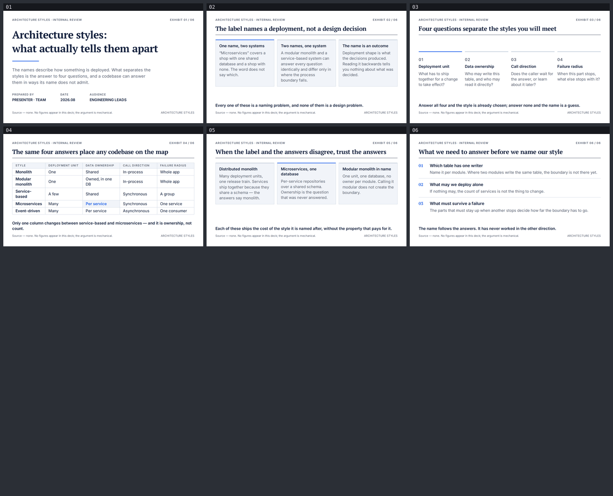

# Architecture styles: what actually tells them apart

`slides-grab`으로 만든 영문 6장 덱. 스타일은 `ppt-strategy-navy-deck`.



**[뷰어 열기](https://jeonck.github.io/pt-slide/decks/ai-roadmap/viewer.html)** ·
[PDF](ai-roadmap.pdf) · [PPTX](ai-roadmap.pptx) · [이미지](preview/)

## 구성

| # | 액션 타이틀 |
|---|---|
| 01 | Architecture styles: what actually tells them apart (커버) |
| 02 | The label names a deployment, not a design decision |
| 03 | Four questions separate the styles you will meet |
| 04 | The same four answers place any codebase on the map |
| 05 | When the label and the answers disagree, trust the answers |
| 06 | What we need to answer before we name our style (마무리) |

## 판단한 것과 그 이유

**스타일을 이걸로 고른 이유.** 이 덱의 본체는 "무엇으로 구분하는가"라는 **기준 비교**다.
`ppt-strategy-navy-deck`은 액션 타이틀(라벨이 아니라 완결된 결론 문장)과 그 아래 1px 헤어라인,
12열 그리드 위의 근거 모듈이 계약으로 박혀 있어 그 논지 형태와 그대로 맞는다. 두 가지 블루와
회색만 쓰는 규칙도 비교표에서 강조를 한 칸에만 두는 데 유리했다.

**헤어라인이 다섯 시트에서 같은 높이에 있다.** 본문 다섯 장 모두 y=86.5pt(실측)다. 액션 타이틀이
한 줄이어야 성립하므로, 슬라이드를 쓰기 전에 다섯 문장의 폭을 실측했다. 그중 하나가
655.4pt로 656pt 폭에 **0.6pt**만 남아 문장을 줄였다.

**수치와 차트가 없다.** 출처를 댈 수 있는 데이터가 없다. 비교표의 칸에 들어가는 것은
"One / A few / Many"처럼 **세는 말이 아니라 구분하는 말**이다. 스타일이 가진 차트 3색과 kpi 토큰은
선언만 되어 있고 쓰지 않았다.

**폴더 이름이 주제와 맞지 않는다.** 사용자가 `decks/ai-roadmap`을 지정했고 경로는 그대로 따랐다.

**렌더에서만 보인 결함 둘.** 슬라이드 4의 마무리 문장이 표 마지막 행 위에 겹쳐 그려졌다 —
자식이 `main`을 넘친 것이라 `validate`는 6/6 통과를 찍었다. 표 행 패딩을 8→3pt로 줄여 해결했다.
커버 제목은 leading 1.2에서 디센더가 잘려 1.3으로 올렸다(이건 validate가 잡았다).

**PPTX 규칙을 처음부터 지켰다.** `<header>`·`<footer>` 태그 없음, 모든 글자를 `<p>`·`<h*>` 안에,
텍스트 요소에 장식 없음, `<li>` 안에 블록 요소 없음, 하단 여백 32pt. 그 결과 이 덱은 저장소에서
처음으로 **첫 시도에 편집 가능한 PPTX**로 나왔다 — 텍스트 상자 105개, 누락 0, 중복 0.

## 다시 만들기

```bash
npx slides-grab validate     --slides-dir decks/ai-roadmap
npx slides-grab png          --slides-dir decks/ai-roadmap --output-dir decks/ai-roadmap/gate-preview --resolution 1080p
npx slides-grab build-viewer --slides-dir decks/ai-roadmap
node scripts/patch-viewer.mjs decks/ai-roadmap
npx slides-grab pdf          --slides-dir decks/ai-roadmap --output decks/ai-roadmap/ai-roadmap.pdf --resolution 1080p
node scripts/build-pptx.mjs  decks/ai-roadmap
```

슬라이드를 고치면 게이트 영수증이 무효가 된다. 지문을 갱신하고 `design-gate --verdict proceed`를
다시 받아야 `pdf`·`convert`가 돈다.
