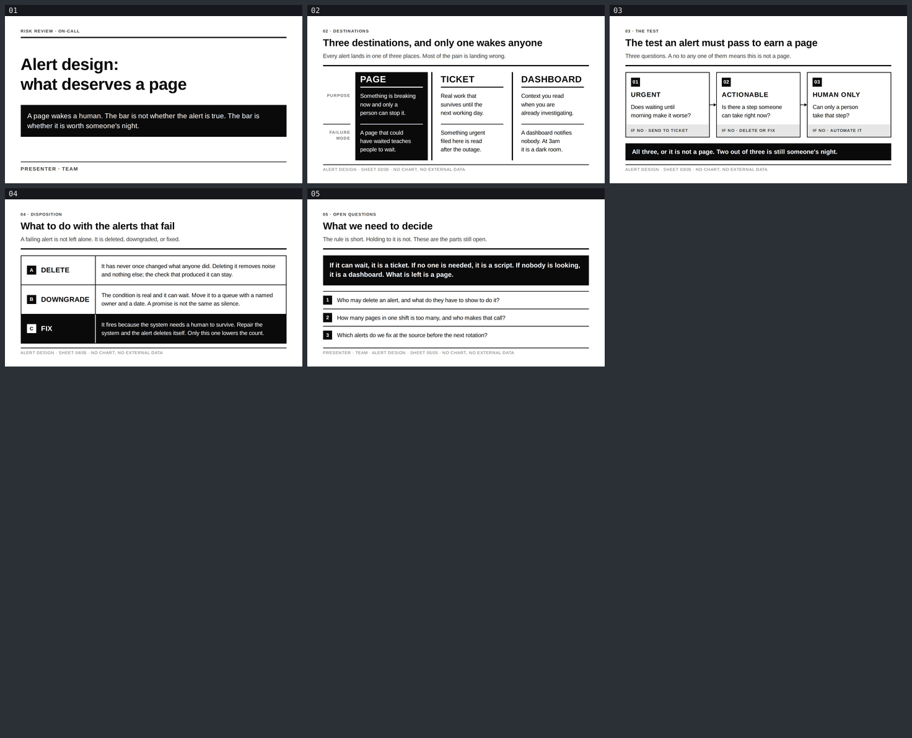

# alert-design — Alert design: what deserves a page

A five-slide English risk review for the engineers who carry the pager and the leads who decide
what may ring it. Built with [slides-grab](https://github.com/NomaDamas/slides-grab).

**[Open the viewer](https://jeonck.github.io/pt-slide/decks/alert-design/viewer.html)** ·
[PDF](alert-design.pdf)



| # | Sheet |
|---|---|
| 01 | Alert design: what deserves a page (cover) |
| 02 | Three destinations, and only one wakes anyone |
| 03 | The test an alert must pass to earn a page |
| 04 | What to do with the alerts that fail |
| 05 | What we need to decide |

## What the deck argues

A page wakes a human, so the bar is not whether the alert is *true* — it is whether it is worth
someone's night. Sheet 02 separates the three things an alert can be routed to: a PAGE interrupts
a person, a TICKET makes a promise for later, a DASHBOARD is read only by someone already
looking. Each has a distinct failure when something lands in the wrong one. Sheet 03 turns that
into the rule the reader can apply tomorrow — three yes/no gates, and a no to any of them sends
the alert somewhere else: *urgent* (does waiting make it worse), *actionable* (is there a step to
take now), *human-only* (can only a person take it). Sheet 04 closes the escape hatch: an alert
that fails is deleted, downgraded, or fixed at the source — "everyone knows to ignore that one"
is not on the list, and only the third option lowers the count. Sheet 05 hands over the rule in
one inverted block and three decisions the room still has to make.

- Style: bundled `ppt-monochrome-risk` — **assigned, not chosen.** White paper, black ink, five
  achromatic steps and no colour at all; thick rules cut each sheet into declared regions, and
  emphasis is never a hue but a black-fill inversion, the way a stamp reads.
- Canvas 720pt × 405pt. Arimo 400/700 embedded under `assets/fonts/`; no remote URLs anywhere in
  the saved slides, and no Pretendard, since there is no Hangul here.
- **No figures and no chart.** Alert volumes, MTTA/MTTR, page-per-shift counts and vendor
  benchmarks are all unsourceable here, so the deck contains no number at all. The argument is
  mechanical: an interruption has a cost whether or not anyone measures it, so the bar is set by
  what the interruption buys. Every content sheet's footer states `NO CHART, NO EXTERNAL DATA`,
  so the absence is declared rather than merely quiet.
- `PRESENTER · TEAM` on the cover and in the closing footer is a **placeholder**.

## What the spec decided and what this deck decided

The spec decided, and the deck obeyed without argument:

- **Zero colour.** Not one chromatic pixel — `grep` over the five slides returns exactly five hex
  values, all spec tokens: `#0A0A0A`, `#FFFFFF`, `#3D3D3D`, `#767676`, `#E6E6E6`. Red is banned
  even for a warning, so the "this is the dangerous one" signal on sheet 04 is a black-fill row.
- **Rules, not whitespace, divide regions.** This is on the Avoid list, and it is the item that
  actually caught this deck out — see the render fixes below.
- **Bold or heavier headlines, 0px corners, no shadow, no gradient.** Every corner in the deck is
  square; there is no gradient of any kind, including no `radial-gradient` pattern fill.
- **Its own diagram vocabulary rather than an invented layout.** `diagram.comparison` on 02 (three
  columns split by 4px rules, the emphasised column inverted), `diagram.process_flow` on 03
  (right-angle nodes, 0.4in black number chips, 2pt right-angle connectors with sharp triangle
  heads), numbered-chip rows on 04 and 05.

This deck decided, and recorded why (full table in [`design-debt.md`](design-debt.md)):

- **Arimo substitutes for Helvetica Neue.** Neither Helvetica Neue nor Arial is distributable or
  on npm, and slides-grab forbids remote font URLs. Arimo is metric-compatible with both, and is
  the substitution `decks/mlops-platform` already made. Arimo has no Black weight, so the display
  headline is 700 — the spec's requirement is "Bold or heavier".
- **Type is not scaled to the spec's absolute points.** The spec targets 13.33in; this canvas is
  10in, a 0.75× scale, under which its 17pt body / 12pt label / 10pt caption become 12.75 / 9 /
  7.5pt — all below this repo's 14pt body and 10pt absolute floors. The ratios are kept, the
  absolute values are not.
- **Diagram nodes are HTML boxes; only the connectors are SVG.** `diagram.render` asks for SVG
  and no div blocks, but this repo needs slide text in semantic tags so the PPTX text engine and
  screen readers can reach it. The nodes are drawn to the spec's geometry regardless.
- **Sheet 03 is three gates plus a terminal bar, not the spec's 4–5 steps.** The argument has
  exactly three tests; a fourth would have to be invented. The black bar is the fourth stage.

## The budget

Both axes were computed before any slide HTML was written — that is the step that prevents the
rework, and the full arithmetic is in [`slide-outline.md`](slide-outline.md).

```
vertical    405 − padding 30+26 = 349
            − header (eyebrow 20 + title 37 + subline 32 + 4px rule 17) = 105.4
            − footer (2px rule + margin 12 + caption 18)                =  29.5
            → main = 214pt on sheets 02–05

horizontal  content 644pt. Arimo is metric-compatible with Helvetica, so the repo's measured
            0.48 coefficient applies directly.
            title   24pt → 644 ÷ 11.52 = 55 chars → written to ≤50   [must not wrap: it sets
                                                                      the y of the 4px rule]
            subline 14pt → 644 ÷  6.72 = 95 chars → written to ≤80   [must not wrap]
```

Longest title written is 44 characters, longest subline 75. **Both budgets held: 5/5 on the first
`validate`, 0 errors and 0 warnings, and it stayed 5/5 through every subsequent edit.** No title
or subline wrapped in any render, so the 4px rule sits at the same y on all four content sheets —
which is the whole of this style's "strict grid".

## What the renders caught that validate did not

`validate` was green from the first run and stayed green through all of it. Every one of these
was found by opening the PNGs and looking:

1. **The 4px divider between PAGE and TICKET was invisible** (sheet 02). It was a `border-left`
   on the TICKET column, flush against the black-filled PAGE block, so the fill swallowed it —
   one divider visible, one not. Both are now standalone 4px flex items with white on each side.
2. **Sheet 02's cell text was vertically centred**, so the first lines of the three columns did
   not align. In a strict-grid style that is the style breaking. Now top-aligned.
3. **The verb and body columns on sheet 04 were divided by whitespace only**, and so were the
   rule block and the question list on sheet 05 — both squarely on this style's Avoid list. Both
   now carry a 2px rule; on sheet 04 it is on *every* row and only its colour inverts, so no row
   shifts relative to its siblings.
4. **That new rule on sheet 04 spanned only the content height**, reading as a floating stub
   rather than a table rule, because the row was `align-items: center`. Row is now `stretch`.
5. **"DOWNGRADE" then touched the rule.** Fixed with 17pt / 0.02em rather than widening the
   column, which would have pushed row B's body copy onto a third line.
6. **Sheet 03's gate questions were 13pt** — above the 10pt floor but below the 14pt body
   minimum, and those questions are the slide's whole argument. Raised to 14pt, paid for by
   narrowing the connectors 20pt → 16pt and cutting each question to ≤43 characters.
7. **Runt last lines** on sheets 02 and 03 ("day.", "wait.", "step?"). `text-wrap: balance` on
   the wrapping paragraphs.
8. **Sheet 05's "Q1"/"Q2"/"Q3" chips were cramped** at 12pt in a 22pt square. Single digits now.
9. **The cover's spare height was all above the headline**, leaving a dead band under the top
   rule and nothing below the thesis block. `justify-content: center`.

## Files

| Path | What |
|---|---|
| `slide-01.html` … `slide-05.html` | The slides — editable, searchable semantic HTML |
| `slide-outline.md` | Approved outline, tokens, both budgets, the render fixes, recorded deviations |
| `design-debt.md` | Notes accepted at the gate rather than fixed, with reasons |
| `gate-pass-a.md`, `gate-pass-b.md` | Design gate reports |
| `.slides-grab/` | Gate receipt and render evidence |
| `gate-preview/`, `contact-sheets/` | The PNGs that were actually opened and reviewed |
| `preview/` | The image embedded above (committed; GitHub serves repo `.html` as source) |
| `viewer.html`, `alert-design.pdf` | Exports |

## Rebuild

```bash
npm install
npx slides-grab validate     --slides-dir decks/alert-design
npx slides-grab png          --slides-dir decks/alert-design --output-dir decks/alert-design/gate-preview --resolution 1080p
node scripts/build-contact-sheets.mjs decks/alert-design/gate-preview --web
npx slides-grab build-viewer --slides-dir decks/alert-design
npx slides-grab pdf          --slides-dir decks/alert-design --output decks/alert-design/alert-design.pdf --resolution 1080p
```

Run every `slides-grab` command **from the repo root** — `cd`-ing into the deck folder first
makes it look for `decks/alert-design/decks/alert-design` and fail.

Editing a slide invalidates the gate receipt. Re-run validate → png → open the PNGs → refresh the
two pass reports' fingerprints (`sha256sum slide-0*.html`) → `slides-grab design-gate --verdict
proceed` before exporting.

The fonts came from npm, not a CDN (the egress proxy blocks jsDelivr):

```bash
npm install --no-save --no-audit --no-fund --prefix .font-staging-alert @fontsource/arimo
cp .font-staging-alert/node_modules/@fontsource/arimo/files/arimo-latin-{400,700}-normal.woff2 \
   decks/alert-design/assets/fonts/
rm -rf .font-staging-alert
```
