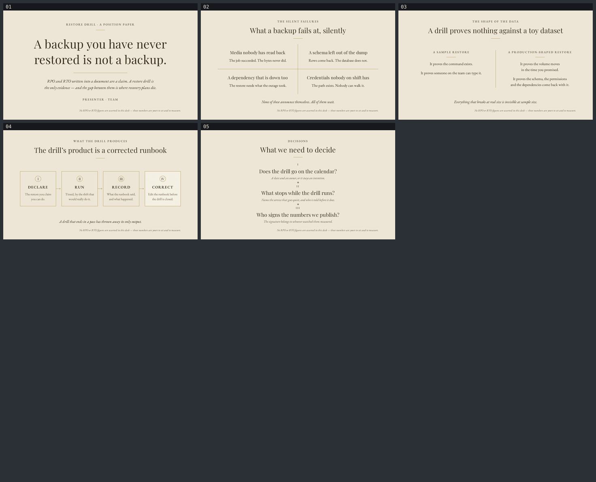

# A backup you have never restored is not a backup

RPO and RTO written into a document are a claim. A restore drill is the only evidence, and the
gap between the two is where recovery plans die. Five sheets, English, for the people who publish
a recovery commitment and the people who would have to honour it.

| | |
|---|---|
| Slides | 5 · 720pt × 405pt semantic HTML |
| Style | [`ppt-heritage-luxury-deck`](#style) |
| Language | English |
| Charts / figures | **none** — [see below](#why-there-are-no-numbers) |
| Fonts | Playfair Display, EB Garamond — embedded locally |

## Contents

| Sheet | Title | What it does |
|---|---|---|
| `slide-01` | A backup you have never restored is not a backup. | The claim, alone on the sheet, with the thesis under it |
| `slide-02` | What a backup fails at, silently | Four failures on a gold hairline cross: unread media, a missing schema, a dependency that is down too, credentials nobody on shift holds |
| `slide-03` | A drill proves nothing against a toy dataset | A sample restore vs a production-shaped one, split by a full-height hairline |
| `slide-04` | The drill's product is a corrected runbook | DECLARE → RUN → RECORD → CORRECT, four hairline nodes; the last one is the point |
| `slide-05` | What we need to decide | Calendar · what stops · who signs |



Open [`viewer.html`](viewer.html) locally for the real thing, or read
[`backup-restore.pdf`](backup-restore.pdf). GitHub serves `.html` from a repo tree as source, not
as a page — that is why the `preview/` sheet above is committed.

## Style

`ppt-heritage-luxury-deck` — champagne `#EDE6D6`, sepia ink `#3A2E1F`, one gold `#A8893E`
hairline per sheet, a Didone display serif on the centre axis and a humanist serif for body.

Three styles were on the shortlist for this deck: heritage luxury,
`ppt-altezza-ultramodern-keynote` and `ppt-cinematic-keynote-deck`. **Heritage luxury was picked
because it is the only one of the three that does not need photographs.** Altezza's identity is a
12–18° clip mask over an image or tone field, and its spec forbids empty placeholder clip
surfaces outright; cinematic wants a single key visual covering 50–70% of each canvas. There are
no images available here, so both would have had to be broken exactly where they are most
themselves. Heritage luxury asks for a centre axis, gold hairlines and large serif type — drama
that type and colour blocking can carry honestly.

It also suits the argument. A hairline rule and a centred Didone line read like something being
entered into a record, and the closing question — who signs that the published numbers are the
measured ones — lands harder on a sheet that already looks like a document that gets signed.

Full reasoning, tokens and budgets: [`slide-outline.md`](slide-outline.md).

## Why there are no numbers

RPO and RTO are the subject of this deck, which is exactly why it prints no hours, no
percentages, no durations, no drill frequencies and no charts. The argument is that those two
figures are a commitment the audience must set and then verify; asserting example figures here
would demonstrate the failure the deck warns about. There is not one Arabic numeral in any
rendered string in the deck — only the Roman numerals I–IV that number the steps and decisions.

The style makes a source caption mandatory (`slide.source_caption: fixed bottom-right italic`).
With nothing to cite, that fixed slot carries the fact instead, identically on all five sheets:

> *No RPO or RTO figures are asserted in this deck — those numbers are yours to set and to measure.*

## Judgement calls

- **Type is not the spec's absolute points.** The spec targets 960 × 540pt; this canvas is
  720 × 405pt. Scaling its 17pt body and 10pt caption by 0.75 lands under the framework's 14pt
  body / 10pt absolute floors, so small type is held at or above the floors and the display sizes
  are scaled down instead (52pt → 44pt cover, 34pt → 26pt sheet titles). A 405pt-tall canvas
  cannot take a 52pt Didone headline plus a rule plus a subtitle and still breathe.
- **One colour was added:** `#6B5D46`, between the spec's `text` and `text-muted` on the same hue.
  The spec's muted `#8A7C63` measures 3.28:1 on the background — under the 4:1 the repo sets for
  secondary text. `#6B5D46` measures 5.15:1 and carries every sub-line and the source caption.
- **Gold is used for no text anywhere.** At 2.66:1 it is not readable type; it is four hairlines,
  a set of node borders, three arrowheads and two lozenges.
- **The presenter line is a placeholder** — `PRESENTER · TEAM`. No name is invented.
- Everything else accepted rather than fixed is in [`design-debt.md`](design-debt.md).

## Defects that only the render showed

`validate` reported 5/5 clean on layouts that were visibly wrong. Fixed after opening the PNGs:

- **slide-03** — the comparison block was stretched to full height, so a dead zone opened under
  the shorter left column. Made auto-height and vertically centred.
- **slide-03** — "promised." was left alone on a line. `text-wrap: balance`.
- **slide-05** — the item separators were the same 34pt hairline as the header rule, so the sheet
  lost its header/body distinction. Separators became gold lozenges.
- **slide-04** — three nodes had a `#C4B79A` border and one had gold, making the border colour do
  two jobs. All four now take the identical gold hairline; step IV is marked by fill alone, which
  shifts no box metric.
- **slide-04** — the step badge was a square against the spec's circle. Made a circle, at 22pt
  with a 12pt numeral, because the spec's 19pt/16pt clips.

Separately, the first `validate` run failed `text-clipped` on the 44pt cover title and all four
26pt sheet titles at 1.25/1.3 leading. The fix was to raise the leading to 1.3/1.35, not to
shrink the type.

## Rebuild

```bash
npx slides-grab validate     --slides-dir decks/backup-restore
npx slides-grab png          --slides-dir decks/backup-restore --output-dir decks/backup-restore/gate-preview --resolution 1080p
npx slides-grab design-gate  --slides-dir decks/backup-restore --verdict proceed \
    --pass-a-report decks/backup-restore/gate-pass-a.md \
    --pass-b-report decks/backup-restore/gate-pass-b.md
npx slides-grab build-viewer --slides-dir decks/backup-restore
npx slides-grab pdf          --slides-dir decks/backup-restore --output decks/backup-restore/backup-restore.pdf --resolution 1080p
node scripts/build-contact-sheets.mjs decks/backup-restore/gate-preview --web
```

Run all of it from the repo root. Editing a slide changes its sha256 and invalidates the gate
receipt, so the gate has to be taken again before `pdf` will run.
