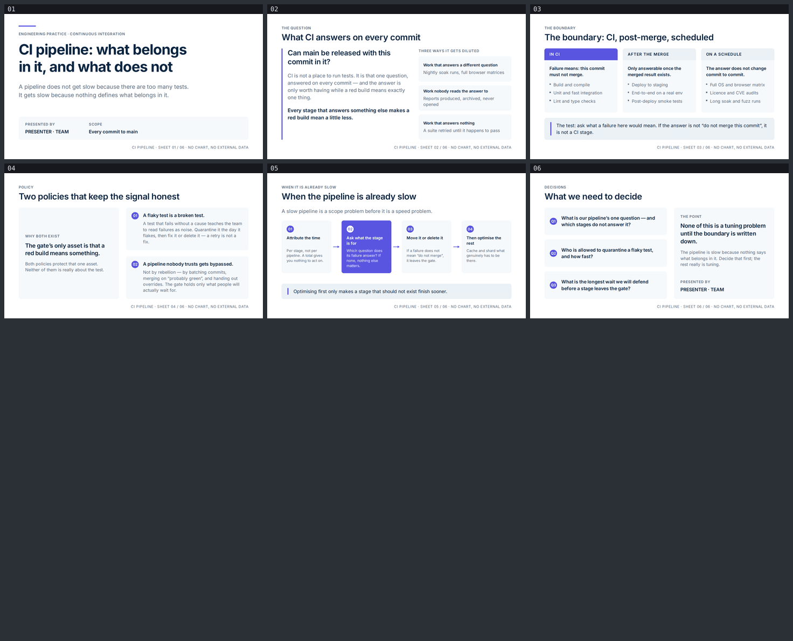

# ci-pipeline — CI pipeline: what belongs in it, and what does not

A six-slide English argument for the engineers who own the pipeline and the leads who decide
what gates a merge. Built with [slides-grab](https://github.com/NomaDamas/slides-grab).

**[Open the viewer](https://jeonck.github.io/pt-slide/decks/ci-pipeline/viewer.html)** ·
[PDF](ci-pipeline.pdf)



| # | Sheet |
|---|---|
| 01 | CI pipeline: what belongs in it, and what does not (cover) |
| 02 | What CI answers on every commit — the one question, and three ways it gets diluted |
| 03 | The boundary: CI, post-merge, scheduled — and the test that decides |
| 04 | Two policies that keep the signal honest |
| 05 | When the pipeline is already slow |
| 06 | What we need to decide |

## What it argues

A pipeline does not get slow because there are too many tests. It gets slow because nothing
defines what belongs in it. So the deck never talks about speed until sheet 05, and when it
does, the first move is not to optimise — it is to ask what each stage is for. The through-line
is a single question ("can main be released with this commit in it?"), a boundary drawn against
it, and two policies that protect the only thing a gate actually owns: that a red build means
something.

- Style: bundled `ppt-precision-fintech-deck` — **assigned, not chosen.** Near-white canvas with
  `#F6F9FC` planes stepping out of it, one indigo-violet accent, deep-navy Inter set tight and
  left, 7:5 asymmetry. `slides-grab show-design` output was treated as a contract and its
  `## Avoid` list was checked line by line in gate Pass A.
- Canvas 720pt × 405pt. Inter 400/600/700 embedded under `assets/fonts/` from npm
  `@fontsource/inter`; no remote URLs. The four Pretendard faces the scaffolder copies in were
  deleted — there is no Hangul here and they are ~3MB of dead weight.
- **No figures and no chart.** See below.
- `PRESENTER · TEAM` on the cover and the closing sheet is a **placeholder**.

## What the spec decided, and what this deck decided

The spec decided the palette, the asymmetry, the diagram vocabulary and the fixed
bottom-right caption. Everything below is where a decision had to be made anyway.

- **No number appears anywhere in this deck.** Build minutes, pass rates, flake percentages,
  "teams that do X ship Y times faster" — every figure that would illustrate this thesis would
  have to be invented, and the gate treats fabricated data as Critical. The argument runs on
  mechanism instead: what a stage's failure *means*, and what the people at the gate start doing
  once it means nothing. The style's mandatory `source_caption` slot therefore carries sheet
  identity and the words `NO CHART, NO EXTERNAL DATA` rather than a citation that does not exist.
- **Type sizes are the spec's, scaled 0.75 and then floored.** The spec targets 13.33 × 7.5in;
  this canvas is 10 × 5.625in. Display 54 → 40pt and title 32 → 24pt scale cleanly, but kicker
  12 → 9pt and caption 10 → 7.5pt would breach the framework's absolute 10pt floor and body
  18 → 13.5pt the 14pt body floor. Kicker and caption are 10pt, body 14pt — larger than the
  scaled spec, never smaller.
- **Title leading 1.15 → 1.20** (cover display 1.05 → 1.20). The spec's values clip descenders
  at these sizes in this renderer.
- **No harmony extension was needed.** Six hex values appear across all six files and every one
  is a literal spec token. `accent light #7C78F0` and both chart tints are declared by the spec
  and deliberately unused — a second accent is on the Avoid list, and there is no chart.
- **No gradient at all**, including the same-hue two-stop the spec permits, and no shadow
  including the CTA shadow it allows. Flat fills only, per the repo rule.
- **Division is by surface step, never by a border.** That is this style's stated Signature and
  the first line of its Avoid list; no card in this deck has an outline.

## The budget

Both budgets were computed before the first line of slide HTML — the step the skill says
prevents the rework.

```
vertical    405 − 32 (pad top) − 26 (pad bottom) − 63.8 (header) − 28 (caption) = 255pt for main
            The bottom-right source caption is fixed furniture: anything main overflows slides
            under it, and validate passes it because it is a child overflowing its parent, not
            a sibling overlap.

horizontal  h1 24pt/600, max-width 560pt → 560 ÷ (24 × 0.48) ≈ 48 chars → written to ≤ 46.
            A two-line title would push main 29pt down into the caption on that sheet alone,
            and this style's whole claim is that the sheets line up.
            Actual titles: 31 / 39 / 40 / 33 / 22 characters.
```

**The vertical budget held: 6/6 on the first `validate`, and measured afterwards, no descendant
of `main` overflows it by even 0.01pt on any sheet.** The horizontal budget held for titles and
missed twice further down, which the renders caught:

- **slide-03** — the bullet ceiling was computed on the 176pt card width but the bullets carry
  an 11pt dot indent, so the real inner width is 165pt and the ceiling at 12pt is ~25 characters,
  not 28. Two bullets wrapped to a second line while their neighbours stayed on one, and the
  three-column row grid came apart. Rewritten to fit.
- **slide-05** — two of the four process labels were written past the 20-character ceiling and
  wrapped, so the gloss under each pill started at a different y. Fixed by reserving two label
  lines in **every** node rather than shortening only the two that wrapped — the same discipline
  the skill gives for emphasis borders: give the space to all of them and change only the value.

Three more defects came out of looking at the renders, all of them invisible to `validate`:
pills stretching to ~193pt around ~115pt of content (and centring the content lifted one badge
out of line with the others, because that node's gloss runs a line longer); a ~150pt void in
slide-02's left column; a ~100pt void in slide-06's right panel. The voids were closed with a
full-height accent spine and two added lines of argument — not with padding, and not with an
invented figure.

## Files

| Path | What |
|---|---|
| `slide-01.html` … `slide-06.html` | The slides — editable, searchable semantic HTML |
| `slide-outline.md` | Approved outline, tokens, both budgets, deviations, and what the render changed |
| `gate-pass-a.md`, `gate-pass-b.md` | Design gate reports |
| `.slides-grab/` | Gate receipt and render evidence |
| `gate-preview/` | Full-size render evidence (six PNGs at 1920×1080) |
| `preview/` | The contact sheet embedded above (committed; GitHub serves repo `.html` as source) |
| `viewer.html`, `ci-pipeline.pdf` | Exports |

## Rebuild

```bash
npm install
npx slides-grab validate     --slides-dir decks/ci-pipeline
npx slides-grab png          --slides-dir decks/ci-pipeline --output-dir decks/ci-pipeline/gate-preview --resolution 1080p
node scripts/build-contact-sheets.mjs decks/ci-pipeline/gate-preview --web
npx slides-grab build-viewer --slides-dir decks/ci-pipeline
npx slides-grab pdf          --slides-dir decks/ci-pipeline --output decks/ci-pipeline/ci-pipeline.pdf --resolution 1080p
```

Run every `slides-grab` command from the repo root, never from inside this folder.

Editing a slide invalidates the gate receipt. Re-run validate → png → refresh the two pass
reports' fingerprints → `slides-grab design-gate --verdict proceed` before exporting.

Re-embedding the fonts, if `assets/fonts/` is ever lost:

```bash
npm install --no-save --no-audit --no-fund --prefix .font-staging-ci @fontsource/inter
for w in 400 600 700; do
  cp .font-staging-ci/node_modules/@fontsource/inter/files/inter-latin-$w-normal.woff2 \
     decks/ci-pipeline/assets/fonts/Inter-$w.woff2
done
rm -rf .font-staging-ci
```
