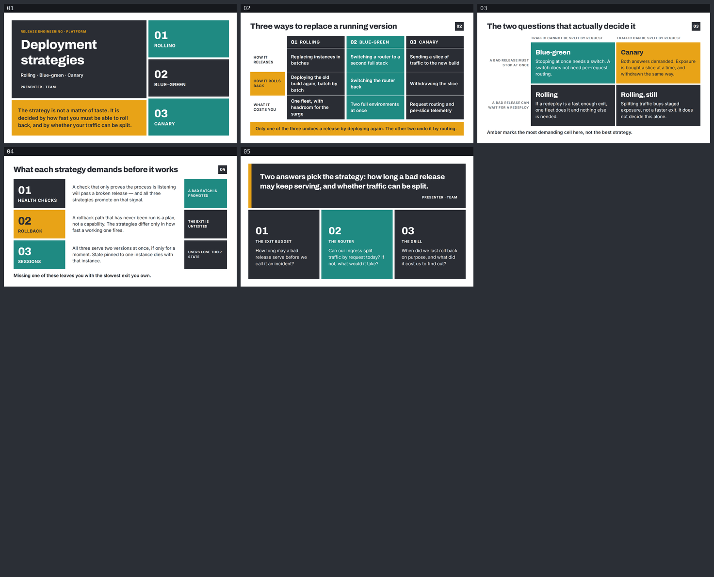

# deployment-strategies — Rolling, blue-green, canary

A five-slide English deck for the platform group that owns the release path and the service
teams whose releases go through it. Built with
[slides-grab](https://github.com/NomaDamas/slides-grab).

**[Open the viewer](https://jeonck.github.io/pt-slide/decks/deployment-strategies/viewer.html)** ·
[PDF](deployment-strategies.pdf)



| # | Sheet |
|---|---|
| 01 | Deployment strategies (cover) |
| 02 | Three ways to replace a running version |
| 03 | The two questions that actually decide it |
| 04 | What each strategy demands before it works |
| 05 | What we have to decide (closing) |

## What it argues

The strategy is not a matter of taste. It is decided by two answers: **how long a bad release
may keep serving**, and **whether traffic can be split by request**. Slide 02 lays the three
mechanisms side by side and shows that only one of them undoes a release by deploying again —
the other two undo it by routing. Slide 03 turns that into a 2×2 the two answers select a cell
in. Slide 04 says what all three need before any of them works: health checks that mean
something, a rollback that has actually been run, and sessions that survive two versions
serving at once. Slide 05 turns the two questions into three things this team has to settle.

## Style

- Bundled `ppt-bold-block-infographic-deck` — **assigned, not chosen.** Solid charcoal, amber
  and teal blocks on white; radius 0, no borders, no shadows, no gradients; 4–6pt white gutters;
  a block *is* a strategy, a quadrant, a prerequisite.
- Canvas 720pt × 405pt. Archivo 700/800 and Inter 400/600/700 embedded under `assets/fonts/`
  from npm `@fontsource/*`; both faces are named by the style spec's Typography section.
  Pretendard deleted — no Hangul here. No remote URLs in any saved slide.
- Exactly five colours in the whole deck, all spec tokens: `#FFFFFF`, `#2A2D34`, `#E8A317`,
  `#1F8A82`, `#6B6F76`.
- `PRESENTER · TEAM` on the cover and closing is a **placeholder**.

## What the spec decided, and what this deck decided

The spec decided the vocabulary. Slide 02 is its `diagram.comparison` (full-height colour-block
columns, 0.75pt white hairlines between rows, label + value). Slide 03 is its `matrix_2x2`
(four quadrants, white gutter, axis labels outside). Slide 05 is its `toc_divider_quote` quote
form (charcoal block, white pull-quote, 0.18in amber left bar). It also decided the faces, the
palette, and that density is the identity — no sheet is allowed to be one big statement.

This deck decided five things against it, all argued in `slide-outline.md`:

1. **No chart, and no invented figure anywhere.** The spec is unusually chart-forward — it
   fixes bar geometry, value-label type, delta colours and an emphasis rule. Every number that
   would fill one (rollback duration, change-failure rate, the cost multiple of two
   environments, canary bake time) would have to be invented or lifted from a benchmark that
   does not describe this platform. So the argument runs on mechanism and the chart tokens go
   unused. The only numerals in the deck are ordinals.
2. **Charcoal ink on amber, not the spec's white inversion.** White on `#E8A317` measures
   **2.17:1**. Charcoal on amber measures **6.46:1**. White inversion is kept on charcoal and
   teal, where it holds up.
3. **No running prose on teal.** White on `#1F8A82` is 4.19:1 — fine for short ≥14pt semibold
   labels and values, short of the 4.5:1 body bar. Teal blocks carry labels only.
4. **Amber never marks a recommended strategy.** The spec reserves amber for the recommended
   column and the recommended quadrant. Recommending one of the three would contradict the
   thesis, so amber marks the *rollback* thread instead — the thesis block (01), the
   `HOW IT ROLLS BACK` row (02), the most demanding quadrant (03), `ROLLBACK` (04), the quote
   bar (05). Slide 03's caption says so out loud.
5. **Type is at this framework's floors, not the spec's absolute points.** The spec targets
   13.33in; this canvas is 10in. Its 18pt body, 13pt card header and 11pt caption scale to
   13.5 / 9.75 / 8.25pt — all under the 14pt body and 10pt absolute floors. Body is 14pt and
   nothing is under 10pt. The spec's 200pt section number is unusable on a 405pt-tall sheet.

## The budget

Both halves were computed before a line of slide HTML was written — that is the step that
prevents the rework.

```
vertical    405 − padding (27 + 24) − header row (24pt × 1.3 + 14 margin) = 308.8pt for main
            on sheets 02–04. The 27pt sheet-number square rides the header row, so it costs
            no height — but its y depends on the title staying one line.
            Cover and closing have no header row: 405 − 48 = 357pt.

horizontal  content 660pt. The title shares its row with the sheet square (27 + 16 gap),
            leaving 584pt. Archivo 800 at 24pt → 584 ÷ (24 × 0.52) ≈ 46 chars → written
            to ≤ 42. Longest title is exactly 42.
            Comparison cells: 178pt block − 24 padding = 154pt; Inter 600 at 14pt →
            ≈ 22 chars/line, values capped at two lines.
```

**Both budgets held: 5/5 on the first validate, no title wrapped, and nothing slid under the
sheet square.** The horizontal coefficient was 4% low, though — Inter 400 at 14pt measures
**0.52**, not the 0.50 used here (a measured 131pt for 18 characters on slide 05). That is why
slide 05's first question wrapped to four lines while its siblings took three. Use 0.52 for
both faces next time.

## What the render caught that validate did not

| Sheet | Defect | Fix |
|---|---|---|
| 03 | Content top-aligned in each quadrant, leaving a large void under all four | Quadrants centre their content vertically |
| 03 | Both axis-rail labels broke into three ragged lines ending on one word ("ONCE", "REDEPLOY") | Rail widened 110 → 130pt; both now break in two |
| 05 | ~110px of dead space under each decision block, and question 01 wrapped to four lines while 02 and 03 took three — the three stopped reading as a set | Question 01 trimmed to three lines; all three blocks centre their content |
| 01, 05 | Presenter lines were muted `#6B6F76` on charcoal — 2.77:1, effectively invisible | Both set to white. Caught by computing the ratio, before the first render |
| 02 | The amber row-label cell had extra left padding the other two rail cells did not, which would have shifted only that label | All three rail cells carry the same padding; only the background changes |
| 05 | The amber quote bar *appeared* to stop short of the block's bottom edge | Not a defect — a pixel scan showed the bar and the block both span y 64–430 |

## Files

| Path | What |
|---|---|
| `slide-01.html` … `slide-05.html` | The slides — editable, searchable semantic HTML |
| `slide-outline.md` | Approved outline, tokens, both budgets, the amber rule, recorded deviations |
| `design-debt.md` | Accepted Minor/Note findings and the departures from the style spec |
| `gate-pass-a.md`, `gate-pass-b.md` | Design gate reports |
| `.slides-grab/` | Gate receipt and render evidence |
| `gate-preview/` | The 1080p PNGs that were opened and reviewed |
| `preview/` | The image embedded above (committed; GitHub serves repo `.html` as source) |
| `viewer.html`, `deployment-strategies.pdf` | Exports |

## Rebuild

```bash
npm install
npx slides-grab validate     --slides-dir decks/deployment-strategies
npx slides-grab png          --slides-dir decks/deployment-strategies --output-dir decks/deployment-strategies/gate-preview --resolution 1080p
node scripts/build-contact-sheets.mjs decks/deployment-strategies/gate-preview --web
npx slides-grab build-viewer --slides-dir decks/deployment-strategies
npx slides-grab pdf          --slides-dir decks/deployment-strategies --output decks/deployment-strategies/deployment-strategies.pdf --resolution 1080p
```

Run every one of these from the repo root — `cd`-ing into the deck folder makes slides-grab
look for `decks/deployment-strategies/decks/deployment-strategies`.

Editing a slide invalidates the gate receipt. Re-run validate → png → refresh the two pass
reports' fingerprints → `slides-grab design-gate --verdict proceed` before exporting.
