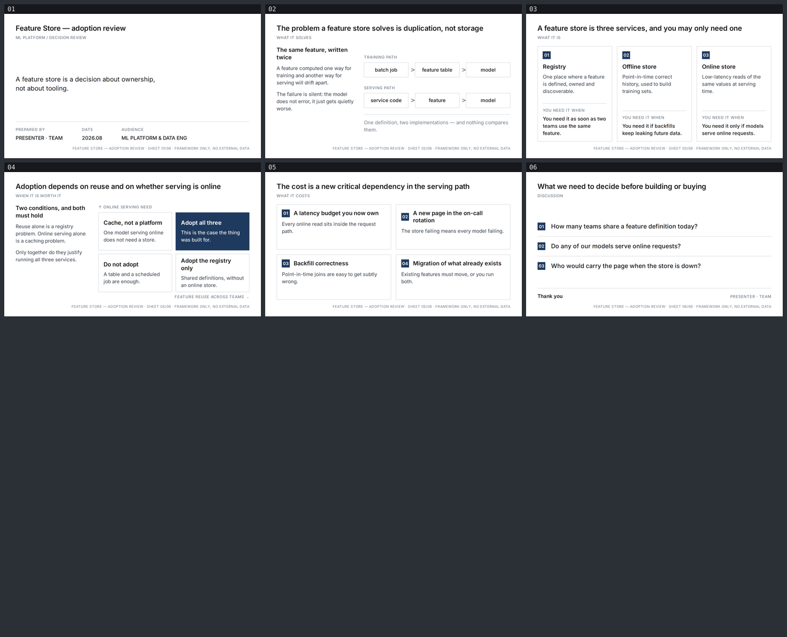

# feature-store — Feature Store adoption review

A six-slide English decision review for the ML platform and data engineering leads who would
own a feature store, and the manager deciding whether to fund one. Built with
[slides-grab](https://github.com/NomaDamas/slides-grab).

**[Open the viewer](https://jeonck.github.io/pt-slide/decks/feature-store/viewer.html)** ·
[PDF](feature-store.pdf)



| # | Action title |
|---|---|
| 01 | Feature Store — adoption review (cover) |
| 02 | The problem a feature store solves is duplication, not storage |
| 03 | A feature store is three services, and you may only need one |
| 04 | Adoption depends on reuse and on whether serving is online |
| 05 | The cost is a new critical dependency in the serving path |
| 06 | What we need to decide before building or buying |

Read the six titles alone and you have the recommendation — that is what a ghost deck is for.

- Style: bundled `ppt-mckinsey-ghost-deck` — white canvas, one grey, emphasis by **weight**
  rather than colour. The accent is spent exactly twice in the whole deck: the number badges,
  and the single filled quadrant on slide 04.
- Canvas 720pt × 405pt. Inter 400/500/600/700 embedded under `assets/fonts/`; no remote URLs,
  and no Pretendard, since there is no Hangul here.
- **No figures.** Adoption rates, latency numbers and cost savings for feature stores cannot be
  sourced, so slide 04's 2×2 is a **framework with no plotted bubbles** — quadrant labels only,
  because any position would be invented.
- `PRESENTER · TEAM` on the cover and closing is a **placeholder**.

## What the spec decided, and what this deck decided

The palette, the action-title band, the mandatory footnote, the asymmetric text-left /
diagram-right split and the one-filled-box emphasis rule all come from
`slides-grab show-design ppt-mckinsey-ghost-deck`. Three choices are this deck's:

- **The cover's title band is the deck name, not a declarative sentence.** Every other sheet
  obeys the rule; a cover that argues before introducing itself reads wrong.
- **Type sizes are not the spec's absolute points.** Its 18pt body and 10pt footnote target a
  13.33in canvas; scaled to 10in they fall under the framework's 14pt / 10pt floors.
- **The footnote carries sheet identity rather than a citation**, because there is no data.

## The budget

Both axes were computed before any slide was written — the style has a fixed band top and a
fixed footnote bottom, and the kicker sits directly under the action title, so a title that
wrapped would push the whole body down and the band would stop being constant:

```
vertical    405 − padding 47 − header 50 − margin 14 − footnote 26  = 268pt for main
horizontal  content 656pt; action title 20pt/600 → 656 ÷ (20 × 0.48) ≈ 68 → written to ≤64
```

Longest action title here is 62 characters. **Both budgets held: `validate` passed 6/6 on the
first run and the first render had no furniture collisions.** One fix was still needed — the
number badges used `line-height: 1`, which clips.

## Files

| Path | What |
|---|---|
| `slide-01.html` … `slide-06.html` | The slides — editable, searchable semantic HTML |
| `slide-outline.md` | Approved outline, tokens, both budgets, recorded deviations |
| `gate-pass-a.md`, `gate-pass-b.md` | Design gate reports |
| `.slides-grab/` | Gate receipt and render evidence |
| `preview/` | The image embedded above (committed; GitHub serves repo `.html` as source) |
| `viewer.html`, `feature-store.pdf` | Exports |

## Rebuild

```bash
npm install
npx slides-grab validate     --slides-dir decks/feature-store
npx slides-grab png          --slides-dir decks/feature-store --output-dir decks/feature-store/gate-preview --resolution 1080p
node scripts/build-contact-sheets.mjs decks/feature-store/gate-preview --web
npx slides-grab build-viewer --slides-dir decks/feature-store
```

Editing a slide invalidates the gate receipt. Re-run validate → png → refresh the two pass
reports' fingerprints → `slides-grab design-gate --verdict proceed` before exporting.
