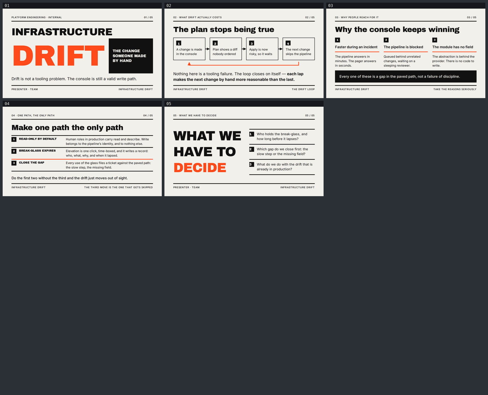

# iac-drift — Infrastructure drift: the change someone made by hand

A five-slide English deck for platform and infrastructure engineers, arguing that drift is not
a tooling problem — it is what happens when the console stays a valid way to change production,
and the fix is making one path the only path. Built with
[slides-grab](https://github.com/NomaDamas/slides-grab).

**[Open the viewer](https://jeonck.github.io/pt-slide/decks/iac-drift/viewer.html)** ·
[PDF](iac-drift.pdf)



| # | Sheet |
|---|---|
| 01 | Infrastructure **Drift** — the change someone made by hand (cover) |
| 02 | The plan stops being true — the drift loop, and why it feeds itself |
| 03 | Why the console keeps winning — three reasons, taken seriously |
| 04 | Make one path the only path — read-only, break-glass that expires, close the gap |
| 05 | What we have to decide (closing) |

## What it argues

The cost of drift is not the diff. It is that `plan` stops matching reality, so `apply` stops
being trusted, so the next change goes to the console too — a loop that closes on itself, and
each lap makes the next change by hand more reasonable than the last. Slide 02 draws that loop
rather than asserting it.

Slide 03 refuses to scold. The console wins on merit: it is faster than the pipeline during an
incident, the pipeline is often blocked behind unrelated work or a sleeping reviewer, and
sometimes the module simply has no field for what needs to change, so there is no valid code to
write. Each of those is a gap in the paved path, not a failure of discipline.

Slide 04 is the answer in the order it has to happen: read-only by default, a break-glass that
expires and writes a record, and — the move that gets skipped — closing the gap that sent
people to the console. Do the first two without the third and the drift just moves out of sight.

## The style

Bundled `ppt-swiss-editorial-bold` — **assigned, not chosen.** `slides-grab show-design` output
was treated as a contract, the `## Avoid` list especially.

- Canvas 720pt × 405pt. Archivo Black (display and labels) and Inter 400/500/600/700 (body and
  captions) embedded under `assets/fonts/` from `@fontsource/*` — 136KB, no remote URL in any
  saved slide. The Pretendard files the scaffolder copies in were deleted: there is no Hangul
  here and four faces is ~3MB of dead weight.
- `#F2F0EB` canvas, `#111111` blocks and rules, `#FF4A1C` as the single spot colour. Radius 0,
  no shadow, no gradient anywhere. The visual vocabulary is type, blocks and rule lines only —
  no icon, emoji or illustration appears in the deck, per the Avoid list.
- **No figures and no chart.** Drift rates, incident counts and "X% of outages are caused by
  manual change" are unsourceable, and the thesis is mechanical: a console that can write is a
  write path, so writes go through it. A mechanism does not need a percentage. `slide-outline.md`
  records this under "no figures, and why".
- `PRESENTER · TEAM` on the cover and closing is a **placeholder**.

## What the spec decided, and what this deck decided

The spec decided: the palette (all four hex values in the deck are spec tokens, verbatim — no
harmonic extension was needed), the two typefaces, radius 0, no shadow or gradient, no icons,
left-aligned asymmetric composition, the 12-column grid, and the diagram vocabulary — rectangle
nodes, 3pt rule connectors, filled-triangle arrowheads, square number badges.

This deck decided:

- **Point sizes are scaled, not copied.** The spec targets 13.33 × 7.5in; this canvas is 10in
  wide, a 0.75 factor. Display 130 → 97.5, heading 44 → 33, body 24 → 18, caption 14 → 10.5.
  Applied as: cover display 132pt (*larger* than the scaled value — "do not set type meekly
  small" is on the Avoid list and `DRIFT` is five characters), closing display 60pt, heading
  34pt, body 18pt, ledger labels 13pt caps, caption 11pt. Nothing anywhere is below 11pt.
- **Margins rounded to the 8pt unit**: 0.7in/0.6in scaled give 37.8/32.4pt → 40/32pt, so the
  content measure is a clean 640pt of 12 columns at 46.67pt with 8pt gutters.
- **One spot colour for the whole deck, not one per slide.** The spec permits a different spot
  per sheet; Pass A's system-consistency check wants a single accent. `#FF4A1C` is used on all
  five, and `#0047FF` is deliberately never used.
- **`#FF4A1C` never carries body copy** — it is about 3.4:1 on the canvas, fine for 60pt and
  132pt display type and for 3pt rules, not for text.
- **Leading floors beat the spec's leading.** The spec says body 1.35; this deck uses 1.45,
  1.2 for display, and 1.4 even inside the fixed 22pt number badges, because tighter values
  clip ascenders and descenders.
- **The return-loop arrowhead is an SVG `<marker>`, not a second `<polygon>`.** A separate
  arrowhead necessarily overlaps its own line's bounding box and raises `sibling-overlap`; as
  one element with the line it does not. Final validate is 0 warnings, not 1.

Accepted Minor and Note findings are in `design-debt.md`.

## The budget

```
vertical    405 − padding 32+32 − top rail 16 − rule 3 + margin 8 − main margin 16
                − bottom rule 3 + margin 12 − bottom rail 16 + margin 8   = 259pt for main
            content sheets spend another 57 on the 34pt heading row       = 202pt of content
            both rails are SIBLINGS of main, so main{flex:1;min-height:0} pins the rules to a
            constant y on all five sheets

horizontal  content 640pt.  Archivo Black mixed 34pt → 0.568 → 33 chars (titles written to ≤29)
            Archivo Black CAPS 13–19pt → 0.70 · CAPS 46pt → 0.71 · CAPS 60pt → 0.727
            Inter 400 14pt → 0.477 · 18pt → 0.466 · Inter 500 16pt → 0.486
            Inter 500 11pt CAPS +0.08em → 0.669
```

**Both budgets were computed before the first slide was written**, from advance widths measured
in headless Chromium rather than the skill's 0.48 rule of thumb — and that mattered
immediately: `INFRASTRUCTURE` at the spec's scaled 78pt display size is 695pt wide and does not
fit a 640pt canvas at all, which is why the cover sets it at 46pt and gives the giant-type
identity to `DRIFT` instead.

The measuring then had to be done **twice**. The pre-write pass under-read Archivo Black by ~29%
and Inter prose by ~17%, because the sample strings were letter-light. The numbers above are
re-measured off the rendered PNGs and are the ones to reuse. The cost of the first pass was one
real defect: at the planned 15pt, `READ-ONLY BY DEFAULT` needs 210pt in a 200pt cell, so it
wrapped, every ledger row grew, and slide 04's closing line overflowed `main` and landed under
the bottom rule on top of the footer caption. `validate` reported 5/5 passing while that was on
screen — a child overflowing its parent is neither an overflow nor a sibling overlap.

Five defects in total were found by opening the renders, four of which `validate` passed. They
are listed sheet by sheet in `slide-outline.md` under "what the render caught".

## Files

| Path | What |
|---|---|
| `slide-01.html` … `slide-05.html` | The slides — editable, searchable semantic HTML |
| `slide-outline.md` | Approved outline, contract, recorded decisions, both budgets, render findings |
| `design-debt.md` | Minor/Note findings accepted at the gate, with what would resolve each |
| `gate-pass-a.md`, `gate-pass-b.md` | Design gate reports |
| `.slides-grab/` | Gate receipt and render evidence |
| `gate-preview/` | Full-size 1080p PNGs, the evidence actually looked at |
| `preview/` | The contact sheet embedded above (committed; GitHub serves repo `.html` as source) |
| `viewer.html`, `iac-drift.pdf` | Exports (PDF 368KB at 1080p) |

## Rebuild

```bash
npm install
npx slides-grab validate     --slides-dir decks/iac-drift
npx slides-grab png          --slides-dir decks/iac-drift --output-dir decks/iac-drift/gate-preview --resolution 1080p
node scripts/build-contact-sheets.mjs decks/iac-drift/gate-preview --web
npx slides-grab build-viewer --slides-dir decks/iac-drift
npx slides-grab pdf          --slides-dir decks/iac-drift --output decks/iac-drift/iac-drift.pdf --resolution 1080p
```

Run every one of these **from the repo root** — `cd`-ing into the deck folder makes slides-grab
look for `decks/iac-drift/decks/iac-drift`.

Editing a slide invalidates the gate receipt. Re-run validate → png → **look at the renders** →
refresh the two pass reports' fingerprints → `slides-grab design-gate --verdict proceed` before
exporting.
