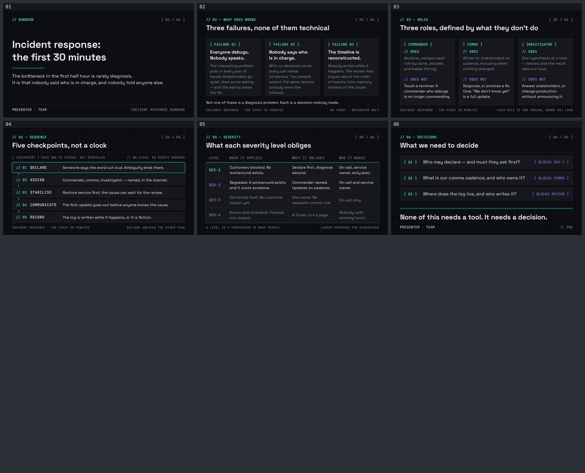

# incident-response — Incident response: the first 30 minutes

A six-slide English runbook for the people who get paged and the people who have to tell
everyone else what is happening. Built with
[slides-grab](https://github.com/NomaDamas/slides-grab).

**[Open the viewer](https://jeonck.github.io/pt-slide/decks/incident-response/viewer.html)** ·
[PDF](incident-response.pdf)



| # | Sheet |
|---|---|
| 01 | Incident response: the first 30 minutes (cover) |
| 02 | Three failures, none of them technical |
| 03 | Three roles, defined by what they don't do |
| 04 | Five checkpoints, not a clock |
| 05 | What each severity level obliges |
| 06 | What we need to decide |

## What it argues

The bottleneck in the first half hour is rarely diagnosis. It is that nobody said who is in
charge, and nobody told anyone outside the room. So the deck spends none of its six sheets on
debugging technique and all of them on the three things that are decided in the first minutes
or not at all: **who is in charge, who is talking to the outside, and who is writing it down.**

Every claim is argued from mechanism — what breaks, and why it breaks that way — never from a
statistic. Sheet 02 names the three failure modes and the mechanism behind each. Sheet 03
defines each role by its prohibition, because the roles fail by drift, not by ignorance: a
commander who opens a terminal has stopped commanding. Sheet 04 is the sequence. Sheet 05 is
the ladder that says who a severity level lets you wake. Sheet 06 is what the room has to
settle before any of it is real.

## Style

- Bundled **`ppt-dark-tech`** — **assigned, not chosen.** Charcoal `#0C0D10` canvas under a
  faint 0.5in machine grid, neon cyan and violet, monospace for anything that is metadata.
  `slides-grab show-design ppt-dark-tech` was treated as a contract, its `## Avoid` list
  included.
- Canvas 720pt × 405pt. **Space Grotesk 400/500/700 and JetBrains Mono 400/500** — the faces
  the spec names — embedded under `assets/fonts/` from npm `@fontsource/*` (116KB total). The
  Pretendard the scaffolder copies in was deleted: there is no Hangul here and it was 3MB of
  dead weight. No remote URL survives in any saved slide.
- `PRESENTER · TEAM` on the cover and the closing sheet is a **placeholder**. No name invented.

## What the spec decided, and what I decided

**The spec decided:** the charcoal ground and the 0.5in grid; both accents and the rule that
there are only two; Space Grotesk and JetBrains Mono; that every meta label, index and column
head is monospace; that depth is a `0 0 8px` neon glow and never a diffuse shadow; that the
one container is a code-block node at `#16181D` with a 1px `#2A2D35` border and a 4px radius;
that emphasis is a 1px neon border with a glow; that connectors are straight, never curved.

**I decided:**

- **No chart, no KPI card, no number presented as measured.** The style offers a whole chart
  vocabulary and a 44pt neon KPI value, and both are unused. MTTR, incident counts and
  benchmarks cannot be sourced for this audience, and an unsourced figure in 44pt neon is
  exactly what the design gate treats as fabricated data. **Sheet 04 in particular carries no
  minute markers** — `0:00 / 0:05 / 0:15` ticks would be claimed durations dressed as
  measurement, and they are also wrong as advice, because the first half hour is a set of
  checkpoints that get *passed*, not slots on a timer. The sheet says so in its own caption
  (`EACH ONE IS PASSED, NOT SCHEDULED` / `// NO CLOCK, NO MINUTE MARKERS`). Sheet 05's ladder
  is footnoted `LADDER PROPOSED FOR DISCUSSION` so it cannot be mistaken for policy or for
  measured practice, and it states obligations rather than response times. Sheet 02's footer
  reads `NO CHART · MECHANISM ONLY`. The only number in the deck is "30 minutes" in the title,
  which names the window everyone already talks about rather than measuring anything.
- **The 0.5in grid is a base64 SVG tile, not a `repeating-linear-gradient`.** The usual way to
  draw a grid background is a gradient, and gradients are forbidden twice over — by the
  style's Avoid list and by the repo's slide rules.
- **Sheet 04 turns the process flow 90°.** The spec wants 4–5 horizontal steps; five columns
  across 652pt leave ~13 characters a line at the 14pt body floor, and the alternative is type
  under 14pt, which is a gate Critical. The vertical hierarchy form is the same vocabulary —
  code-block nodes, straight 1.5pt cyan connectors, mono `// 01`, one glowing active node.
- **Sheet 05's tiers keep a common width** instead of narrowing as `hierarchy_funnel` asks.
  The tiers carry four aligned columns; narrowing them would break the row-to-row comparison
  that is the whole point of a ladder.
- **Type is the framework's floors, not the spec's absolute points.** The spec targets 13.33in;
  this canvas is 10in, where its 17pt body and 11pt caption scale to ~12.75pt and ~8.25pt —
  both under the 14pt body / 10pt absolute floors.
- **Violet has exactly one job.** Cyan marks what you must do; violet marks what you must not,
  and nothing else — the `// DOES NOT` heads, the SEV-2 label, the `[ BLOCKS … ]` tags.

Nothing needed a colour outside the seven spec tokens, so `design-debt.md` records no colour
debt. What it does record is the four accepted Minor/Note findings and the two deviations above.

## The budget

Computed before a single slide was written — both axes, because the sheets carry fixed
furniture (a mono kicker row, a one-line H1, a hairline, a mono footer) that overrunning
content slides under without `validate` ever complaining.

```
vertical (02–05)  405 − padding 46 − kicker 25.2 − H1 40.2 − hairline 13.75 − footer 26.4
                  = 253.45pt for main
vertical (06)     no footer, so main = 279.85pt
vertical (01)     359pt of column; 227.4pt of content, the slack split 0.8 : 1 around the
                  title block so the cover reads as composition rather than a hole
horizontal        content 652pt; chars ≈ width ÷ (font-size × 0.48)
                  H1 at 26pt → ≈52 chars → written to ≤46. Longest H1 is 42.
                  cover 38pt → ≈35 per line → written to ≤24
                  sheet-04 prose over 442pt at 14pt → ≈65 → written to ≤62
                  three-column cards: 178.7pt of text → ≈26 chars a line, 5 body lines max
```

**Both budgets held: 6/6 on the first `validate`, no overflow, no wrapped H1, nothing under
the furniture.** The horizontal estimate was the weaker half — 0.48 is the repo's measured
coefficient for Latin sans, and Space Grotesk 700 runs closer to 0.49, which was enough to
push one card title on sheet 02 to a third line. That is why the render check is not optional.

### What only the renders showed

Four defects, none of them visible to `validate`, all fixed before the gate:

1. **A ~50pt void inside every question card on sheet 06.** That sheet has no footer, so `main`
   is 279.85pt while three stretched cards needed ~153pt, and the surplus opened between each
   question and its bottom-pinned tag. Growing the type to fill it pushed the questions to four
   lines and overflowed instead. Rebuilt as three single-line rows in sheet 04's rhythm — a
   vertically-centred line cannot open that void at any container height.
2. **Sheet 02's third card title wrapped to three lines** while the other two took two, dropping
   that card's body a line below its siblings and breaking the row the three cards read as.
3. **Sheet 05's column heads rendered at body size** — `.head p` outranked `.cap` on specificity
   and silently overrode 11pt with 14pt, so the heads competed with the rows instead of
   labelling them.
4. **The cover's slack was all in one block** below the thesis, which reads as a hole rather
   than as composition.

## Files

| Path | What |
|---|---|
| `slide-01.html` … `slide-06.html` | The slides — editable, searchable semantic HTML |
| `slide-outline.md` | Approved outline, tokens, both budgets, the no-chart reasoning, recorded deviations |
| `design-debt.md` | Accepted Minor/Note findings; records that there is no colour debt |
| `gate-pass-a.md`, `gate-pass-b.md` | Design gate reports |
| `.slides-grab/` | Gate receipt and render evidence |
| `gate-preview/` | Full-resolution render PNGs (not committed — see `.gitignore`) |
| `preview/` | The contact sheet embedded above (committed; GitHub serves repo `.html` as source) |
| `viewer.html`, `incident-response.pdf` | Exports |

## Rebuild

```bash
npm install
npx slides-grab validate     --slides-dir decks/incident-response
npx slides-grab png          --slides-dir decks/incident-response --output-dir decks/incident-response/gate-preview --resolution 1080p
node scripts/build-contact-sheets.mjs decks/incident-response/gate-preview --web
npx slides-grab build-viewer --slides-dir decks/incident-response
npx slides-grab pdf          --slides-dir decks/incident-response --output decks/incident-response/incident-response.pdf --resolution 1080p
```

Run every one of these from the repo root. `cd`-ing into the deck folder makes slides-grab
look for `decks/incident-response/decks/incident-response` and fail.

Editing a slide invalidates the gate receipt. Re-run validate → png → **open the PNGs** →
refresh the two pass reports' fingerprints
(`sha256sum slide-0*.html | awk '{print $2": "$1}'`) →
`slides-grab design-gate --verdict proceed` before exporting.
