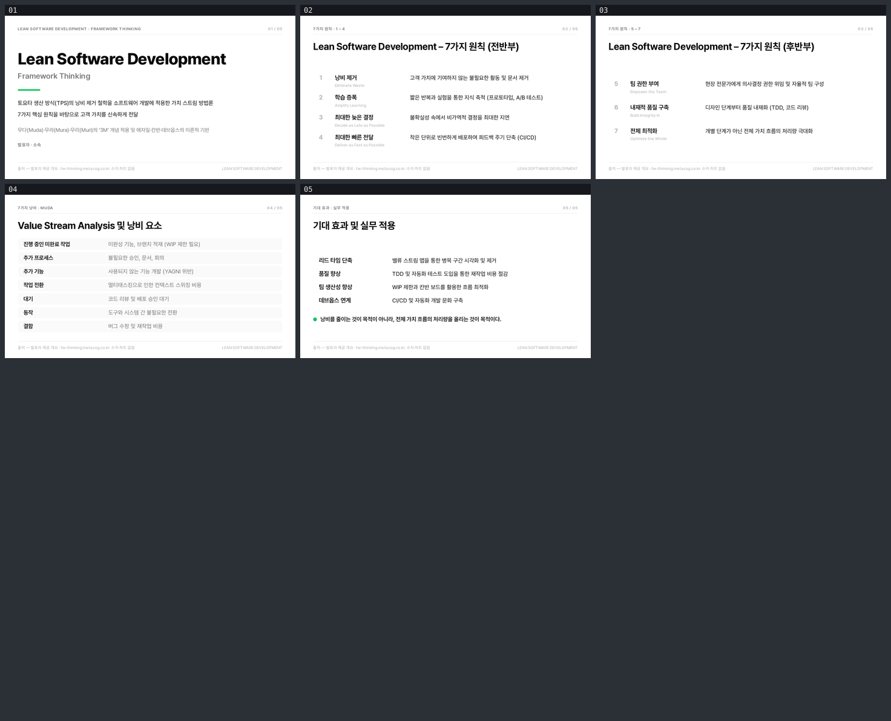

# Lean Software Development — Framework Thinking

`slides-grab`으로 만든 한국어 5장 덱. 스타일은 [`ppt-naver-integrated-report-award`](../style-showcase/).



**[뷰어 열기](https://jeonck.github.io/pt-slide/decks/lean-software-development/viewer.html)** ·
[PDF](lean-software-development.pdf) · [이미지](preview/)

## 구성

| # | 제목 | 내용 |
|---|---|---|
| 01 | Lean Software Development / Framework Thinking | TPS 낭비 제거 철학의 소프트웨어 적용, 3M, 애자일·칸반·데브옵스의 이론적 기반 |
| 02 | 7가지 원칙 (전반부) | 낭비 제거 · 학습 증폭 · 최대한 늦은 결정 · 최대한 빠른 전달 |
| 03 | 7가지 원칙 (후반부) | 팀 권한 부여 · 내재적 품질 구축 · 전체 최적화 |
| 04 | Value Stream Analysis 및 낭비 요소 | 소프트웨어 개발의 7가지 낭비(Muda) |
| 05 | 기대 효과 및 실무 적용 | 리드 타임 · 품질 · 팀 생산성 · 데브옵스 연계 |

## 판단한 것과 그 이유

**본문은 사용자가 장별로 지정해 준 원문이다.** 이 덱은 주제만 받아 내용을 구성한 다른 덱들과 다르다.
제목·항목명·설명 문구를 다듬거나 늘리거나 줄이지 않았고, 5장 구성과 각 장의 항목도 준 그대로다.
레이아웃이 안 맞을 때 카피를 줄이는 것이 이 저장소의 기본 전략이지만, 여기서는 **원문 대신 레이아웃을
고쳤다** — 슬라이드 4가 `main`을 5.8pt 넘쳤을 때 문구가 아니라 행 패딩을 6pt에서 4pt로 줄였고,
표지에서 두 줄로 감긴 문장은 실측한 필요 폭(484.5pt, 474.8pt)에 맞춰 측정 폭을 470pt에서 512pt로
넓혔다.

**스타일을 이걸로 고른 이유.** 한국어 전용 덱인데 이 환경에 한글 서체는 Pretendard 하나뿐이다. 후보
중 이 스타일만 `korean_primary`가 Pretendard 자체라, 스펙이 지정한 서체와 실제 렌더되는 서체가
일치한다. `ppt-strategy-navy-deck`(PT Serif)이나 `ppt-samsung-ir-restrained`(Manrope)는 한글
글리프가 없어 제목이 조용히 폴백으로 그려진다. 두 번째 이유는 이 덱이 전부 "라벨 + 설명" 목록이고
이 스타일의 데이터 카드 그리드와 보고서 밀도가 그 모양 그대로라는 점이다.

**수치와 차트가 없다.** 준 개요에 수치가 없고, 이 저장소는 출처를 댈 수 있는 데이터가 없다. 스타일이
가진 차트 5색·데이터 카드 숫자 토큰은 선언만 되어 있고 쓰지 않았다. 모든 시트의 footer가 이 사실을
밝힌다.

**출처 표기.** 사용자가 슬라이드 1 제목에 링크로 준 주소는
`https://fw-thinking.metacog.co.kr/docs/software-engineering/lean/`다. **이 환경의 egress 프록시가
막고 있어 열어보지 못했다.** 그 문서를 읽고 인용한 것이 아니라 사용자가 지정한 출처를 표기만 한
것이므로, 캡션은 "발표자 제공 개요"라고 적는다.

**그린은 두 곳뿐.** 스펙의 Avoid가 `#03C75A`를 장식색으로 남발하지 말라고 못 박는다. 표지의 4pt 바와
슬라이드 5의 마무리 도트에만 썼다.

**`발표자 · 소속`은 자리표시자다.** 발표 전에 채울 것.

## 실측한 한글 가로 계수

이 저장소의 첫 한글 덱 이후 처음으로 한글 폭을 실측했다(Pretendard 로드 확인 후 헤드리스 크로미움):

| | 계수 |
|---|---|
| 순한글 본문 14pt | 0.70 – 0.72 |
| 한글 + 영문·괄호 혼합 14pt | 0.63 – 0.66 |
| 한글 제목 28pt | 0.725 |

영문 산세리프의 0.48과는 다른 영역이다. 가장 긴 본문
"짧은 반복과 실험을 통한 지식 축적 (프로토타입, A/B 테스트)"이 14pt에서 329.3pt이므로, 설명 칼럼을
428pt로 잡으면 7원칙·7낭비의 모든 설명이 한 줄에 들어간다.

## 다시 만들기

```bash
npx slides-grab validate     --slides-dir decks/lean-software-development
npx slides-grab png          --slides-dir decks/lean-software-development --output-dir decks/lean-software-development/gate-preview --resolution 1080p
npx slides-grab build-viewer --slides-dir decks/lean-software-development
node scripts/patch-viewer.mjs decks/lean-software-development
npx slides-grab pdf          --slides-dir decks/lean-software-development --output decks/lean-software-development/lean-software-development.pdf --resolution 1080p
```

슬라이드를 고치면 게이트 영수증이 무효가 된다. `gate-pass-a.md` / `gate-pass-b.md`의 지문을 갱신하고
`design-gate --verdict proceed`를 다시 받아야 `pdf`가 돈다.
