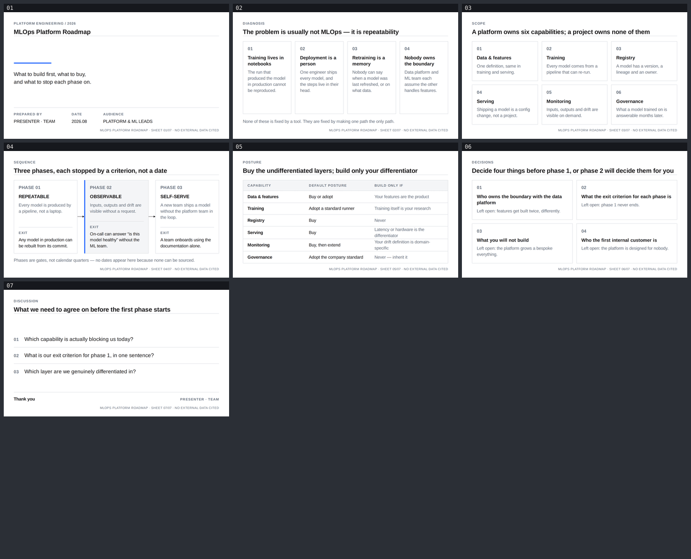

# mlops-platform — MLOps Platform Roadmap

A seven-slide English deck for platform and ML engineering leads deciding what to build
first, and for the leadership funding it. Built with
[slides-grab](https://github.com/NomaDamas/slides-grab).

**[Open the viewer](https://jeonck.github.io/pt-slide/decks/mlops-platform/viewer.html)** ·
[PDF](mlops-platform.pdf)



| # | Action title | Job |
|---|---|---|
| 01 | MLOps Platform Roadmap | Cover |
| 02 | The problem is usually not MLOps — it is repeatability | Four symptoms and what they indicate |
| 03 | A platform owns six capabilities; a project owns none of them | The capability map |
| 04 | Three phases, each stopped by a criterion, not a date | Repeatable → Observable → Self-serve, with exit criteria |
| 05 | Buy the undifferentiated layers; build only your differentiator | Posture per capability |
| 06 | Decide four things before phase 1, or phase 2 will decide them for you | Decisions and their failure modes |
| 07 | What we need to agree on before the first phase starts | Discussion |

- Style: bundled `ppt-consulting-precision-grid` — 12-column strict grid, hairline boxes,
  grey body, a single accent. Read the action titles alone and you have the argument.
- Canvas 720pt × 405pt. Arimo 400/700 embedded under `assets/fonts/`; no remote URLs, and
  no Pretendard, since there is no Hangul here.
- **No figures.** Adoption rates, cycle-time gains and cost numbers for MLOps are exactly
  what cannot be sourced, so the deck argues from sequence and ownership. Slide 04 says so
  outright: phases are gates, not quarters.
- `PRESENTER · TEAM` on the cover and closing is a **placeholder**.

## What the spec decided, and what this deck decided

The palette, the strict grid, the action-title header band, the mandatory source caption and
the hairline diagram language all come from
`slides-grab show-design ppt-consulting-precision-grid`. Three choices are this deck's, and
are recorded in `slide-outline.md`:

- **Arimo substitutes for Arial.** The spec names Arial, which cannot be embedded. Arimo is
  metric-compatible and open, and the spec's own fallback chain already expects an
  Arial-metric face.
- **Type sizes are not the spec's absolute points.** Its 16pt body and 9pt caption target a
  13.33in canvas; scaled to 10in they become 12pt and 6.75pt, under the framework's floors.
- **The source caption carries sheet identity rather than a citation**, because the deck
  presents no data. Dropping it would break the style's signature; inventing a source would
  be worse.

### The height budget

The style has fixed furniture top and bottom, so the layout was budgeted before any slide was
written:

```
405 − padding 42 − header band 54 − rule and margin 17 − caption and margin 26 = 266pt for main
```

Every sheet was laid out against that 266pt, and **the action title is held to one line** so
the hairline rule lands at the same y on all seven. That constant is what makes the grid read
as strict — four titles were shortened to keep it.

## Files

| Path | What |
|---|---|
| `slide-01.html` … `slide-07.html` | The slides — editable, searchable semantic HTML |
| `slide-outline.md` | Approved outline, design tokens, height budget, recorded deviations |
| `gate-pass-a.md`, `gate-pass-b.md` | Design gate reports |
| `.slides-grab/` | Gate receipt and render evidence |
| `preview/` | The image embedded above (committed; GitHub serves repo `.html` as source) |
| `viewer.html`, `mlops-platform.pdf` | Exports |

## Rebuild

```bash
npm install
npx slides-grab validate     --slides-dir decks/mlops-platform
npx slides-grab png          --slides-dir decks/mlops-platform --output-dir decks/mlops-platform/gate-preview --resolution 1080p
node scripts/build-contact-sheets.mjs decks/mlops-platform/gate-preview --web
npx slides-grab build-viewer --slides-dir decks/mlops-platform
```

Editing a slide invalidates the gate receipt. Re-run validate → png → refresh the two pass
reports' fingerprints → `slides-grab design-gate --verdict proceed` before exporting.
