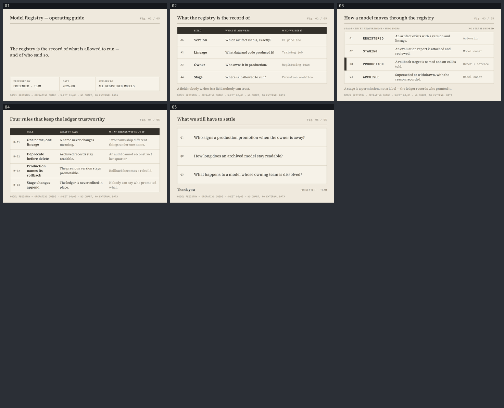

# model-registry — Model Registry operating guide

A five-slide English operating guide for the ML platform team that runs the registry and the
model owners who have to live by its rules. Built with
[slides-grab](https://github.com/NomaDamas/slides-grab).

**[Open the viewer](https://jeonck.github.io/pt-slide/decks/model-registry/viewer.html)** ·
[PDF](model-registry.pdf)



| # | Sheet |
|---|---|
| 01 | Model Registry — operating guide (cover) |
| 02 | What the registry is the record of — version, lineage, owner, stage |
| 03 | How a model moves through the registry — the promotion ledger |
| 04 | Four rules that keep the ledger trustworthy |
| 05 | What we still have to settle |

- Style: bundled `ppt-archival-index-deck` — paper-beige canvas, serif prose with monospace
  index codes, rule lines instead of arrows. Chosen because a registry **is** an index, and
  this style is a library catalogue.
- Canvas 720pt × 405pt. Source Serif 4 400/600 and IBM Plex Mono 400/500 embedded under
  `assets/fonts/`; no remote URLs, no Pretendard, since there is no Hangul here.
- **No figures and no chart.** Registry adoption counts and audit findings cannot be sourced.
  The style makes a figure number and footnote mandatory *for charts*; with no chart, the
  footnote carries the sheet identity instead.
- `PRESENTER · TEAM` on the cover and closing is a **placeholder**.

## Constraints this style imposes that the others did not

- **No accent colour exists in the spec.** Emphasis is ink-brown solid fill or a 45° hatch —
  the deck's only emphasis is the table header rows and the left bar on the PRODUCTION row.
- **No arrow connectors.** The spec forbids them; the promotion sequence on slide 03 reads
  through monospace number continuity and rule lines, which is how a ledger works anyway.
- **Serif body, monospace only for index codes, values and captions.** Mixing the two is the
  signature; making the body monospace would be a different style entirely.
- **Dense is correct.** The Avoid list warns against leaving sheets empty, so the four content
  sheets are full tables rather than airy ones.

## The budget

```
vertical    405 − padding 46 − title row 38 − rule and margin 15 − footnote 26 = 280pt for main
horizontal  content 656pt; the title shares its line with the Fig. marker, leaving ~546pt.
            Source Serif 600 at 20pt → 546 ÷ (20 × 0.50) ≈ 54 chars → written to ≤50.
```

The skill's 0.48 coefficient was measured on a sans; serif runs slightly wider, so this used
0.50 and checked the render. Longest title here is 43 characters. **Both budgets held: 5/5 on
the first validate, and the first render had no collisions and no wrapped titles.** One fix was
needed — the emphasis bar on slide 03 shifted its row 9pt right and broke the index column
alignment, so every row now carries the same border width and only the colour changes.

## Files

| Path | What |
|---|---|
| `slide-01.html` … `slide-05.html` | The slides — editable, searchable semantic HTML |
| `slide-outline.md` | Approved outline, tokens, both budgets, recorded deviations |
| `gate-pass-a.md`, `gate-pass-b.md` | Design gate reports |
| `.slides-grab/` | Gate receipt and render evidence |
| `preview/` | The image embedded above (committed; GitHub serves repo `.html` as source) |
| `viewer.html`, `model-registry.pdf` | Exports |

## Rebuild

```bash
npm install
npx slides-grab validate     --slides-dir decks/model-registry
npx slides-grab png          --slides-dir decks/model-registry --output-dir decks/model-registry/gate-preview --resolution 1080p
node scripts/build-contact-sheets.mjs decks/model-registry/gate-preview --web
npx slides-grab build-viewer --slides-dir decks/model-registry
```

Editing a slide invalidates the gate receipt. Re-run validate → png → refresh the two pass
reports' fingerprints → `slides-grab design-gate --verdict proceed` before exporting.
