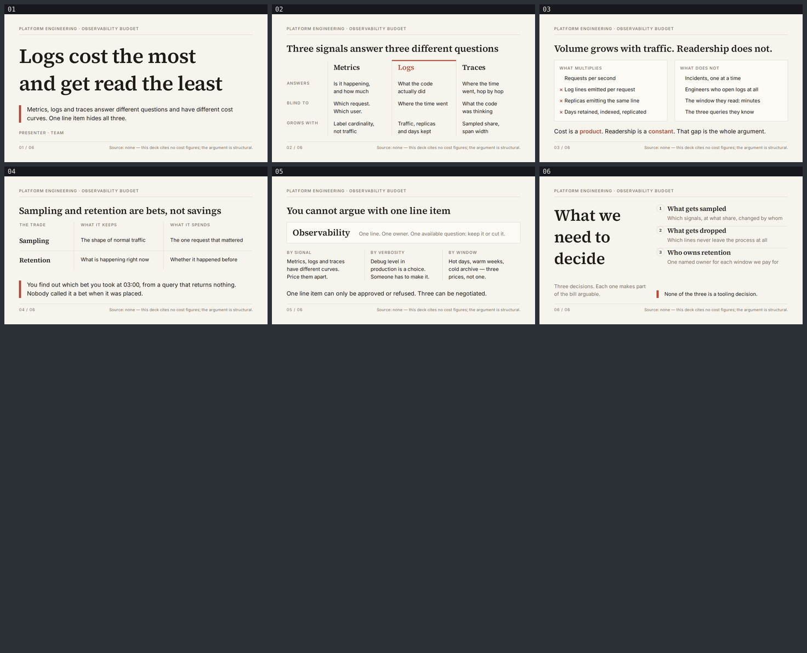

# observability-cost — Logs cost the most and get read the least

A six-slide English deck for the people who sign the observability invoice and the platform
engineers who generated it. It argues that metrics, logs and traces answer different questions
and have different cost curves, so treating them as one "observability" line item is what makes
the bill both large *and* unarguable. Built with
[slides-grab](https://github.com/NomaDamas/slides-grab).

**[Open the viewer](https://jeonck.github.io/pt-slide/decks/observability-cost/viewer.html)** ·
[PDF](observability-cost.pdf)



| # | Sheet |
|---|---|
| 01 | Logs cost the most and get read the least (cover) |
| 02 | Three signals answer three different questions — what each one is blind to, and what makes each one expensive |
| 03 | Volume grows with traffic. Readership does not. — what multiplies against what does not |
| 04 | Sampling and retention are bets, not savings — what each keeps, what each spends, and when you find out |
| 05 | You cannot argue with one line item — the three axes that unbundle it |
| 06 | What we need to decide (closing) |

## What it argues

**02** refuses the substitution move before the cost argument starts. Metrics answer *is it
happening and how much* and are blind to which request; logs answer *what the code actually
did* and are blind to where the time went; traces answer *where the time went, hop by hop* and
are blind to what the code was thinking. They are not three prices for one thing, so "turn
observability down" is not a decision anyone can actually make.

**03** is the cost argument, and it is made structurally because there is no sourced number to
make it with. Log volume is a **product** — requests per second × log lines per request ×
replicas emitting the same line × days retained, indexed and replicated. Log readership is a
**constant** — incidents happen one at a time, a bounded number of engineers ever open a log,
they read a window of minutes, and they run queries they already know. A product beats a
constant no matter what the constants are. That is the whole magnitude claim, and it does not
need a magnitude.

**04** takes the two standard levers seriously rather than recommending them. Sampling keeps the
shape of normal traffic and spends the one request that mattered. Retention keeps what is
happening right now and spends whether it happened before. Neither is a saving; both are bets.
And the sheet names the case the brief asked for: you find out which bet you took at 03:00, from
a query that returns nothing, and nobody called it a bet when it was placed.

**05** is why none of this gets argued today. A single line item admits exactly two responses,
approve and refuse. Split it by signal, by verbosity and by retention window and each becomes a
negotiation with a right answer — which is what makes **06**'s three decisions askable: what
gets sampled, what gets dropped, who owns retention.

## No figures, and why

**There is no chart, no bar, no cost-per-GB, no retention curve and no percentage anywhere in
this deck.** The only digits in the visible copy are the page numbers, the decision indices 1–3,
and `03:00` on slide 04.

A cost argument pulls very hard toward a figure, and this was the deck's largest content risk.
Every number that would fit here — "logs are N× the metrics bill", "$X per GB per month",
"Y% of log lines are never queried" — exists in vendor marketing and nowhere this repo can cite.
Inventing one is Critical under the gate's content-discipline check, and it would also be the
weakest part of the argument, because both claims are structural: a product grows faster than a
constant, and signals that answer different questions are not substitutes at any price.

So the deck says so, to the audience, in the style's own mandatory fixed bottom-right
source-caption slot, on **all six sheets**:

> Source: none — this deck cites no cost figures; the argument is structural.

Two consequences follow and are recorded rather than hidden: the style's chart tokens `#C8BFAD`
and `#9B917F` are **declared and never used**, and so is its 40pt `kpi` token. `PRESENTER · TEAM`
on the cover is a **placeholder** — no name is invented either.

## The style, and why this one

Bundled **`ppt-editorial-product-deck`**, chosen from a shortlist of three
(`ppt-every-golden-grid-keynote`, `ppt-editorial-product-deck`, `ppt-expressive-material`).
`slides-grab show-design` output was treated as a contract, the `## Avoid` list especially.

It won on three specific counts:

1. **This deck has no data and this style does not need any.** Its stated hierarchy comes from
   *typeface contrast* — serif headings against sans body — not from colour, KPI tiles or chart
   blocks. `ppt-every-golden-grid-keynote` carries a 55pt `kpi` token, eight chart tokens, and
   an Avoid rule against leaving a golden block holding one element — all of which push toward
   figures that cannot be sourced. `ppt-expressive-material` is four accents, 28pt blobs and
   "playful", which is the wrong register for an invoice nobody can argue with.
2. **It has exactly one accent.** The argument has exactly one villain, so one terracotta marks
   the Logs column and nothing else competes with it.
3. **It has a mandatory `slide.source_caption: fixed bottom-right`.** That is the slot the
   no-figures fact belongs in, and it is the only one of the three styles that defines one.

The cream canvas also does not collide with any deck already in this repo.

- Canvas 720pt × 405pt. **Source Serif 4** 400/600 (headings, display, ledger terms, badge
  numerals) and **Inter** 400/500/600 (body, labels, captions) embedded under `assets/fonts/`
  from `@fontsource/*` — 136KB, and **no `http(s):` URL appears in any saved slide**. The four
  Pretendard faces the scaffolder copies in were deleted: there is no Hangul here and they are
  ~3MB of dead weight.
- `#F7F4EE` cream canvas, `#FCFAF5` surface on three elements, `#1F1B16` ink, `#7A7164`
  secondary, `#DAD3C4` hairlines, `#B5503A` as the single accent. Radius 4px, **no shadow, no
  gradient, no icon, no emoji, no SVG** — grepped and confirmed zero hits for each.
- **Every colour in the deck is a spec token, verbatim.** No harmonic extension was needed, so
  there is nothing in the palette that is not traceable to the published style.

## What the spec decided, and what this deck decided

The spec decided the palette, the two typefaces and their roles, the 12-column grid, the cream
(never white) canvas, the shadowless 4px surface panels, the 0.75pt hairline system, the
left-aligned composition, the fixed bottom-right source caption, and the diagram vocabulary —
2–3 column comparisons with vertical dividers and no column fill, and 0.34in no-fill step badges
with serif numerals.

This deck decided:

- **Point sizes are scaled by 0.75, then floored.** The spec targets 13.33 × 7.5in; this canvas
  is 10 × 5.625in. Straight scaling puts the kicker at 8.25pt, body at 13.5pt and caption at
  7.5pt — all under the framework's floors. So kicker, micro labels and the source caption are
  held at **11pt**, body is **16pt** (secondary 14pt), and the cover and closing display are set
  *above* the scaled value at **56pt** and **44pt**, because the gate wants a real anchor on
  those two sheets and this deck has no image or figure to supply one. **Nothing anywhere is
  below 11pt.**
- **Margins rounded to the 8pt unit**: 0.8in/0.65in scaled give 43.2/35.1pt → **40/32pt**, so
  the content measure is a clean **640pt** — 12 columns of 46pt with 8pt gutters.
- **Serif leading is 1.35, not the spec's 1.15.** Source Serif 4's ascent + descent exceeds
  1.15em, so the first build failed `validate` with `text-clipped` on *every* serif heading, at
  18, 20, 24, 26, 44 **and** 56pt. This is a face-metrics problem, not a large-type problem.
  `line-height: 1` appears nowhere in the deck.
- **`#7A7164` is secondary ink only.** Measured at **4.39:1** on the cream — over the 4:1 bar for
  supporting text, under 4.5:1 for body. It carries kickers, micro labels, captions and
  qualifiers, never a sentence carrying an argument. All argument prose is `#1F1B16` (~15:1).
- **The accent is rule, not ink.** `#B5503A` measures 4.58:1 and would be legal as text, but it
  appears as a 6pt left rule on three sheets, a 3pt top rule on 02, and exactly three coloured
  words in the whole deck (`Logs`, `product`, `constant`), all at 16pt or larger.
- **`rule left 0.12in #B5503A` is read as a left-edge rule**, scaled to 6pt, not as a segment of
  the hairline — the only reading that is visible at this scale.
- **Emphasis never changes a box.** All three signal columns on 02 carry
  `border-top: 3pt solid transparent`; only the Logs column's *colour* changes. This is the
  "emphasise one and only that one shifts out of column" trap, avoided by giving every peer the
  space and varying only the value.

Accepted Minor and Note findings are in `design-debt.md`.

## The budget

```
vertical    405 − padding 32+32 − kicker 15.4 − rule margin 8 − hairline 0.75
                − main margin 20 − footer margin 16 − hairline 0.75
                − footer padding 8 − caption 15.4              = main 256.7pt
            render-verified at 256.74pt (top 76.13 → bottom 332.87) on all six sheets
            content sheets spend another 46.5 on the 26pt heading row  = 210.2pt of content
            header and footer are SIBLINGS of main, so main{flex:1;min-height:0} pins both
            hairlines to a constant y on all six sheets

horizontal  content 640pt.
            Source Serif 4 600 mixed  26pt → 0.483–0.493 · 46pt → 0.455–0.482
            Source Serif 4 600 mixed  18–24pt → 0.505–0.568
            Inter 400 mixed  11pt → 0.495–0.499 · 14pt → 0.454–0.518 · 16pt → 0.469–0.483
            Inter 500 ALL CAPS +0.10em 11pt → 0.693–0.792
```

**Both budgets were computed before the first slide was written**, from advance widths measured
in headless Chromium against this deck's own woff2 files — not from the skill's 0.48 rule of
thumb, and not with `page.setContent()`, which silently measures the fallback face.

**All-caps labels were measured separately from mixed-case prose, and that is the whole reason
to measure.** The same Inter setting sentences runs **0.47**; setting tracked uppercase micro
labels it runs **up to 0.792** — 1.4 to 1.7× wider per character. Budgeting the labels off the
prose coefficient would have under-read them by roughly 60%, and it changed a layout before a
line was written: slide 02's row-label rail was planned at 88pt, `COST GROWS WITH` measures
**125.3pt**, so the label became `GROWS WITH` and the rail widened.

Measuring first did not make the horizontal budget free, though. `GROWS WITH` still wrapped in
the render, because the 100pt rail's *available* width is 84pt once its own 16pt `padding-right`
comes off, and the label needs 87.2pt. Available width is not box width — the rail is now 112pt.

## What the render caught that `validate` did not

Seven defects, all found by opening the 1080p PNGs. `validate` reported **6/6 passing, 0 errors,
0 warnings** while five of them were on screen.

| Sheet | Defect | Fix |
|---|---|---|
| 02 | The 3pt accent mark was on `.compare > *`, so it repeated on every grid cell and striped the Logs column with four terracotta bars instead of marking it once | Mark moved to the signal-header row: all three reserve a transparent 3pt border, only Logs' colour changes |
| 02 | `GROWS WITH` wrapped in the 100pt row-label rail — needs 87.2pt, available was 84pt after the rail's own padding | Rail widened to 112pt; verified one line in the render |
| 02 | Row labels sat ~11pt below the first line of the cells they label. Cause was **CSS specificity**: `.compare .col { padding: 0 16pt }` beat `.cell { padding-top: 11pt }` and zeroed the cells' top padding while the labels kept theirs | Shorthand split into `padding-left`/`padding-right`; row padding restated at matching specificity, labels +1pt to cap-align 11pt caps against 14pt prose |
| 03 | A ~70pt hollow band above the footer rule — the panels sat at content height in a `main` that had more to give | `.panels{flex:1}`, `.panel` a flex column, `.factors` on `space-between`. Filled by layout; no content invented to fill it |
| 04 | The closing callout ran to three lines and its descenders touched the footer hairline. The copy was 172 chars against a measured two-line ceiling of ~159 | Copy cut to 118 chars, and `margin-top:auto` pins the block to `main`'s bottom edge. The shorter line is the better sentence |
| 06 | The 6pt accent rule was twice the height of the line it ruled — `padding-top` sat on the same element as the `border-left`, so the bar spanned the padding too | Padding dropped; `margin-top:auto` alone does the spacing, and margins fall outside the border box |
| 06 | The two columns ended at different heights with ~45pt of dead air under both | Both closing elements pinned with `margin-top:auto`; the standfirst and the terracotta line now share a bottom edge |

Two runt lines were also fixed after the second render (`apart.` alone on line three of slide
05's first column, `traffic` alone on line two of a slide-02 cell) with `text-wrap: balance`.

And one defect `validate` *did* catch, recorded because the **spec** caused it: Source Serif 4
clips at the style's specified `leading 1.15` at every size this deck uses. See
`design-debt.md` §1.

## Files

| Path | What |
|---|---|
| `slide-01.html` … `slide-06.html` | The slides — editable, searchable semantic HTML |
| `slide-outline.md` | Approved outline, the style contract, recorded decisions, both budgets, render findings |
| `design-debt.md` | Minor/Note findings accepted at the gate, and every deviation from the style spec |
| `gate-pass-a.md`, `gate-pass-b.md` | Design gate reports |
| `.slides-grab/` | Gate receipt and 2160p render evidence (~1.5MB) |
| `gate-preview/` | Full-size 1080p PNGs — the evidence actually looked at. Gitignored; regenerate with the command below |
| `preview/` | The contact sheet embedded above (committed; GitHub serves repo `.html` as source) |
| `viewer.html`, `observability-cost.pdf` | Exports (PDF 512KB at 1080p) |

## Rebuild

```bash
npm install
npx slides-grab validate     --slides-dir decks/observability-cost
npx slides-grab png          --slides-dir decks/observability-cost --output-dir decks/observability-cost/gate-preview --resolution 1080p
node scripts/build-contact-sheets.mjs decks/observability-cost/gate-preview --web
npx slides-grab build-viewer --slides-dir decks/observability-cost
npx slides-grab pdf          --slides-dir decks/observability-cost --output decks/observability-cost/observability-cost.pdf --resolution 1080p
```

Run every one of these **from the repo root** — `cd`-ing into the deck folder makes slides-grab
look for `decks/observability-cost/decks/observability-cost`.

Editing a slide invalidates the gate receipt. Re-run validate → png → **look at the renders** →
refresh the two pass reports' fingerprints → `slides-grab design-gate --verdict proceed` before
exporting.
