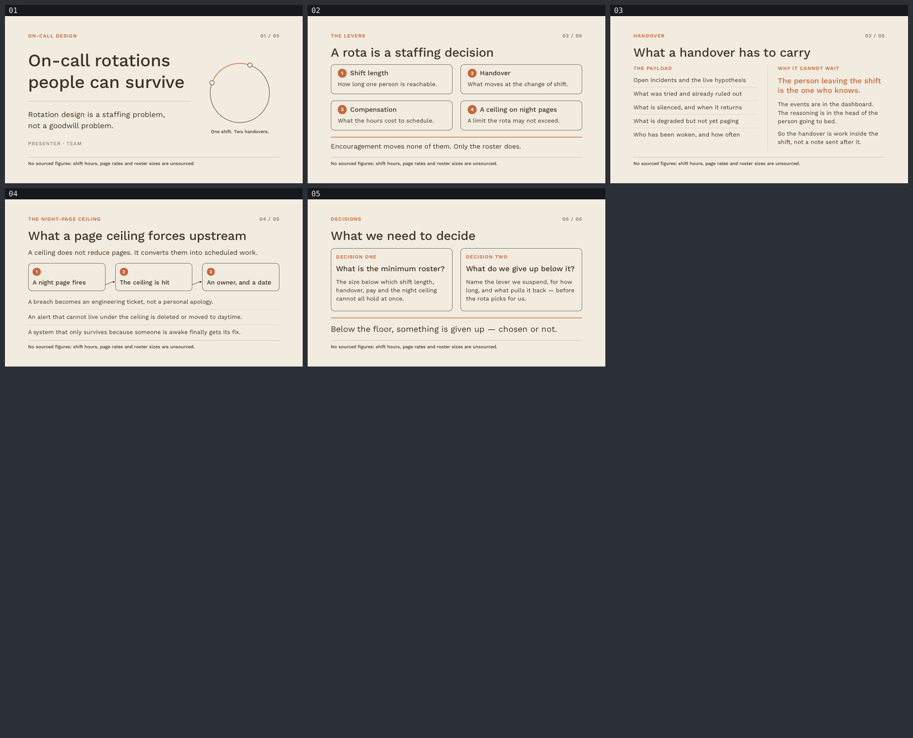

# oncall-rotation — On-call rotations people can survive

A five-slide English deck for engineering leadership and the people who carry the pager,
arguing that rotation design is a staffing problem, not a goodwill problem — shift length,
handover, compensation and a ceiling on night pages are the levers, and a rota too thin to
hold them cannot be encouraged into holding them. Built with
[slides-grab](https://github.com/NomaDamas/slides-grab).

**[Open the viewer](https://jeonck.github.io/pt-slide/decks/oncall-rotation/viewer.html)** ·
[PDF](oncall-rotation.pdf)



| # | Sheet |
|---|---|
| 01 | On-call rotations people can survive (cover) |
| 02 | A rota is a staffing decision — the four levers, and what encouragement moves |
| 03 | What a handover has to carry — the payload, and why it cannot wait |
| 04 | What a page ceiling forces upstream — the breach has to land on an owner |
| 05 | What we need to decide (closing) |

## What it argues

Slide 02 names the four levers once — shift length, handover, compensation, a ceiling on night
pages — and says the thing the rest of the deck depends on: all four are set by how many people
are on the rota, and none of them moves on morale. That is the frame; sheets 03 and 04 each go
deep on one of them.

Slide 03 treats a handover as a transfer of state, not a status update: open incidents and the
live hypothesis, what was tried and ruled out, what is silenced and when it returns, what is
degraded but not yet paging, who has been woken and how often. The reason the person leaving
the shift is the one who knows is that the dashboard keeps the events and the outgoing engineer
keeps the reasoning — the ruled-out branches, the hunch that has not been written anywhere. So
the handover is work scheduled *inside* the shift, not a note sent afterwards by someone who
has already gone to bed.

Slide 04 answers the obvious objection to a night-page ceiling: it does not reduce pages. It
converts them into work someone has to schedule. The flow is the mechanism — a page fires, the
ceiling is hit, and the breach lands on an owner with a date. Without that last node the
ceiling is decoration. What it forces upstream: a breach becomes an engineering ticket instead
of a personal apology, alerts that cannot live under it get deleted or moved to daytime, and
the system that only survives because someone is awake finally gets the fix it was deferring.

Slide 05 asks for two decisions rather than agreement: what the minimum roster is, and what we
give up when we are below it. The second is the one that usually goes unasked — below the floor
a lever gets dropped whether or not anyone chose it.

## Judgement calls, and why

### No numbers — none at all

This repo cannot source data, and this topic tempts fabrication badly: shift hours, pages per
night, roster sizes, handover durations, on-call pay multiples, burnout rates. An invented
number inside a staffing argument is worse than no number, because it is exactly the thing the
audience would carry out of the room.

So the deck has **no chart, no percentage, no duration, no benchmark and no headcount.** Every
lever is named and never priced. Where the argument needs a threshold it hands the threshold
back to the room as a decision ("what is the minimum roster?") instead of asserting a value.
Even the cover ring is drawn without countable people — any number of markers on it would
claim a roster size. It carries two markers, and those mark the two handovers that bound one
shift, which is definitional rather than measured.

The style's grid makes an 11pt source caption mandatory on every sheet. Dropping it would break
the style; filling it with a citation we do not have would be a lie. So the slot carries the
fact instead: *No sourced figures: shift hours, page rates and roster sizes are unsourced.*

Speaker is the placeholder `Presenter · Team`. No name was invented.

### The style

Bundled **`ppt-warm-minimal-diagram-deck`**, picked from a shortlist of three
(`ppt-soft-pastel-system-deck` and `ppt-kula-minimalist-keynote` were the others).

The argument runs on mechanism, and this style's entire identity is a thin line-diagram kit:
no-fill nodes with 1pt ink outlines, curved 1pt connectors with small arrowheads, one terracotta
element per sheet. That is the right vocabulary for a causal chain. It also has a mandatory
caption slot and no mandatory data slot, so a deck with nothing to cite can use its furniture
honestly. And warm sand reads humane without reading soft, which suits a deck about people
being woken at night but not one that has to land as a budget request.

`ppt-soft-pastel-system-deck` was the runner-up: plump pastel nodes undercut the staffing case,
and it carries three accent colours where this deck wants one point of emphasis per sheet.
`ppt-kula-minimalist-keynote` was rejected outright — its Avoid list bans empty placeholder
frames and requires real photographs, duotone fields, charts or diagrams inside its rounded
image frames. With no images and no data, its gallery grid could only be filled dishonestly or
left as the blank sand blocks it explicitly forbids.

`show-design` output was treated as a contract. **No palette extension was needed:** the deck
uses exactly the six spec tokens it needs and invents no colour. Two deliberate departures are
recorded in [`design-debt.md`](design-debt.md): the caption is set in ink brown rather than the
spec's `text muted` (which measures 3.25:1 on this background and carries the no-data
disclosure), and step badges sit inside the node outline rather than overhanging its corner.

### Fonts

Pretendard was deleted — this deck has no Korean text, and four Pretendard faces are ~3.1MB of
dead weight. Work Sans 300/400/500/600, which the style spec names, is embedded locally from
`@fontsource/work-sans` at 82KB total. No `http(s):` appears in any saved slide.

## What the render caught that `validate` did not

`validate` reports 5 passed with 5 warnings, all of them the cover ring's own arc and handover
markers intersecting the ring they sit on — that intersection is the diagram. It passed six real defects that only showed up in the
PNGs, all now fixed and listed in [`gate-pass-b.md`](gate-pass-b.md). The two worth repeating:

- **Slide 05: both card bodies overflowed the card's bottom outline.** The closing line had
  wrapped to two lines and stolen the cards' height. Nothing was outside the frame and no
  siblings overlapped, so `validate` was clean — a child overflowing its parent is exactly the
  blind spot the skill warns about.
- **Slide 02: one card's gloss wrapped, and because the cards were centred, that card's header
  dropped below its three neighbours'.** The row's first lines stopped aligning. The copy was
  shortened *and* the cards moved to `justify-content:flex-start`, so a future second line can
  never break the alignment again.

And one methodological failure worth recording: **the first width-measurement run measured the
wrong font.** The script built its probe page with `page.setContent()`, whose origin is
`about:blank`, so the `file://` `@font-face` URLs never loaded and every width came back for
Chromium's fallback face — 8–15% narrow. Four strings it called safe wrapped in the real
render. The script now navigates to a real `file://` probe page and refuses to report anything
unless `document.fonts.check()` confirms every weight. Details and the corrected coefficient
table are in [`slide-outline.md`](slide-outline.md).

## Regenerate

```bash
npx slides-grab validate     --slides-dir decks/oncall-rotation
npx slides-grab png          --slides-dir decks/oncall-rotation --output-dir decks/oncall-rotation/gate-preview --resolution 1080p
node scripts/build-contact-sheets.mjs decks/oncall-rotation/gate-preview          # review sheet
npx slides-grab design-gate  --slides-dir decks/oncall-rotation --verdict proceed \
  --pass-a-report decks/oncall-rotation/gate-pass-a.md \
  --pass-b-report decks/oncall-rotation/gate-pass-b.md
npx slides-grab build-viewer --slides-dir decks/oncall-rotation
npx slides-grab pdf          --slides-dir decks/oncall-rotation --output decks/oncall-rotation/oncall-rotation.pdf --resolution 1080p
node scripts/build-contact-sheets.mjs decks/oncall-rotation/gate-preview --web    # committed preview/
```

Run every command from the repo root — `cd`-ing into the deck folder makes slides-grab look for
`decks/oncall-rotation/decks/oncall-rotation`. Editing any slide invalidates the gate receipt
(the fingerprints change), so re-run validate → png → gate before exporting again.
