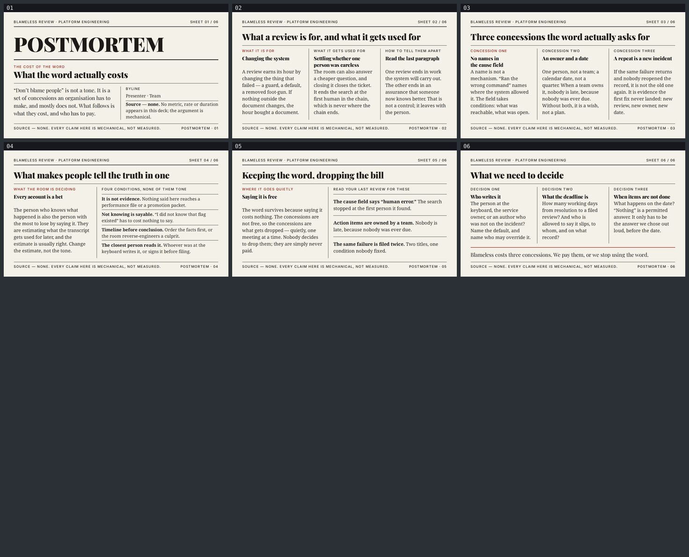

# postmortem — Blameless postmortems: what the word actually costs

A six-slide English deck for engineers and the managers who sign off on incident reviews,
arguing that "don't blame people" is not a tone but a set of concessions an organisation has to
make — and mostly does not. Built with [slides-grab](https://github.com/NomaDamas/slides-grab).

**[Open the viewer](https://jeonck.github.io/pt-slide/decks/postmortem/viewer.html)** ·
[PDF](postmortem.pdf)



| # | Sheet |
|---|---|
| 01 | **POSTMORTEM** — what the word actually costs (cover) |
| 02 | What a review is for, and what it gets used for |
| 03 | Three concessions the word actually asks for |
| 04 | What makes people tell the truth in one |
| 05 | Keeping the word, dropping the bill |
| 06 | What we need to decide (closing) |

## What it argues

A review answers two questions, and the second one is cheaper. It can change the thing that
failed — a guard, a default, a removed foot-gun — or it can settle whether one person was
careless, which closes the ticket and ends the search at the first human in the chain. Slide 02
gives the test that separates them: read the last paragraph. One ends in work the system will
carry out; the other ends in an assurance that someone now knows better, which is not a control
because it leaves with the person.

Slide 03 is the spine. Three concessions: **no names in the cause field** (a name is not a
mechanism — the field takes conditions); **an owner and a date** (one person, a calendar date;
when a team owns the item nobody is late, because nobody was ever due); **a repeat is a new
incident** (if the same failure returns and nobody reopened the record, that is evidence the
first fix never landed).

Slide 04 treats candour as a consequence of conditions, not of a facilitator's tone: the person
who knows most has the most to lose by saying it, and is estimating what the transcript gets
used for later. Four conditions change that estimate. Slide 05 gives three tells to audit your
own last review by. Slide 06 is a decision sheet, not a Q&A: who writes it, what the deadline
is, and what happens when the action items are not done — where "nothing" is a permitted
answer, as long as it is the one chosen out loud in advance.

## The style

Bundled `ppt-print-first-newspaper` — **chosen**, from a shortlist of three
(`ppt-print-first-newspaper`, `ppt-minimal-mono-note`, `ppt-editorial-infographic-deck`).
`slides-grab show-design` output was treated as a contract, the `## Avoid` list especially.

Why the newspaper:

- **The subject is a document.** A postmortem is a written, filed account of an event, and this
  deck is about what that account is allowed to say — what goes in the cause field, whose name
  appears, what the last paragraph commits to. Newsprint is the visual language where "who gets
  named in print" is the native question.
- `ppt-editorial-infographic-deck` is a data-journalism style — 54pt serif figures, KPI cells,
  emphasis bars. With no numbers permitted, most of its vocabulary would go unused, and its
  empty numeral slots would invite exactly the invented statistic this deck argues against.
- `ppt-minimal-mono-note` is single-column by contract and caps the body at eight lines. The
  core sheets here are comparisons — *for* versus *used for*, three concessions side by side —
  and one column would turn a contrast into a sequence.
- Against the ten decks already in this repo, no other uses cream newsprint with a serif
  masthead; the nearest neighbour, `iac-drift`, is sans-serif black-and-orange giant type.

The build:

- Canvas 720pt × 405pt. Playfair Display 900/400 (masthead, headlines, subheads), Noto Serif
  400/700 (prose) and Inter 500 (kickers, folios) embedded under `assets/fonts/` from
  `@fontsource/*` — 98KB, and no `http(s):` URL in any saved slide. The Pretendard files the
  scaffolder copies in were deleted: no Hangul here, and four faces is ~3MB of dead weight.
- Four colours, all spec tokens, verbatim: `#F4F1E8` paper, `#1C1B17` ink, `#2E2C26` body ink,
  `#A8231B` accent. No harmonic extension was needed. Radius 0, no shadow, no gradient, no
  filled panel anywhere — every division on every sheet is a 0.5pt or 2pt rule line.
- The accent appears **once per sheet**: one kicker on slides 01–05, the 2pt closing rule on
  slide 06. Never as body text, never as a fill, per the Avoid list.
- No icon, emoji or illustration. The visual vocabulary is type, hairline rules and column
  measure. Column count varies 2 · 3 · 3 · 2 · 2 · 3 — the spec asks a magazine to redivide its
  page sheet to sheet.
- **No figures and no chart.** "X% of incidents are human error", "teams doing blameless reviews
  resolve N% faster", mean-time-to-anything — none of it is sourceable here, and the thesis is
  mechanical: a name in the cause field ends the search; an action item without an owner has
  nobody to be late. A mechanism does not need a percentage. The style's mandatory
  source/dateline slot carries that fact instead of a citation — the cover byline block says it
  in full, and every sheet's folio repeats `SOURCE — NONE. EVERY CLAIM HERE IS MECHANICAL, NOT
  MEASURED.` `slide-outline.md` records the decision under "no figures, and why".
- `Presenter · Team` in the cover byline is a **placeholder**. No name or organisation is
  invented anywhere in the deck.

## What the spec decided, and what this deck decided

The spec decided: the palette, the three type roles (serif display, serif body, sans meta only),
radius 0, no gradient or fill, hairline and section rule weights, multi-column as the identity,
no icons or illustration, and "fill the columns".

This deck decided:

- **Point sizes are scaled, not copied.** The spec targets 13.33 × 7.5in; this canvas is 10in
  wide, a 0.75 factor. Display 56 → 42, heading 36 → 27, deck 22 → 16.5, body 20 → 15,
  caption 13 → 9.75. Applied as: masthead **64pt** (*larger* than scaled — one word, and it is
  the cover's anchor), headline **28pt**, subhead 16pt, standfirst and closing line 17pt, prose
  15pt, list prose 14pt, meta **11pt** (rounded *up* past the framework's 10pt floor). Nothing
  anywhere is below 11pt; no prose is below 14pt.
- **Margins rounded to the 8pt unit**: 0.6in/0.5in scaled give 32.4/27pt → 32/24pt, so the
  content box is 656 × 357pt; column gap 0.25in scaled → 16pt.
- **Leading floors beat the spec's leading.** Prose 1.45, meta 1.4, subheads 1.3, headlines
  1.25, masthead 1.35. `line-height: 1` appears nowhere. The masthead needed two attempts:
  `validate` clipped Playfair's descenders at both 1.2 and 1.3.
- **Body face is Noto Serif (Latin), not Noto Serif KR** — same typeface, no Hangul to carry.
- **Three families where Pass A prefers two**, because the contract declares three and reserves
  the sans for meta type. Recorded rather than quietly reduced; see `design-debt.md`.
- **The subhead block carries a `min-height` on every column, not only the ones that wrap.** A
  subhead that wraps in one column alone drops that column's prose off the shared first-line
  baseline, and in a style whose identity is a strict column grid, that misalignment *is* the
  defect. Same reasoning behind giving every list row the same rule and the same padding.
- **Paper grain (spec: 5%) is omitted** — the gradient-free tile read as compression noise at
  1080p. Recorded in `design-debt.md`, along with the unused halftone-photograph vocabulary.

## The budgets

```
vertical    405 − padding 24+24                                  = 357pt
              − masthead kicker row 15.4 − section rule 2 + 6
              − foot: 12 + hairline 0.5 + 7 + folio row 15.4
              − main's own top margin 14                         = 284.7pt for main
            content sheet: headline 35 + 10, hairline 0.5 + 10   = 229pt for the column band
            per column: kicker 15.4 + subhead block 41.6 + 6     = 166pt ≈ 7 body lines
            header and footer are SIBLINGS of main, so main{flex:1;min-height:0} pins them to
            the same y on all six sheets (main bottom 346.1pt everywhere, measured)

horizontal  measure 656pt full width, 197pt in a 3-column band, 249–374pt in a 2-column band
            Playfair Display 900 mixed-case headline  0.435 – 0.484  → budget 0.49
            Playfair Display 900 CAPS masthead        0.751          → budget 0.78
            Inter 500 11pt CAPS +0.12em               0.650 – 0.763  → budget 0.78
            Noto Serif 400 prose                      0.465 – 0.482  → budget 0.50
```

**Both budgets were computed before the first slide was written**, and the horizontal one was
**measured, not estimated**, in headless Chromium against the exact strings the slides use. That
mattered: all-caps kickers run ~60% wider per character than serif prose at the same size, so
`HOW YOU TELL WHICH ONE YOU ARE IN` needed 260pt in a 197pt column and became
`HOW TO TELL THEM APART` before it was ever rendered.

Six render-only defects were still found by opening the PNGs, three of which `validate` reported
as clean — a byline column printed on top of the footer, a whole sheet's columns running 51pt
under the foot rule, and one column a line longer than its neighbours. They are listed sheet by
sheet in `gate-pass-b.md`.

## Files

| Path | What |
|---|---|
| `slide-01.html` … `slide-06.html` | The slides — editable, searchable semantic HTML |
| `slide-outline.md` | Approved outline, contract, recorded decisions, both budgets |
| `design-debt.md` | Accepted departures and Note findings, with what would resolve each |
| `gate-pass-a.md`, `gate-pass-b.md` | Design gate reports |
| `.slides-grab/` | Gate receipt and render evidence |
| `gate-preview/` | Full-size 1080p PNGs, the evidence actually looked at (not committed) |
| `preview/` | The contact sheet embedded above (committed; GitHub serves repo `.html` as source) |
| `viewer.html`, `postmortem.pdf` | Exports (PDF 735KB at 1080p) |

## Rebuild

```bash
npm install
npx slides-grab validate     --slides-dir decks/postmortem
npx slides-grab png          --slides-dir decks/postmortem --output-dir decks/postmortem/gate-preview --resolution 1080p
node scripts/build-contact-sheets.mjs decks/postmortem/gate-preview --web
npx slides-grab build-viewer --slides-dir decks/postmortem
npx slides-grab pdf          --slides-dir decks/postmortem --output decks/postmortem/postmortem.pdf --resolution 1080p
```

Run every one of these **from the repo root** — `cd`-ing into the deck folder makes slides-grab
look for `decks/postmortem/decks/postmortem`.

Editing a slide invalidates the gate receipt. Re-run validate → png → **look at the renders** →
refresh the two pass reports' fingerprints → `slides-grab design-gate --verdict proceed` before
exporting.
