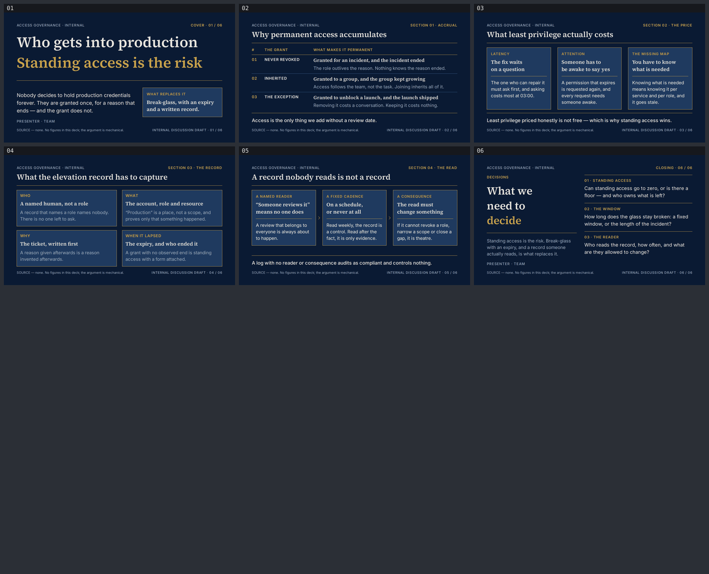

# prod-access — Who gets into production

A six-slide English deck for platform and security engineers, arguing that the risk is not who
is allowed into production but who is *permanently* allowed in — and that break-glass with an
expiry and a written record is the mechanism that replaces standing access. Built with
[slides-grab](https://github.com/NomaDamas/slides-grab).

**[Open the viewer](https://jeonck.github.io/pt-slide/decks/prod-access/viewer.html)** ·
[PDF](prod-access.pdf)



| # | Sheet |
|---|---|
| 01 | Who gets into production — **Standing access is the risk** (cover) |
| 02 | Why permanent access accumulates — three grants, none of which ever ended |
| 03 | What least privilege actually costs — the bill, priced honestly |
| 04 | What the elevation record has to capture — who, what, why, when it lapsed |
| 05 | A record nobody reads is not a record — reader, cadence, consequence |
| 06 | What we need to decide (closing) |

## What it argues

`decks/iac-drift` states the whole rule in one line on one slide: *"BREAK-GLASS EXPIRES —
elevation is one click, time-boxed, and writes a record: who, what, why, and when it lapsed."*
**This deck is that line unfolded.** It is deliberately never restated as a bullet here.

Slide 02 refuses to scold. Nobody decides to hold production credentials forever; three
perfectly reasonable grants — for an incident, to a group, to unblock a launch — simply have no
mechanism that ends them. Accrual is the default state of an access system, not a lapse of
discipline.

Slide 03 prices the alternative honestly, because a deck that treats least privilege as
obviously correct cannot explain why nobody has it. It costs latency at the worst possible
moment, it costs an approver who is awake, and it costs an inventory of what each role actually
needs that goes stale as fast as the services change. Naming that bill is what makes break-glass
an answer rather than a slogan.

Slide 04 is the schema sheet, and each of its four fields is written against the way that field
gets filled in uselessly: a record that names a *role* names nobody; "production" is a place,
not a scope; a reason supplied afterwards is a reason invented afterwards; a grant with no
observed end is standing access with a form attached.

Slide 05 is the part the one-liner cannot carry. Writing the record is the cheap half. The read
is the expensive half, so the read is what gets quietly dropped — and the result still passes
audit, which is exactly why nobody notices.

## The style

Bundled `ppt-goldman-ir-deck` — **chosen**, from a shortlist of `ppt-dark-luxury-keynote`,
`ppt-prismatic-dark-deck` and `ppt-goldman-ir-deck`. `slides-grab show-design` output was
treated as a contract, the `## Avoid` list especially.

Why this one, in order of weight:

1. **Its mandatory furniture is this deck's subject.** The style requires a bottom-right
   disclaimer + pagination footline on every sheet and a source footnote on every body sheet. A
   deck arguing that an access grant is only real when it is recorded, attributable and dated
   should itself be recorded, attributable and dated on every page. The footline is the thesis
   applied to the artefact.
2. **Its native module is a ruled financial table**, which is exactly the shape of a record
   schema. The argument gets to use the style's strongest asset instead of fighting it.
   `ppt-prismatic-dark-deck`'s native module is a glowing node diagram, which this argument
   does not have.
3. **The other two were rejected on their own Avoid lists, not on taste.**
   `ppt-dark-luxury-keynote` says *"사진 없이 텍스트만으로 채우지 말 것 — 풀블리드 비주얼이
   정체성"* and bans empty gold placeholder frames; its identity is full-bleed product
   photography this repo cannot source, and its own remedy for dead space is a gradient, which
   the repo bans outright. `ppt-prismatic-dark-deck` is mood `gradient`; its prism glow has to
   arrive as rasterized PNG/Sharp assets, and without them the style degrades to flat-token
   fallback everywhere — the style with its identity removed.

Colour overlap with the eleven decks already in this repo was checked: none of them uses deep
navy + metallic gold, and the only other dark deck (`ppt-dark-tech`, incident-response) is a
different hue family and a sans-serif identity.

- Canvas 720pt × 405pt. **Source Serif 4** 400/600 and **Inter** 400/500/600 embedded under
  `assets/fonts/` from `@fontsource/*` — 136KB, no remote URL in any saved slide. The four
  Pretendard faces the scaffolder copies in were deleted: there is no Hangul here and they are
  ~3MB of dead weight.
- `#0A1A33` canvas, `#1F3A5F` panels, `#C8A24B` gold as 0.5pt hairlines and labels only —
  **never as a fill**, which is the first line of the Avoid list. Radius 0, no shadow, no
  gradient, no glow, no emoji, no icon anywhere. `grep -ci 'gradient|box-shadow|border-radius|http'`
  returns 0 on all six files.
- **No figures and no chart.** "% of breaches involving standing credentials", mean-time-to-revoke
  and over-privileged-role counts are unsourceable here, and the thesis is mechanical: a
  credential that never expires is a credential you are relying on nobody misusing. A mechanism
  does not need a percentage. Per the brief, that fact is carried **in the style's mandatory
  source-caption slot** rather than a citation — every sheet reads
  `SOURCE — none. No figures in this deck; the argument is mechanical.`
- `PRESENTER · TEAM` on the cover and closing is a **placeholder**.

## What the spec decided, and what this deck decided

The spec decided: the palette (all six hex values in the deck are spec tokens, verbatim — no
harmonic extension was needed and none was invented), the two typefaces, radius 0, no shadow or
gradient, gold as hairline only, the strict 12-column grid, the mandatory footline, and the
table vocabulary — 11pt uppercase header over a 0.5pt gold rule, 1px navy row rules, a total row
under a gold rule.

This deck decided:

- **Point sizes are scaled up, not copied.** The spec targets 13.33 × 7.5in; this canvas is
  10in wide, a 0.75 factor. Scaling literally gives heading 19.5pt, body 12.75pt and disclaimer
  6pt — the last two below this framework's 14pt body floor and 10pt absolute floor. Applied
  instead: cover display 46pt, closing display 34pt, heading 24pt, panel claim 16pt, body 15pt,
  secondary body 14pt, labels 11–12pt caps, footline 10pt. Nothing anywhere is below 10pt.
- **The 8pt disclaimer is raised to 10pt — a deliberate deviation from the spec**, because 8pt
  is a Critical here. The IR identity (a disclaimer + pagination pinned bottom-right on every
  sheet) is preserved; only the size moved.
- **Two typefaces exactly, and the spec's monospace is not a third — a second deliberate
  deviation.** The style's diagram vocabulary asks for monospace step numbers, but its own
  Typography block declares only Source Serif 4 and Inter, and Pass A caps a deck at two faces.
  Step numbers are Inter 600 12pt with `font-variant-numeric: tabular-nums` and +0.06em
  tracking, in gold.
- **Contrast was computed, not eyeballed**, because this is a dark deck. `#3A5A85` is **2.47:1**
  on the canvas and was therefore removed from text duty entirely — it is 1px row rules only.
  That is precisely the "muted grey that reads fine on white and lands near 2.7:1 on charcoal"
  case. The presenter line was checked by name: `#9AA6BC` at 7.08:1.
- **Panels are legible as panels only because of their gold hairline.** `#1F3A5F` is 1.51:1
  against the canvas, which is why the spec specifies the hairline in the first place.
- **Emphasis never changes an element's box.** The last ledger row's rule on slide 02 is
  coloured `transparent` rather than removed, so all three rows keep identical boxes.
- **Leading floors beat the spec's leading**: 1.45 body, 1.4 serif claims, 1.35 display.
  `line-height: 1` appears nowhere.

Accepted findings are in `design-debt.md`.

## The budget

```
vertical    405 − padding 32+32 − header (label 15.4 + 6 + h2 31.2 + 10 + rule 0.5)
                − main margin 14 − footer (14 + margin 12)              = 237.8pt for main
            cover and closing keep the label row but drop h2 + divider  = 285.8pt
            header and footer are SIBLINGS of main, so main{flex:1;min-height:0} pins the
            gold divider and the footline to a constant y on all six sheets

horizontal  content 640pt.  Source Serif 4 600 mixed 0.466–0.547 → budget 0.55
            Inter 400/500 prose 0.430–0.500 → budget 0.48
            Inter 500/600 ALL CAPS +0.06/0.08em 0.594–0.894 → budget 0.80
```

Both budgets were computed **before the first slide was written**, from advance widths measured
in headless Chromium rather than the skill's 0.48 rule of thumb — and that caught a real wrap
before a line of HTML existed: `HOW IT WAS GRANTED` needs 142pt in a 140pt label cell at 11pt
caps, the exact `READ-ONLY BY DEFAULT` failure from `decks/iac-drift`. It became `THE GRANT`.

**The measuring then had to be redone, and the reason is the most reusable thing in this deck.**
The pre-write probe declared the two `@font-face` rules on a blank page and then measured hidden
spans. `await document.fonts.ready` resolved *immediately*, because nothing on that page used
either face yet, so there was nothing pending — and the spans were then measured against the
**fallback** metrics. Every coefficient came out 10–20% low. Five overflow defects followed, all
of which `validate` reported as clean. The fix is to measure the real slide files, where the
faces are genuinely in use. The numbers above are the render-verified ones.

Ten render-only defects in total were found by opening the PNGs, listed sheet by sheet in
`slide-outline.md` under "what the render caught". The one most worth remembering: **a 0.5pt
flex item does not overflow when its container is short — it is shrunk to zero and disappears.**
The cover's gold hairline rendered as literally nothing until `flex:none` was added.

## Files

| Path | What |
|---|---|
| `slide-01.html` … `slide-06.html` | The slides — editable, searchable semantic HTML |
| `slide-outline.md` | Approved outline, contract, recorded decisions, both budgets, render findings |
| `design-debt.md` | Findings accepted at the gate, with what would resolve each |
| `gate-pass-a.md`, `gate-pass-b.md` | Design gate reports |
| `.slides-grab/` | Gate receipt and render evidence |
| `gate-preview/` | Full-size 1080p PNGs, the evidence actually looked at (gitignored) |
| `preview/` | The contact sheet embedded above (committed; GitHub serves repo `.html` as source) |
| `viewer.html`, `prod-access.pdf` | Exports (PDF 596KB at 1080p) |

## Rebuild

```bash
npm install
npx slides-grab validate     --slides-dir decks/prod-access
npx slides-grab png          --slides-dir decks/prod-access --output-dir decks/prod-access/gate-preview --resolution 1080p
node scripts/build-contact-sheets.mjs decks/prod-access/gate-preview --web
npx slides-grab build-viewer --slides-dir decks/prod-access
npx slides-grab pdf          --slides-dir decks/prod-access --output decks/prod-access/prod-access.pdf --resolution 1080p
```

Run every one of these **from the repo root** — `cd`-ing into the deck folder makes slides-grab
look for `decks/prod-access/decks/prod-access`.

Editing a slide invalidates the gate receipt. Re-run validate → png → **look at the renders** →
refresh the two pass reports' fingerprints → `slides-grab design-gate --verdict proceed` before
exporting.
