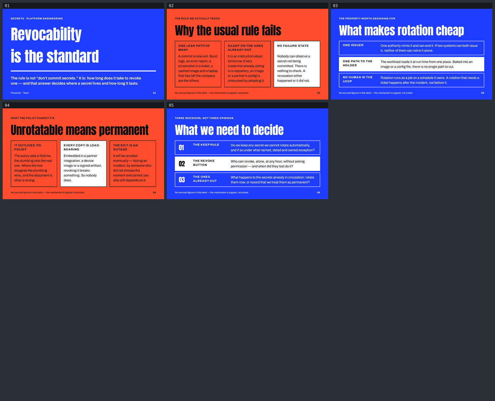

# secrets — Revocability is the standard

A five-slide English deck for the engineering group that owns identity, CI and the platform's
secret material — and for the manager who has to sign the exception when a secret cannot be
rotated. Built with [slides-grab](https://github.com/NomaDamas/slides-grab).

**[Open the viewer](https://jeonck.github.io/pt-slide/decks/secrets/viewer.html)** ·
[PDF](secrets.pdf)



| # | Sheet |
|---|---|
| 01 | Revocability is the standard (cover) |
| 02 | Why the usual rule fails |
| 03 | What makes rotation cheap |
| 04 | Unrotatable means permanent |
| 05 | What we need to decide (closing) |

## What it argues

The useful rule is not "don't commit secrets." It is **how long does it take to revoke one** —
and that single question decides where a secret lives, how long it lives, and whether rotation
is a job or a ticket.

Sheet 02 takes the usual rule apart on its own terms: it names one leak path out of many, it
says nothing about every credential already in circulation, and it has no failure state — you
cannot observe a secret *not* being committed, whereas a revocation either happened or it did
not. Sheet 03 replaces it with three structural properties that make a secret cheap to rotate:
one issuer, one path to the holder, no human in the loop. Sheet 04 is the sharp end — a secret
nobody can rotate is permanent whatever the policy says, because every embedded copy becomes
load-bearing and the only remaining exit is an outage someone else's timing chose. Sheet 05
turns that into three decisions this room can make: whether we keep unrotatable secrets at all,
who holds the revoke button, and what happens to the ones already out.

## Style

- Bundled **`ppt-pattern-bold-poster-keynote`** — **chosen, not assigned.** Full-bleed
  saturated single-colour fields with giant Anton headlines set poster-style, white-outline
  modules underneath, a fixed footline. Radius 0, no shadow, no gradient, no image.
- **Why this one, out of the three on the shortlist.** `ppt-keynote-minimal-fullbleed` forbids
  bullet lists outright and caps a sheet at one text block — the closing sheet here is three
  named decisions and cannot survive that. `ppt-confident-color-block-deck` fits the content
  but is solid colour blocks on white with a heavy grotesque, which is the shape
  `decks/deployment-strategies` already occupies in this repo; the two would have read as one
  series. This style was picked because **its colour alternation carries the argument** — the
  field flips blue → vermilion → blue → vermilion → blue, and this deck's structure is exactly
  that alternation (standard, the rule that fails, the property that works, the failure that is
  permanent, the decisions). It also has a *mandatory* source slot, which is the right place to
  say on every sheet that nothing here is priced. Full reasoning in `slide-outline.md`.
- Canvas 720pt × 405pt. **Anton 400** (display) and **Archivo 400/600/700** (subhead, body,
  labels), embedded under `assets/fonts/` from npm `@fontsource/anton` and
  `@fontsource/archivo`; both faces are named by the style spec's Typography section.
  Pretendard deleted — no Hangul in this deck. No remote URL in any saved slide.
- **Exactly four colours in the whole deck**, all spec tokens: `#1F3DFF` (blue field),
  `#FF4D2E` (vermilion field), `#FFFFFF`, `#0E0E0E`.
- `Presenter · Team` on the cover is a **placeholder**. No name was invented.

## What we decided, and why

### No numbers. None.

This is the topic that most tempts a figure — rotation intervals, mean time to revoke,
credentials in circulation, the share of breaches that start with a leaked key. **This repo
cannot source any of it**, nothing here has been measured against this platform, and a
plausible figure lifted from a vendor report is exactly the invented data the design gate calls
Critical. So the deck argues the mechanism and prices nothing. Where a number would sit there
is a property instead — *one issuer*, *one path to the holder*, *no human in the loop* — each
checkable by reading the system rather than by trusting a statistic.

The style's mandatory source label carries that fact verbatim on all four content sheets,
instead of a citation:

> No sourced figures in this deck — the mechanism is argued, not priced.

Its `kpi` token (a 240pt Anton number) and its entire chart vocabulary are therefore unused.

### No credential ever appears on a slide

Not a token string, not key material, not a plausible fake one. Secrets are referred to by role
only — "a credential", "the secret", "what the workload reads at run time". A fake secret on a
slide is a real secret in a screenshot six months later.

### Ink, not white, on the vermilion sheets

The spec puts white type on the saturated field. White on `#FF4D2E` measures **3.31:1** — under
the 4.5:1 body bar, and visibly hazy in the first render. Sheets 02 and 04 therefore run the
spec's `ink` token: **5.84:1**. Sheets 01, 03 and 05 keep white on blue (**6.63:1**). That is a
substitution between two tokens of the same spec, not a new colour, and it makes the
claim/counter-claim alternation stronger. `design-debt.md` §1.

### Anton runs at `line-height: 1.5`

The spec sets display leading `0.95`. `validate` reports `text-clipped` on Anton at 1.25, 1.4
*and* 1.45 — its em box is far taller than its cap height. 1.5 is the first value that clears,
and it is comfortably above this framework's floor. The cost is an airy cover headline; two
ways around it were tried and rejected. `design-debt.md` §2.

### Type is the spec's, re-scaled and then floored

The spec targets a 13.33in canvas; this one is 10in, a 0.75 factor. Scaled, the spec's 13pt
label lands at 9.75pt — under the 10pt absolute floor — so labels stay at 13pt unscaled and the
footline sits at 10.5pt. Body is 15pt rather than the scaled 21pt, because three modules of
real prose do not fit a 405pt sheet at 21pt. Sheet titles are 52pt, just inside the spec's own
90px headline floor. `slide-outline.md` § deviations.

## What the render caught that `validate` did not

`validate` reported **5/5 clean** while all of the following were true. Each was found by
opening the 1920×1080 PNGs and looking at them, and confirmed by measuring the rendered DOM.

1. **Three modules hanging 16.7pt under the footline on sheets 02 and 04.** The white-solid
   module's body wrapped to seven lines instead of the six budgeted; because a grid row is
   auto-sized to its tallest child, *all three* columns grew with it. Fixed by cutting the two
   long bodies to six lines and adding `grid-template-rows: minmax(0,1fr)` as a guard.
2. **White type on vermilion at 3.31:1.** Not an overflow, not a clip — just not readable
   enough. Fixed by switching those sheets to ink.
3. **The footline crowding the module boxes** on every sheet, ~5pt of air. Fixed by opening
   `footer` margin-top from 12pt to 18pt.
4. **Column bodies that would have started at different heights** where one label wrapped to
   two lines and its neighbour to one. Fixed by reserving two label lines on every column
   (`min-height: 36.4pt`) so the three bodies share a first baseline.

## Both budgets, computed before the first slide was written

The full arithmetic is in `slide-outline.md`. In short: `main` gets **320.3pt** (405 − padding
− footline − its margin), and on content sheets the module strip gets **206.9pt** of that.

The horizontal budget was **measured, not estimated**, with a Playwright probe against the
exact strings that went on the slides. What came back:

| face · treatment | measured coefficient |
|---|---|
| Anton 400, mixed-case prose, 51–72pt | 0.383 – 0.427 |
| Archivo 400 body prose, 15pt | 0.426 |
| Archivo 600 subhead, 18pt | 0.438 |
| **Archivo 700 UPPERCASE + 0.08em tracking, 13pt** | **0.625 – 0.735** |

All-caps labels run ~70% wider per character than prose in the same family. Budgeting the label
cells at the prose coefficient would have under-reserved every one of them by that much — the
exact failure the repo's notes single out.

Two sheet titles were cut *before any HTML existed* because they measured past the 648pt frame:
`What makes a secret cheap to rotate` (741pt) became `What makes rotation cheap`, and
`A secret nobody can rotate is permanent` (819pt) became `Unrotatable means permanent`. Both
originals were two claims in one line; one claim each reads better anyway.

## Files

| | |
|---|---|
| `slide-01.html` … `slide-05.html` | the slides, 720pt × 405pt each |
| `slide-outline.md` | style choice, budgets, deviations, per-sheet plan |
| `design-debt.md` | accepted Minor/Note findings and the two Major fixes |
| `gate-pass-a.md` / `gate-pass-b.md` | design gate reports |
| `preview/slides-01-05.png` | contact sheet (committed — GitHub serves `.html` as source) |
| `secrets.pdf` | 5 pages at 1080p |
| `viewer.html` | keyboard-navigable viewer |
| `assets/fonts/` | Anton + Archivo woff2 and their licences |

## Rebuild

```bash
npx slides-grab validate --slides-dir decks/secrets
npx slides-grab png      --slides-dir decks/secrets --output-dir decks/secrets/gate-preview --resolution 1080p
npx slides-grab design-gate --slides-dir decks/secrets --verdict proceed \
  --pass-a-report decks/secrets/gate-pass-a.md --pass-b-report decks/secrets/gate-pass-b.md
npx slides-grab build-viewer --slides-dir decks/secrets
npx slides-grab pdf          --slides-dir decks/secrets --output decks/secrets/secrets.pdf --resolution 1080p
node scripts/build-contact-sheets.mjs decks/secrets/gate-preview --web
```

Run every one of them from the repo root. Editing a slide changes its sha256 and voids the gate
receipt, so the gate has to be re-passed before `pdf` will run again.
