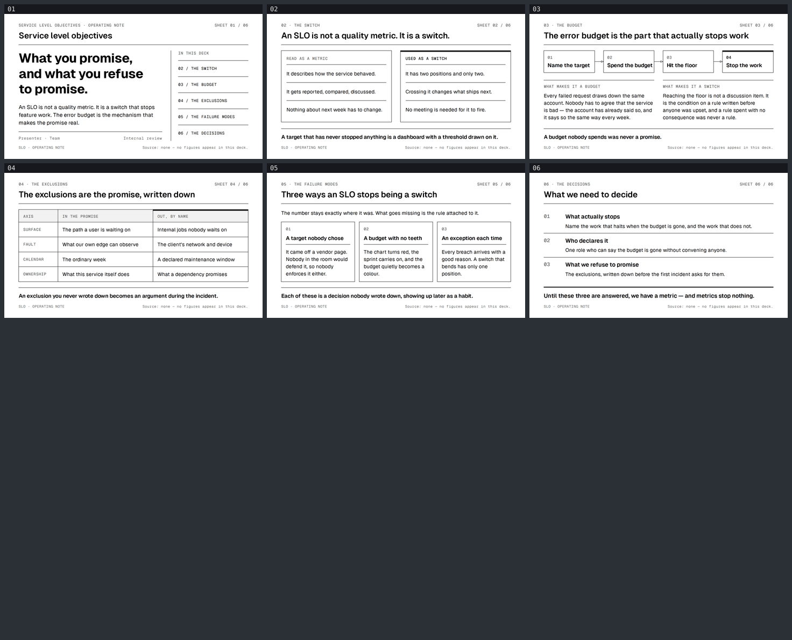

# SLO — what you promise, and what you refuse to promise

여섯 장짜리 영어 덱. SLO는 품질 지표가 아니라 **기능 개발을 멈추는 스위치**이고, 그 약속을
실제로 만드는 장치가 에러 버짓이라는 주장. 아무것도 멈추지 않는 SLO는 대시보드라는 것,
그리고 **무엇을 약속하지 않기로 했는지**가 약속의 절반이라는 것을 같은 무게로 다룬다.



**[뷰어](https://jeonck.github.io/pt-slide/decks/slo/viewer.html)** ·
[PDF](slo.pdf) · [이미지](preview/)

## 구성

| # | 제목 | 하는 일 |
|---|---|---|
| 01 | Service level objectives | 커버. 36pt 디스플레이 3줄 + 모노 목차 인덱스 |
| 02 | An SLO is not a quality metric. It is a switch. | 같은 숫자를 지표로 읽을 때와 스위치로 쓸 때의 대비 |
| 03 | The error budget is the part that actually stops work | 4단계 프로세스 — 목표 명명 → 버짓 소진 → 바닥 도달 → 작업 중지 |
| 04 | The exclusions are the promise, written down | 네 축(범위·장애·달력·소유권)에서 무엇이 안에 있고 무엇이 일부러 밖에 있는지 |
| 05 | Three ways an SLO stops being a switch | 아무도 고르지 않은 목표 · 이빨 없는 버짓 · 매번 만드는 예외 |
| 06 | What we need to decide | 무엇이 실제로 멈추나 · 누가 선언하나 · 무엇을 약속하지 않을 것인가 |

## 스타일

`ppt-monochrome-infrastructure-deck` (번들). 후보 셋(`ppt-strategy-navy-deck`,
`ppt-bcg-exhibit-deck`, `ppt-monochrome-infrastructure-deck`) 중에서 골랐다.

셋 중 **강조 장치가 색이 아닌 유일한 스타일**이기 때문이다 — 스펙이 "강조는 색이 아니라
굵기와 보더 두께 대비로만"이라고 못 박는데, 그게 이 덱의 주장 자체다. SLO는 더 자세한 설명이
아니라 더 무거운 규칙이다. BCG 익스히빗 덱은 정체성이 `Exhibit N.N` 번호와 차트 문법인데
이 덱에는 데이터가 한 톨도 없어서 그 절반을 못 지킨다. 전략 네이비 덱은 논증 구조는 잘 맞지만
위계를 블루 두 가지로 만들고 계약의 절반이 차트 규율이다.

- 서체: **Geist** 400/600/700 + **Geist Mono** 400/500 — 스펙이 지정한 두 서체를
  `@fontsource/geist-sans` / `@fontsource/geist-mono`에서 받아 `assets/fonts/`에 로컬 임베드.
  영어 전용 덱이라 스캐폴딩이 넣어준 Pretendard 4종(~3MB)은 손으로 지웠다. 저장된 슬라이드에
  `http(s):` 문자열은 하나도 없다(인라인 SVG의 `xmlns`도 제거).
- 색: `#FFFFFF` / `#F2F2F2` / `#000000` / `#666666` 넷뿐. **팔레트를 확장하지 않았다.**
  스펙의 다섯 번째 토큰 `#999999`는 일부러 안 썼다 — 이 덱의 텍스트 역할은 산문과 라벨 둘뿐이라
  세 번째 회색은 할 일이 없다.

## 판단한 것과 그 이유

**수치를 하나도 쓰지 않았다.** 가용성 목표, 에러 버짓 도입 효과, MTTR 개선폭 — 전부 벤더
자료에는 있고 이 저장소가 인용할 수 있는 곳에는 없다. 지어내면 게이트의 content-discipline에서
Critical이고, 무엇보다 슬라이드에서 제일 약한 문장이 된다. 이 덱의 주장은 **기계적**이다:
멈춤 규칙이 붙은 버짓은 다음에 무엇이 나갈지를 누가 정하는지를 바꾼다. 그건 퍼센트가 없어도
참이다. 그래서 03장은 루프를 **크기로 재지 않고 이름으로 부른다.**

브리프의 지시대로, 스타일이 필수로 요구하는 `slide.source_caption` 자리에는 인용 대신 그
사실을 넣었다. 여섯 장 모두 우하단에 이렇게 적혀 있다:

> `Source: none — no figures appear in this deck.`

**발표자는 자리표시자다.** 커버의 `Presenter · Team`은 이름을 지어내지 않기 위한 placeholder다.

**포인트 크기는 베낀 게 아니라 환산했다.** 스펙은 13.33 × 7.5in을 겨냥하고 이 캔버스는
10 × 5.625in이라 0.75배다. display 48 → 36, title 30 → 23, body 17 → 12.75인데 프레임워크의
14pt 본문 하한에 걸려 14pt, 모노 라벨·캡션은 10pt 절대 하한에 걸려 11pt / 10pt. 행간도 스펙의
1.1 / 1.2 대신 프레임워크 하한인 1.2 / 1.3 / 1.4를 쓴다. `line-height: 1`은 어디에도 없다.

**강조는 형제의 박스를 절대 밀지 않는다.** 02장의 스위치 패널, 03장의 `04` 노드, 04장의
"OUT, BY NAME" 열 — 3pt 강조 막대는 **모든** 형제에 존재하고 색만 `transparent` → `#000000`으로
바뀐다. 한 항목에만 장식을 붙여 그 항목만 어긋나는 함정을 피하려는 것이다.

**05장에는 강조 항목이 없다.** 세 가지 실패 양상은 동등하고, 하나를 표시하면 이 덱이 근거를
댈 수 없는 순위를 주장하게 된다. `design-debt.md` 1번 항목.

수용한 Minor/Note는 전부 [`design-debt.md`](design-debt.md)에 있다.

## 렌더에서만 드러난 결함

`validate`는 처음부터 6/6 통과였다. 아래는 전부 그 상태에서 PNG를 열어보고 찾은 것들이다.

| 시트 | 무엇 | 고친 방법 |
|---|---|---|
| 02 | 오른쪽 패널 항목 둘이 두 줄로 감겨 두 패널의 항목 헤어라인과 첫 줄 y가 어긋남 | 카피를 줄여 여섯 항목 전부 한 줄로 (측정 여유 11.7–58.9pt) |
| 06 | 닫는 문장이 640pt를 8.3pt 초과해 감기면서 `anything.`이 혼자 남음 | 문장 교체, 여유 53.5pt |
| 06 | 첫 행의 `border-top`이 헤더 룰 44px 아래에 놓여 룰이 두 줄로 보임 | `.drow + .drow`로 옮겨 행 사이에만 룰 |
| 06 | 모노 인덱스가 두 요소짜리 텍스트 블록 대비 세로 중앙 정렬돼 제목과 문장 사이에 떠 있음 | 행 정렬을 `flex-start`로 |
| 04 | `AXIS`·`OUT, BY NAME`만 잉크색이라 헤더 행이 두 열 강조처럼 읽힘 | 색 오버라이드 제거 — 모노 라벨 전부 `#666666`, 산문 전부 `#000000` |
| 04·05 | 셀 여유 1.5pt, 카드 헤더 여유 0.9pt — 한 줄이긴 하나 벽에 닿음 | 카피 축소 + 카드 gap 16→12pt, padding 14→12pt |

**가로 예산은 재서 잡았다.** 처음 만든 계측 스크립트는 `page.setContent()`로 임시 문서를
띄웠는데 거기서는 `file://` `@font-face`가 로드되지 않아 **폴백 서체를 재고 있었고, 산문이
16–18% 좁게 나왔다.** 그 값으로 잡은 예산이 위 02장 결함의 원인이다. 실제 슬라이드 문서로
이동해 다시 재고 나서야 맞았다. 실측 계수:

| 종류 | 계수 |
|---|---|
| Geist 산문·제목 (혼합 대소문자, 14–23pt) | 0.434 – 0.534 |
| Geist Mono 대문자 라벨 (11pt, tracking 0.04em) | **0.654** (등폭) |
| Geist Mono 캡션 (10pt, 혼합) | 0.640 |

스킬의 출발점 0.48은 Geist 산문에는 대체로 맞지만 **모노 대문자 라벨에는 36% 과소평가**다.
`OWNERSHIP`은 11pt에서 68.1pt가 필요한데 축 열을 14%로 잡으면 65.6pt밖에 못 준다. 그래서
열 폭을 **17%로 넓혔다** — 단어를 줄이는 대신에.

## 재생성

```bash
# 리포 루트에서 실행할 것
npx slides-grab validate --slides-dir decks/slo
npx slides-grab png      --slides-dir decks/slo --output-dir decks/slo/gate-preview --resolution 1080p
npx slides-grab design-gate --slides-dir decks/slo --verdict proceed \
  --pass-a-report decks/slo/gate-pass-a.md --pass-b-report decks/slo/gate-pass-b.md
npx slides-grab build-viewer --slides-dir decks/slo
npx slides-grab pdf         --slides-dir decks/slo --output decks/slo/slo.pdf --resolution 1080p
node scripts/build-contact-sheets.mjs decks/slo/gate-preview --web   # preview/ 이미지
```

슬라이드를 고치면 지문(sha256)이 달라져 게이트 영수증이 무효가 된다. `gate-pass-a.md` /
`gate-pass-b.md`의 `Slide fingerprints:` 줄을 갱신하고 게이트를 다시 통과시켜야 `pdf`가 돈다.

```bash
cd decks/slo && sha256sum slide-0*.html | awk '{print $2": "$1}'
```
