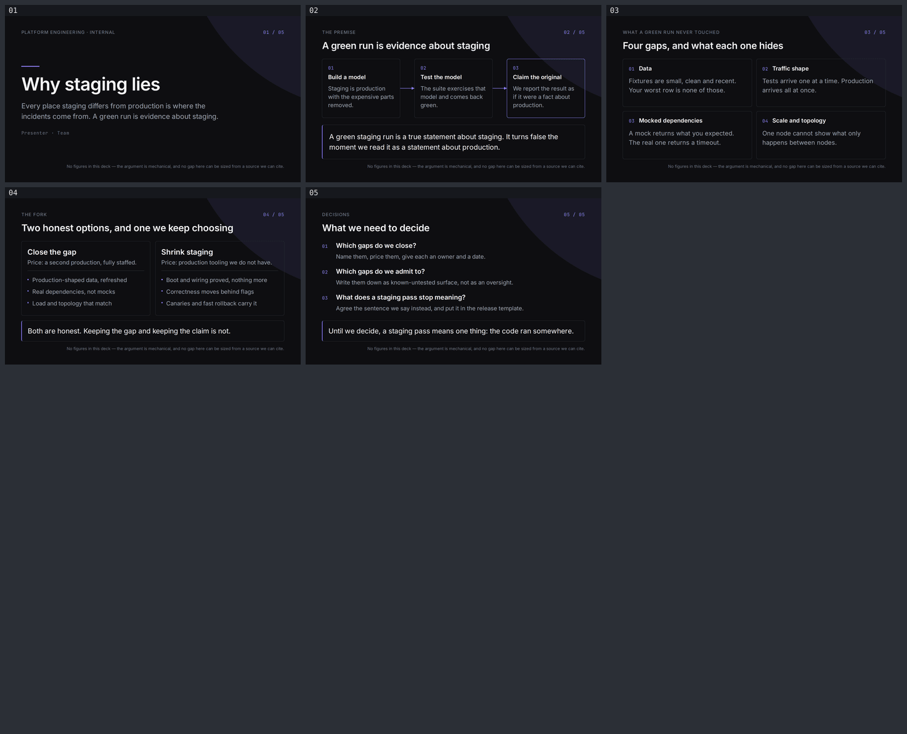

# Why staging lies

A five-slide internal engineering deck. The thesis: staging is a model of production, a test
run measures the model, and every place the model differs from the original — the data, the
traffic shape, the mocked dependencies, the scale — is untested surface by construction. So a
green staging run is evidence about staging, and the fork is to either close the gap and pay
for it, or shrink staging deliberately and move verification into production behind flags and
canaries.

| # | Slide | Does |
|---|-------|------|
| 01 | **Why staging lies** | Cover. States the claim and the mechanism in two lines. |
| 02 | **A green run is evidence about staging** | Three-step process: build a model → test the model → claim the original. The third step is where the error enters. |
| 03 | **Four gaps, and what each one hides** | Data, traffic shape, mocked dependencies, scale and topology — and what a green run never touched in each. |
| 04 | **Two honest options, and one we keep choosing** | Close the gap (price: a second production) vs. shrink staging (price: production tooling). Neither is marked as recommended. |
| 05 | **What we need to decide** | Which gaps we close, which we admit to, and what a staging pass stops meaning. |

- Style: `ppt-engineered-dark-deck` (bundled)
- Canvas: 720 × 405pt · Language: English
- Fonts: Inter 400/500/600 and JetBrains Mono 400, embedded locally under `assets/fonts/`

## Judgement calls, and why

**No numbers anywhere.** There is no chart, percentage, duration, cost or benchmark in this
deck, and that is deliberate. Every number this topic invites — how many incidents trace to a
staging/production difference, what a parity environment costs, how long a canary must run —
is a number this repo cannot source. Inventing one would be a Critical finding under the
gate's content-discipline check, and it would also be the weakest part of the case: the
argument is mechanical, so it holds at any magnitude and needs none. The style's mandatory
bottom-right `source_caption` slot therefore carries that disclosure on all five sheets
instead of a citation.

**Why this style.** Picked from a three-way shortlist against
`ppt-isometric-platform-deck` and `ppt-bauhaus-geometric`. It is the only one of the three
with a fixed source-caption slot, which is exactly what a deck with nothing to cite needs;
its vocabulary — unfilled hairline boxes, mono step numbers, one accent, at most six lines of
prose — is a reasoning vocabulary rather than a picture-of-a-system one; and a low-glare dark
sheet is the register for an internal review that often happens after an incident. The full
comparison is in `slide-outline.md` under "style choice".

**Presenter is a placeholder.** `Presenter · Team`. No name is invented.

**Palette.** No colour outside the style spec appears. The one addition to the obvious set is
`#2E2E36` (the spec's `surface bar` token) for the in-card divider on slide 04, because the
`#26262C` border token was invisible inside a card already framed in `#26262C`. Recorded in
`design-debt.md`.

**The style's glow is a flat fill.** The spec's signature is one radial glow per sheet; this
repo forbids gradients, so the first stop is used as a flat fill. The first attempt rendered
as a hard-edged planet — an object, which the style's own Avoid list forbids the glow from
becoming — so the disc centre was moved off-canvas and only a shallow arc is cropped into the
top-right corner. See `design-debt.md` §1.

## What the render pass caught that `validate` did not

`validate` reported 5/5 clean before any of these were found by opening the PNGs:

- the corner wash rendering as a circular object on every sheet;
- two single-word runt lines sitting side by side on slide 04;
- the slide-04 in-card divider being invisible against its own card frame;
- slide 02's third node being a line shorter than its siblings, leaving that card emptier;
- slide 05's last note nearly abutting the closing strip.

All five are fixed. Details and severities are in `gate-pass-b.md`.

## Regenerate

Run every command from the repo root.

```bash
npx slides-grab validate     --slides-dir decks/staging-parity
npx slides-grab png          --slides-dir decks/staging-parity \
                             --output-dir decks/staging-parity/gate-preview --resolution 1080p
npx slides-grab design-gate  --slides-dir decks/staging-parity --verdict proceed \
                             --pass-a-report decks/staging-parity/gate-pass-a.md \
                             --pass-b-report decks/staging-parity/gate-pass-b.md
npx slides-grab build-viewer --slides-dir decks/staging-parity
npx slides-grab pdf          --slides-dir decks/staging-parity \
                             --output decks/staging-parity/staging-parity.pdf --resolution 1080p
node scripts/build-contact-sheets.mjs decks/staging-parity/gate-preview --web
```

Editing any slide changes its fingerprint and invalidates the gate receipt; re-run from
`validate` and update the fingerprints in both gate reports.



## Files

| | |
|---|---|
| `slide-01.html` … `slide-05.html` | the slides |
| `slide-outline.md` | content plan, style contract, and the height/width budgets computed before writing |
| `gate-pass-a.md` / `gate-pass-b.md` | design-gate reports |
| `design-debt.md` | accepted deviations and Minor/Note findings |
| `viewer.html` | keyboard-navigable viewer |
| `staging-parity.pdf` | 1080p export |
| `preview/` | committed contact sheet, so the slides are visible inside the repo tree |
| `gate-preview/` | full-size render evidence |
