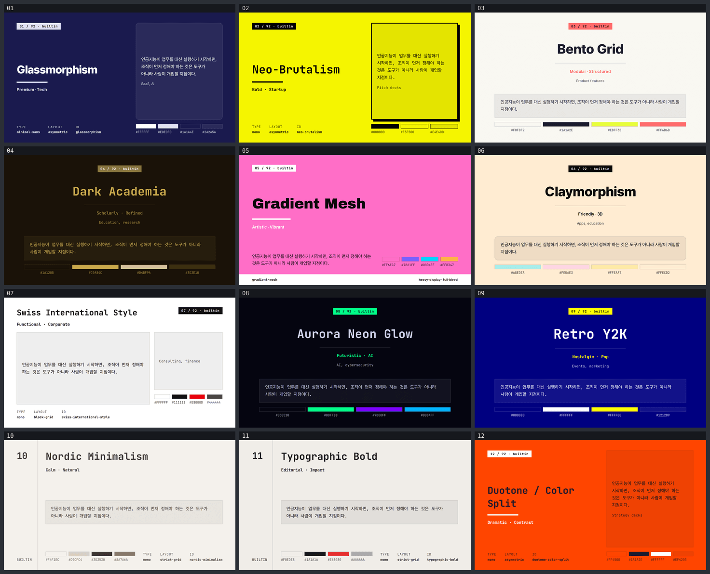
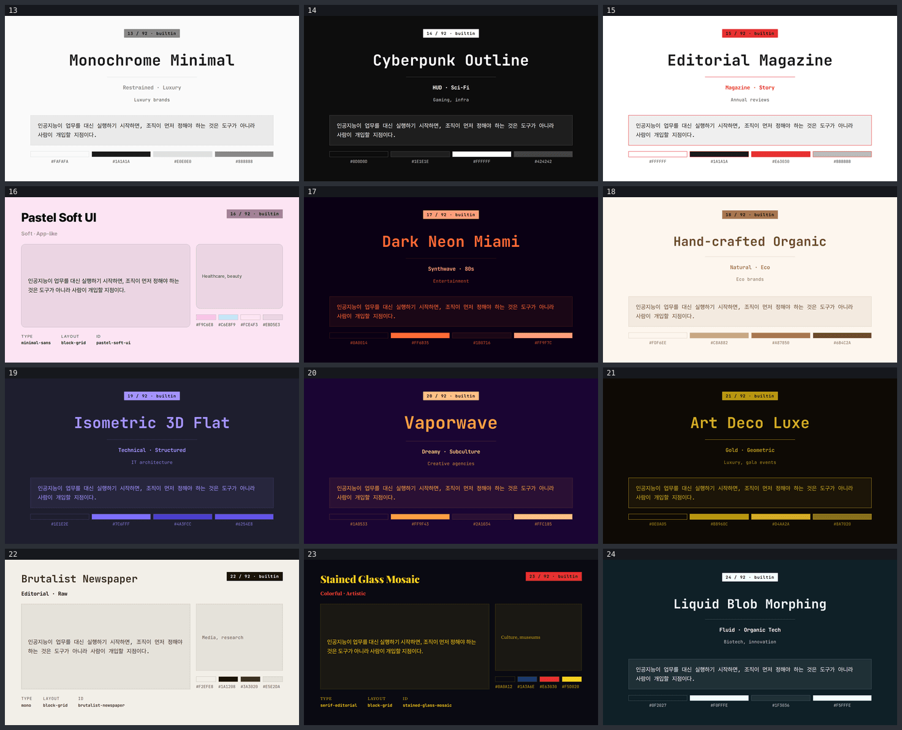
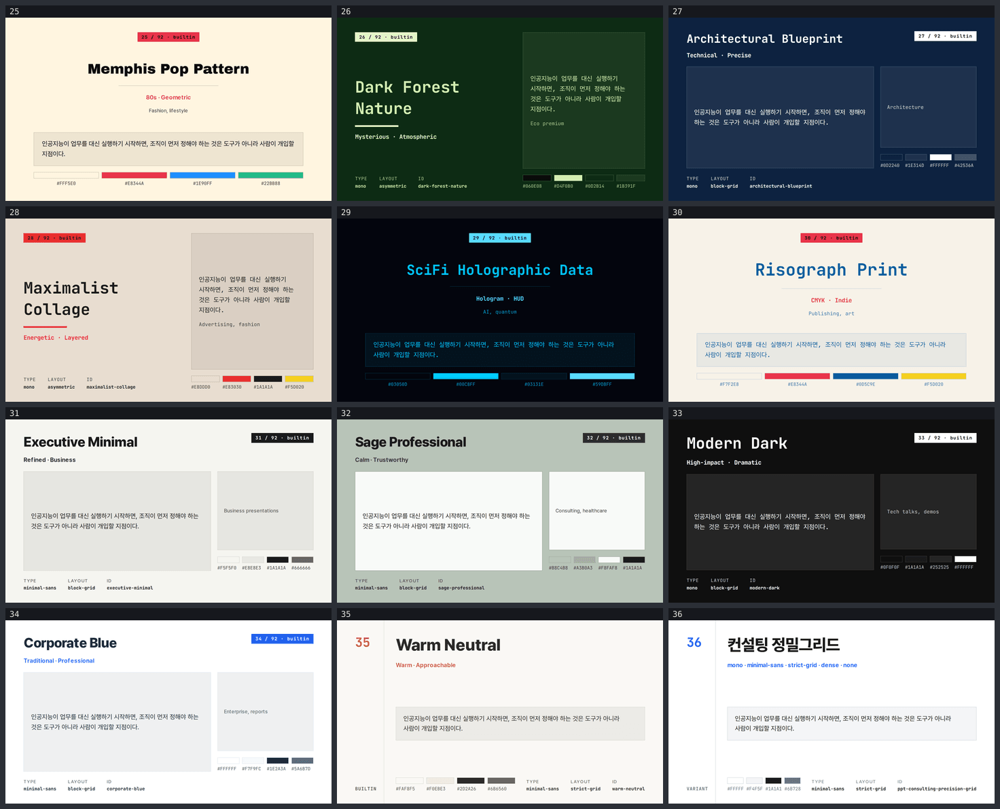
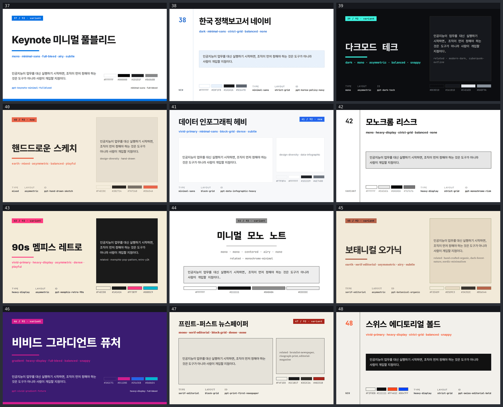
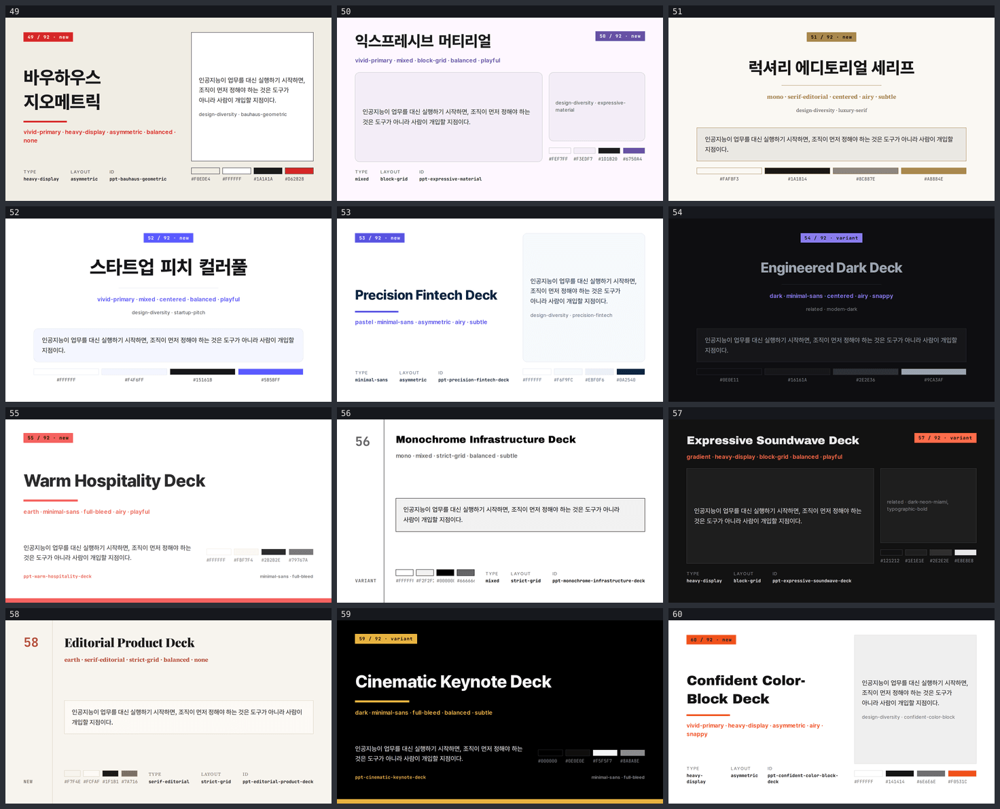
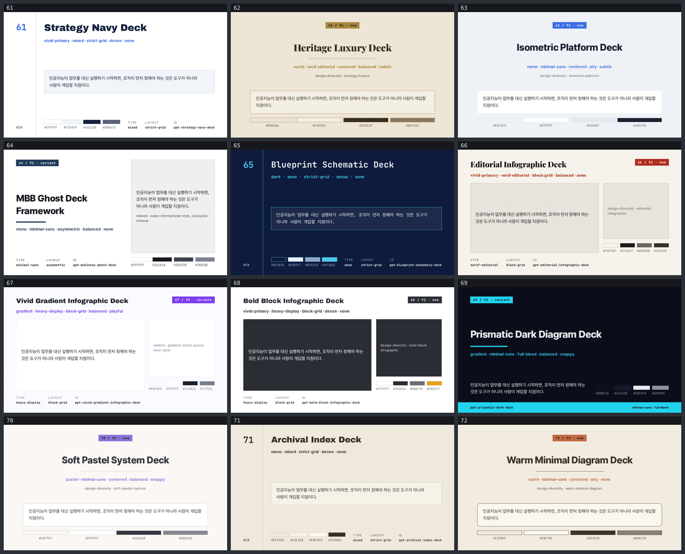
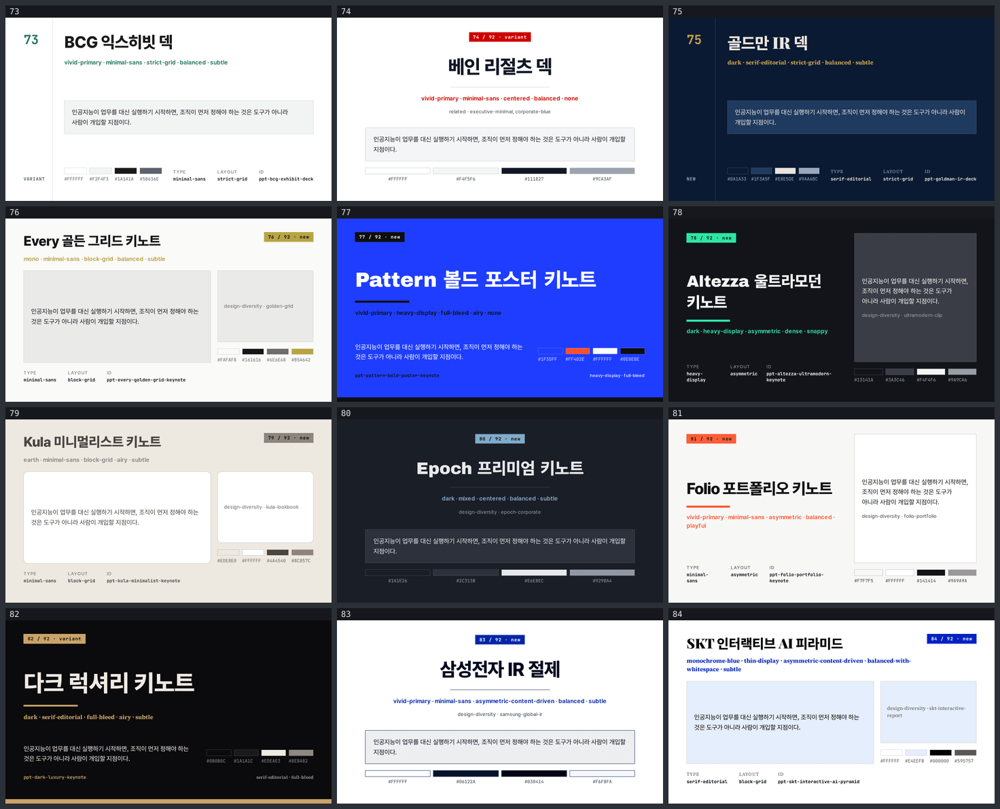
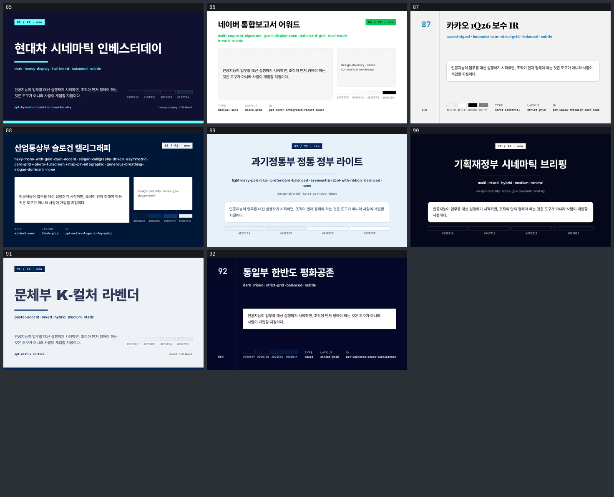

# style-showcase — 번들 스타일 92종 견본

slides-grab에 들어 있는 **선택 가능한 디자인 스타일 92종을 한 장씩** 보여주는 견본 덱.
`npx slides-grab list-styles`가 출력하는 목록과 정확히 같은 92개다 (원본 데이터에는 95개가 있고, 그중 3개 `ppt-glassmorphism` · `ppt-neo-brutalism` · `ppt-editorial-magazine`는 builtin id의 별칭이라 CLI가 걸러낸다).

각 슬라이드는 손으로 쓴 게 아니라 **스타일 자신의 스펙에서 값을 읽어 생성**된다 — `scripts/build-style-showcase.mjs`.

## 한 장에 담긴 것

| 요소 | 출처 |
|---|---|
| 제목 | 스타일의 `title` |
| 무드 줄 | 스타일의 `mood` 원문 그대로 |
| 보조 줄 | builtin은 `bestFor`, design-diversity는 `relatedStyleIds` |
| 본문 문장 | 92장 전부 **동일한 한 문장** — 달라지는 건 색과 타이포뿐이도록 |
| 색 스와치 | 실제로 적용된 hex를 그대로 라벨로 출력 (`palette-report.json`과 대조 가능) |
| TYPE / LAYOUT / ID | 아래 규칙으로 정해진 축과 `--style`에 넣을 id |

## 어디까지가 스펙이고 어디부터가 이 스크립트인가

**스펙에서 그대로 온 것**
- bg / surface / text / muted / accent / border 여섯 토큰. 모두 해당 스타일의 `background`·`colors`에서 추출.
- 타이포 축과 레이아웃 축. design-diversity 스타일은 `mood`가 `<팔레트> · <타이포> · <레이아웃> · <밀도> · <모션>` 순서라 해당 자리를 읽는다. builtin과, 자체 어휘를 쓰는 85–92번은 `fonts`/`layout`/`signature` 문구를 키워드로 판별한다 — 그래서 슬라이드에 무드 원문을 같이 찍어 검증할 수 있게 했다.
- 각진/둥근 모서리, 두꺼운 테두리 + 블러 없는 오프셋 그림자 같은 시그니처는 스펙이 그렇게 적어둔 스타일에만 적용된다 (예: 02 Neo-Brutalism).

**이 스크립트가 정한 것 — 스펙 재현이 아님**
- **레이아웃 5종**(`strict-grid` `full-bleed` `centered` `asymmetric` `block-grid`)은 축을 표현하려고 만든 견본 프레임이지, 각 스타일의 실제 슬라이드 구성이 아니다.
- **서체 대체.** 스펙이 지정한 Segoe UI·Impact·Bebas Neue 같은 서체는 이 환경에 없다. 타이포 축에 맞춰 로컬 임베드된 5종(Pretendard / Archivo Black / JetBrains Mono / Source Serif 4 / Playfair Display)으로 매핑했다. 한글은 항상 Pretendard로 떨어진다.
- **대비 보정.** 스펙 토큰을 그대로 쓰면 자기 배경 위에서 안 읽히는 경우가 있어(본문 4.5:1, 보조 4:1, 액센트 2.2:1 미만) 92장 중 **29장**에 대체색을 넣었다. 대체는 같은 스펙의 다른 hex를 우선 쓰고, 없으면 그 스펙의 text↔bg 축을 섞는다. 원본·대체·측정된 비율이 전부 `palette-report.json`에 남아 있다.
- **그라디언트는 첫 스톱만 평면으로.** slides-grab이 슬라이드 HTML에서 CSS 그라디언트를 금지한다. 전체 스톱은 스와치에 남는다.

## 브라우저에서 바로 보기

> `slide-07.html`을 GitHub에서 클릭하면 페이지가 아니라 **소스 코드**가 보인다. GitHub은 저장소 안의
> `.html`을 렌더링하지 않고 텍스트로 서빙한다 — 파일이 잘못된 게 아니다.
> **실제 페이지로 보려면 [Pages 뷰어](https://jeonck.github.io/pt-slide/decks/style-showcase/viewer.html)를 열면 된다.**
> 아래는 GitHub 안에서 바로 훑어보라고 미리 구워 둔 이미지다 — 클릭하면 원본 크기로 열린다.

전체를 한 번에 넘겨 보려면 [**92쪽 PDF**](slides-grab-style-showcase.pdf)가 편하다 — PDF는 GitHub이 뷰어로 렌더링해 준다.

**01–12번**



**13–24번**



**25–36번**



**37–48번**



**49–60번**



**61–72번**



**73–84번**



**85–92번**



### 슬라이드를 실제 HTML로 열려면

| 방법 | 하는 법 |
|---|---|
| **로컬에서 열기** (권장) | 저장소를 클론한 뒤 `decks/style-showcase/viewer.html`을 브라우저로 연다. 폰트·레이아웃이 그대로 나오는 유일한 방법 |
| **GitHub Pages** | **이미 배포돼 있다** — [92장 뷰어](https://jeonck.github.io/pt-slide/decks/style-showcase/viewer.html), 개별 슬라이드도 [`/slide-07.html`](https://jeonck.github.io/pt-slide/decks/style-showcase/slide-07.html)처럼 열린다. `main` 푸시마다 자동 재배포 |
| **htmlpreview** | `htmlpreview.github.io/?<파일 URL>` — 설정 없이 되지만 `./assets/fonts/`를 못 따라가서 한글 폰트가 깨질 수 있다 |

위 미리보기 이미지는 렌더된 PNG에서 만든다:

```bash
npx slides-grab png --slides-dir decks/style-showcase \
  --output-dir decks/style-showcase/gate-preview --resolution 1080p
node scripts/build-contact-sheets.mjs decks/style-showcase/gate-preview --web
```

## 스타일 92종 전체 목록

`#`는 이 덱의 슬라이드 번호다 — `slide-07.html`을 열면 07번 스타일이 나온다.
`id`가 아웃라인 meta의 `style:`에 그대로 들어가는 값이다.

`타이포 · 레이아웃`은 이 견본이 쓴 축이다. design-diversity 스타일은 `mood`의 해당 자리를 읽었고,
builtin과 자체 어휘를 쓰는 85–92번은 스펙 문구에서 키워드로 판별했다 (슬라이드에 무드 원문이 같이 찍혀 있어 대조할 수 있다).

`bg / accent`는 실제로 적용된 값이다. ⚠︎ 표시는 스펙의 원래 토큰이 자기 배경 위에서 대비가 모자라
대체색이 들어간 슬라이드다 — 원본·대체·측정 비율은 `palette-report.json`에 있다 (총 29장).

분류: builtin 35 · new 38 · variant 19

| # | id | 이름 | 분류 | 타이포 · 레이아웃 | bg / accent |
|---|---|---|---|---|---|
| 01 | `glassmorphism` | Glassmorphism | builtin | minimal-sans · asymmetric | `#1A1A4E` / `#E0E0F0` |
| 02 | `neo-brutalism` | Neo-Brutalism | builtin | mono · asymmetric | `#F5F500` / `#000000` |
| 03 | `bento-grid` | Bento Grid | builtin | minimal-sans · centered | `#F8F8F2` / `#FF6B6B` ⚠︎ |
| 04 | `dark-academia` | Dark Academia | builtin | mono · centered | `#1A1208` / `#8A7340` |
| 05 | `gradient-mesh` | Gradient Mesh | builtin | heavy-display · full-bleed | `#FF6EC7` / `#FFFFFF` ⚠︎ |
| 06 | `claymorphism` | Claymorphism | builtin | minimal-sans · centered | `#FFECD2` / `#070707` |
| 07 | `swiss-international-style` | Swiss International Style | builtin | mono · block-grid | `#FFFFFF` / `#111111` |
| 08 | `aurora-neon-glow` | Aurora Neon Glow | builtin | mono · centered | `#050510` / `#00FF88` |
| 09 | `retro-y2k` | Retro Y2K | builtin | mono · centered | `#000080` / `#FFFF00` |
| 10 | `nordic-minimalism` | Nordic Minimalism | builtin | mono · strict-grid | `#F4F1EC` / `#3D3530` ⚠︎ |
| 11 | `typographic-bold` | Typographic Bold | builtin | mono · strict-grid | `#F0EDE8` / `#1A1A1A` |
| 12 | `duotone-color-split` | Duotone / Color Split | builtin | mono · asymmetric | `#FF4500` / `#FFFFFF` ⚠︎ |
| 13 | `monochrome-minimal` | Monochrome Minimal | builtin | mono · centered | `#FAFAFA` / `#888888` |
| 14 | `cyberpunk-outline` | Cyberpunk Outline | builtin | mono · centered | `#0D0D0D` / `#FFFFFF` |
| 15 | `editorial-magazine` | Editorial Magazine | builtin | mono · centered | `#FFFFFF` / `#E63030` |
| 16 | `pastel-soft-ui` | Pastel Soft UI | builtin | minimal-sans · block-grid | `#FCE4F3` / `#A28197` ⚠︎ |
| 17 | `dark-neon-miami` | Dark Neon Miami | builtin | mono · centered | `#0A0014` / `#FF9F7C` |
| 18 | `hand-crafted-organic` | Hand-crafted Organic | builtin | mono · centered | `#FDF6EE` / `#A87850` |
| 19 | `isometric-3d-flat` | Isometric 3D Flat | builtin | mono · centered | `#1E1E2E` / `#A594FF` |
| 20 | `vaporwave` | Vaporwave | builtin | mono · centered | `#1A0533` / `#FFC185` |
| 21 | `art-deco-luxe` | Art Deco Luxe | builtin | mono · centered | `#0E0A05` / `#B8960C` |
| 22 | `brutalist-newspaper` | Brutalist Newspaper | builtin | mono · block-grid | `#F2EFE8` / `#1A1208` |
| 23 | `stained-glass-mosaic` | Stained Glass Mosaic | builtin | serif-editorial · block-grid | `#0A0A12` / `#E63030` |
| 24 | `liquid-blob-morphing` | Liquid Blob Morphing | builtin | mono · centered | `#0F2027` / `#F5FFFE` |
| 25 | `memphis-pop-pattern` | Memphis Pop Pattern | builtin | heavy-display · centered | `#FFF5E0` / `#E8344A` |
| 26 | `dark-forest-nature` | Dark Forest Nature | builtin | mono · asymmetric | `#0D2B14` / `#E3F5CC` |
| 27 | `architectural-blueprint` | Architectural Blueprint | builtin | mono · block-grid | `#0D2240` / `#FFFFFF` |
| 28 | `maximalist-collage` | Maximalist Collage | builtin | mono · asymmetric | `#E8DDD0` / `#E83030` ⚠︎ |
| 29 | `scifi-holographic-data` | SciFi Holographic Data | builtin | mono · centered | `#03050D` / `#59DBFF` |
| 30 | `risograph-print` | Risograph Print | builtin | mono · centered | `#F7F2E8` / `#E8344A` |
| 31 | `executive-minimal` | Executive Minimal | builtin | minimal-sans · block-grid | `#F5F5F0` / `#1A1A1A` ⚠︎ |
| 32 | `sage-professional` | Sage Professional | builtin | minimal-sans · block-grid | `#B8C4B8` / `#2D2D2D` ⚠︎ |
| 33 | `modern-dark` | Modern Dark | builtin | mono · block-grid | `#0F0F0F` / `#FFFFFF` ⚠︎ |
| 34 | `corporate-blue` | Corporate Blue | builtin | minimal-sans · block-grid | `#FFFFFF` / `#2563EB` ⚠︎ |
| 35 | `warm-neutral` | Warm Neutral | builtin | minimal-sans · strict-grid | `#FAF8F5` / `#C45A3B` ⚠︎ |
| 36 | `ppt-consulting-precision-grid` | 컨설팅 정밀그리드 | variant | minimal-sans · strict-grid | `#FFFFFF` / `#0B5FFF` |
| 37 | `ppt-keynote-minimal-fullbleed` | Keynote 미니멀 풀블리드 | variant | minimal-sans · full-bleed | `#FFFFFF` / `#0071E3` ⚠︎ |
| 38 | `ppt-korea-policy-navy` | 한국 정책보고서 네이비 | new | minimal-sans · strict-grid | `#FFFFFF` / `#1B66C9` |
| 39 | `ppt-dark-tech` | 다크모드 테크 | variant | mono · asymmetric | `#0C0D10` / `#3DF5E0` |
| 40 | `ppt-hand-drawn-sketch` | 핸드드로운 스케치 | new | mixed · asymmetric | `#F4ECDC` / `#E8654A` |
| 41 | `ppt-data-infographic-heavy` | 데이터 인포그래픽 헤비 | new | minimal-sans · block-grid | `#F7F8FA` / `#2563EB` |
| 42 | `ppt-monochrome-risk` | 모노크롬 리스크 | variant | heavy-display · strict-grid | `#FFFFFF` / `#0A0A0A` |
| 43 | `ppt-memphis-retro-90s` | 90s 멤피스 레트로 | variant | heavy-display · asymmetric | `#F4ECD8` / `#FF3B7F` |
| 44 | `ppt-minimal-mono-note` | 미니멀 모노 노트 | variant | mono · centered | `#FFFFFF` / `#8A8A8A` ⚠︎ |
| 45 | `ppt-botanical-organic` | 보태니컬 오가닉 | variant | serif-editorial · asymmetric | `#F2EAD9` / `#B5654A` |
| 46 | `ppt-vivid-gradient-future` | 비비드 그라디언트 퓨처 | variant | heavy-display · full-bleed | `#3A1C71` / `#D11D8E` |
| 47 | `ppt-print-first-newspaper` | 프린트-퍼스트 뉴스페이퍼 | variant | serif-editorial · block-grid | `#F4F1E8` / `#A8231B` |
| 48 | `ppt-swiss-editorial-bold` | 스위스 에디토리얼 볼드 | new | heavy-display · strict-grid | `#F2F0EB` / `#FF4A1C` |
| 49 | `ppt-bauhaus-geometric` | 바우하우스 지오메트릭 | new | heavy-display · asymmetric | `#F0EDE4` / `#D62828` |
| 50 | `ppt-expressive-material` | 익스프레시브 머티리얼 | new | mixed · block-grid | `#FEF7FF` / `#6750A4` |
| 51 | `ppt-luxury-editorial-serif` | 럭셔리 에디토리얼 세리프 | new | serif-editorial · centered | `#FAF8F3` / `#A8884E` ⚠︎ |
| 52 | `ppt-startup-pitch-colorful` | 스타트업 피치 컬러풀 | new | mixed · centered | `#FFFFFF` / `#5B5BFF` |
| 53 | `ppt-precision-fintech-deck` | Precision Fintech Deck | new | minimal-sans · asymmetric | `#FFFFFF` / `#5A55E0` |
| 54 | `ppt-engineered-dark-deck` | Engineered Dark Deck | variant | minimal-sans · centered | `#0E0E11` / `#8B7BF0` ⚠︎ |
| 55 | `ppt-warm-hospitality-deck` | Warm Hospitality Deck | new | minimal-sans · full-bleed | `#FFFFFF` / `#F4625F` |
| 56 | `ppt-monochrome-infrastructure-deck` | Monochrome Infrastructure Deck | variant | mixed · strict-grid | `#FFFFFF` / `#666666` |
| 57 | `ppt-expressive-soundwave-deck` | Expressive Soundwave Deck | variant | heavy-display · block-grid | `#121212` / `#FF6B4A` |
| 58 | `ppt-editorial-product-deck` | Editorial Product Deck | new | serif-editorial · strict-grid | `#F7F4EE` / `#B5503A` |
| 59 | `ppt-cinematic-keynote-deck` | Cinematic Keynote Deck | variant | minimal-sans · full-bleed | `#000000` / `#E8B341` |
| 60 | `ppt-confident-color-block-deck` | Confident Color-Block Deck | new | heavy-display · asymmetric | `#FFFFFF` / `#F0531C` |
| 61 | `ppt-strategy-navy-deck` | Strategy Navy Deck | new | mixed · strict-grid | `#FFFFFF` / `#2563EB` |
| 62 | `ppt-heritage-luxury-deck` | Heritage Luxury Deck | new | serif-editorial · centered | `#EDE6D6` / `#A8893E` ⚠︎ |
| 63 | `ppt-isometric-platform-deck` | Isometric Platform Deck | new | minimal-sans · centered | `#EEF1F5` / `#3B6FE0` |
| 64 | `ppt-mckinsey-ghost-deck` | MBB Ghost Deck Framework | variant | minimal-sans · asymmetric | `#FFFFFF` / `#1F3A5F` ⚠︎ |
| 65 | `ppt-blueprint-schematic-deck` | Blueprint Schematic Deck | new | mono · strict-grid | `#0E1B3D` / `#4FC8E8` |
| 66 | `ppt-editorial-infographic-deck` | Editorial Infographic Deck | new | serif-editorial · block-grid | `#F6F3EC` / `#B22B1F` |
| 67 | `ppt-vivid-gradient-infographic-deck` | Vivid Gradient Infographic Deck | variant | heavy-display · block-grid | `#FBFAFE` / `#7C3AED` |
| 68 | `ppt-bold-block-infographic-deck` | Bold Block Infographic Deck | new | heavy-display · block-grid | `#FFFFFF` / `#2A2D34` |
| 69 | `ppt-prismatic-dark-deck` | Prismatic Dark Diagram Deck | variant | minimal-sans · full-bleed | `#0B0E1A` / `#22D3EE` |
| 70 | `ppt-soft-pastel-system-deck` | Soft Pastel System Deck | new | minimal-sans · centered | `#FAF7F4` / `#8B72D9` ⚠︎ |
| 71 | `ppt-archival-index-deck` | Archival Index Deck | new | mixed · strict-grid | `#EFE9DD` / `#33302A` ⚠︎ |
| 72 | `ppt-warm-minimal-diagram-deck` | Warm Minimal Diagram Deck | new | minimal-sans · centered | `#F2EBDF` / `#C2693F` ⚠︎ |
| 73 | `ppt-bcg-exhibit-deck` | BCG 익스히빗 덱 | variant | minimal-sans · strict-grid | `#FFFFFF` / `#177B57` |
| 74 | `ppt-bain-results-deck` | 베인 리절츠 덱 | variant | minimal-sans · centered | `#FFFFFF` / `#CC0000` ⚠︎ |
| 75 | `ppt-goldman-ir-deck` | 골드만 IR 덱 | new | serif-editorial · strict-grid | `#0A1A33` / `#C8A24B` |
| 76 | `ppt-every-golden-grid-keynote` | Every 골든 그리드 키노트 | new | minimal-sans · block-grid | `#FAFAF8` / `#B5A642` |
| 77 | `ppt-pattern-bold-poster-keynote` | Pattern 볼드 포스터 키노트 | new | heavy-display · full-bleed | `#1F3DFF` / `#0E0E0E` ⚠︎ |
| 78 | `ppt-altezza-ultramodern-keynote` | Altezza 울트라모던 키노트 | new | heavy-display · asymmetric | `#13141A` / `#2EE6A6` |
| 79 | `ppt-kula-minimalist-keynote` | Kula 미니멀리스트 키노트 | new | minimal-sans · block-grid | `#EDE8E0` / `#8C857C` ⚠︎ |
| 80 | `ppt-epoch-premium-keynote` | Epoch 프리미엄 키노트 | new | mixed · centered | `#1A1E26` / `#7FA9C9` |
| 81 | `ppt-folio-portfolio-keynote` | Folio 포트폴리오 키노트 | new | minimal-sans · asymmetric | `#F7F7F5` / `#FF5C35` ⚠︎ |
| 82 | `ppt-dark-luxury-keynote` | 다크 럭셔리 키노트 | variant | serif-editorial · full-bleed | `#0B0B0C` / `#C9A36A` |
| 83 | `ppt-samsung-ir-restrained` | 삼성전자 IR 절제 | new | minimal-sans · centered | `#FFFFFF` / `#0028A8` ⚠︎ |
| 84 | `ppt-skt-interactive-ai-pyramid` | SKT 인터랙티브 AI 피라미드 | new | serif-editorial · block-grid | `#FFFFFF` / `#0023C3` |
| 85 | `ppt-hyundai-cinematic-investor-day` | 현대차 시네마틱 인베스터데이 | new | heavy-display · full-bleed | `#101030` / `#66FFFF` |
| 86 | `ppt-naver-integrated-report-award` | 네이버 통합보고서 어워드 | new | minimal-sans · block-grid | `#FFFFFF` / `#03C75A` |
| 87 | `ppt-kakao-friendly-card-news` | 카카오 1Q26 보수 IR | new | serif-editorial · strict-grid | `#F2F2F2` / `#007ABF` ⚠︎ |
| 88 | `ppt-motie-slogan-infographic` | 산업통상부 슬로건 캘리그래피 | new | minimal-sans · block-grid | `#001838` / `#E8F8F8` ⚠︎ |
| 89 | `ppt-msit-ai-three-powers` | 과기정통부 정통 정부 라이트 | new | minimal-sans · centered | `#E7F1FA` / `#002060` |
| 90 | `ppt-moef-fiscal-blue` | 기획재정부 시네마틱 브리핑 | new | mixed · centered | `#05091A` / `#FCFCF6` ⚠︎ |
| 91 | `ppt-mcst-k-culture` | 문체부 K-컬처 라벤더 | new | mixed · full-bleed | `#EEF2F7` / `#022853` |
| 92 | `ppt-unikorea-peace-coexistence` | 통일부 한반도 평화공존 | new | mixed · strict-grid | `#050829` / `#EDF4FD` ⚠︎ |

## 파일

| 경로 | 내용 |
|---|---|
| `slide-01.html` … `slide-92.html` | 견본 슬라이드 (720pt × 405pt) |
| `palette-report.json` | 92장 전부의 해석된 토큰 + 대체 내역 |
| `gate-pass-a.md`, `gate-pass-b.md` | 디자인 게이트 리포트. Pass B는 렌더된 92장을 3×4 컨택트 시트 8장으로 전부 확인한 뒤 작성 |
| `.slides-grab/` | 게이트 영수증 (`design-gate.json`, 리포트) |
| `preview/` | README에 붙는 미리보기 이미지 8장 (커밋됨) |
| `viewer.html` | 92장 미리보기 — 로컬 브라우저로 열 것. GitHub에서는 소스로 보인다 |
| `slides-grab-style-showcase.pdf` | 92쪽 PDF (1080p 캡처) |

렌더 PNG(`gate-preview/`, `.slides-grab/gate-preview/`)는 용량 때문에 커밋하지 않는다 — 아래 명령으로 언제든 다시 만든다.

## 다시 만들기

```bash
npm install
node scripts/build-style-showcase.mjs                                    # 92장 재생성
npx slides-grab validate --slides-dir decks/style-showcase               # 92/92 통과
npx slides-grab png --slides-dir decks/style-showcase \
  --output-dir decks/style-showcase/gate-preview --resolution 1080p      # 렌더
node scripts/build-contact-sheets.mjs decks/style-showcase/gate-preview         # 리뷰용 컨택트 시트 8장
node scripts/build-contact-sheets.mjs decks/style-showcase/gate-preview --web   # README용 preview/ 이미지
npx slides-grab build-viewer --slides-dir decks/style-showcase
```

스타일 하나가 마음에 들면 그 id를 덱 아웃라인의 `style:`에 적으면 된다:

```bash
npx slides-grab show-design ppt-korea-policy-navy   # 색·타이포·레이아웃·금지사항 전문
```
